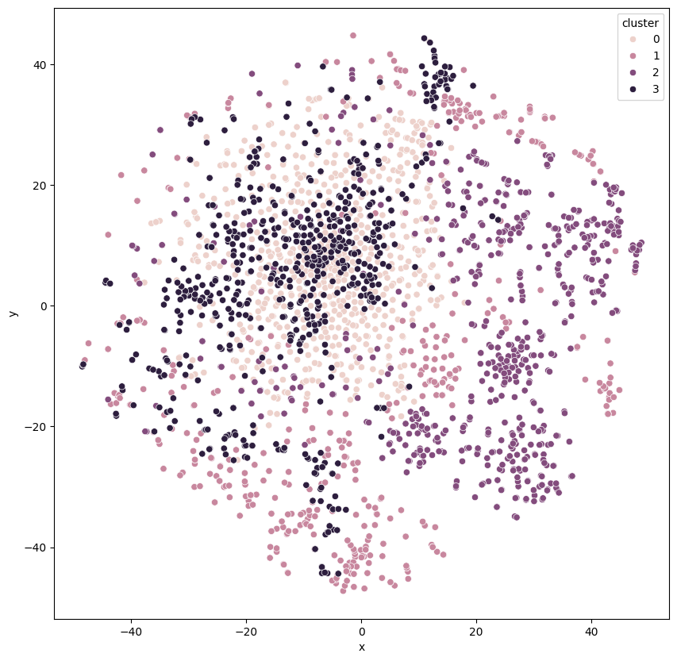
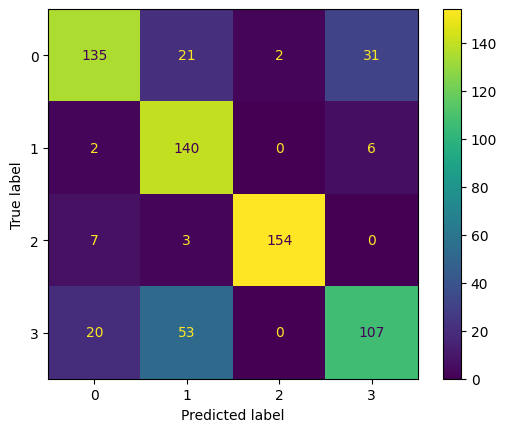
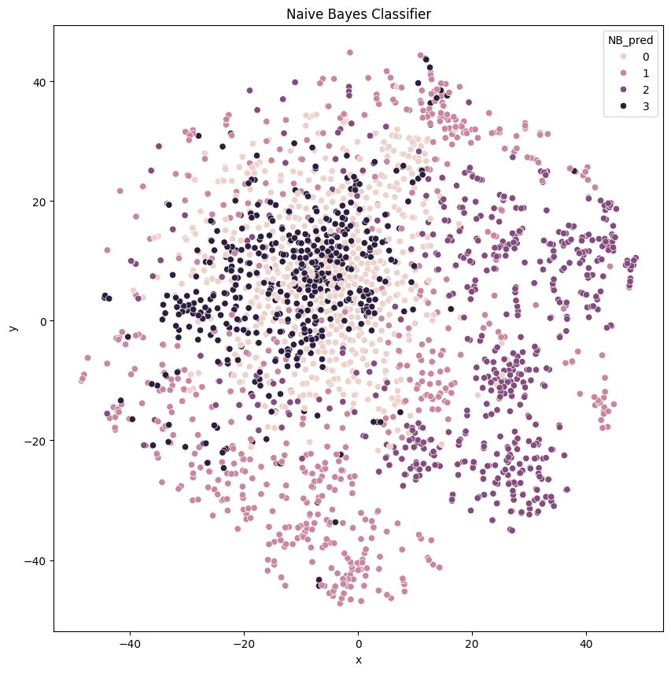
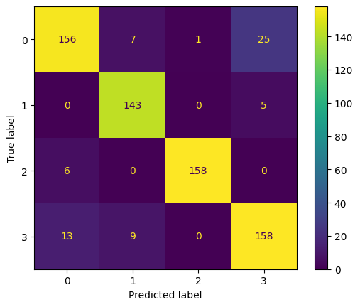
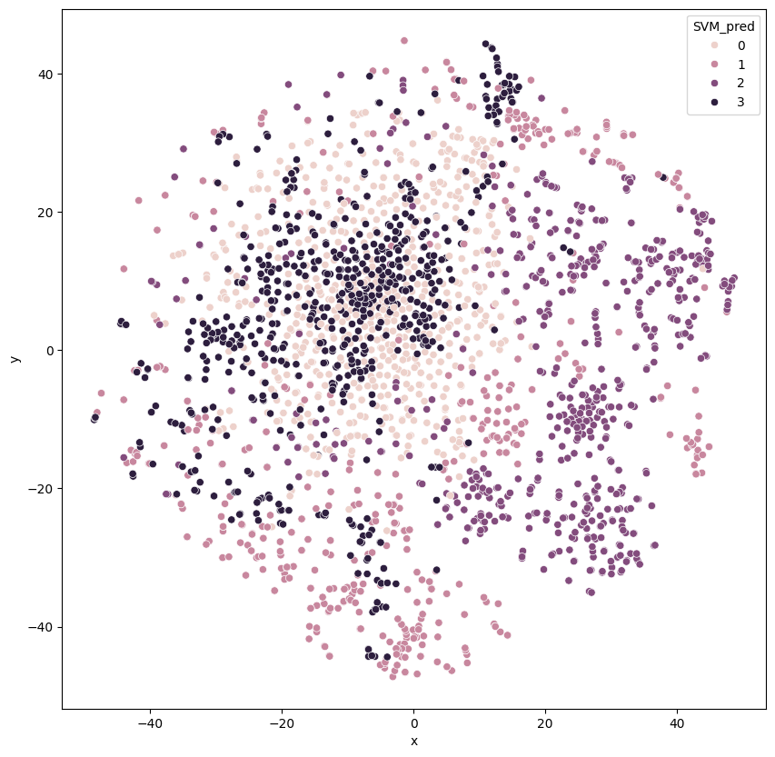
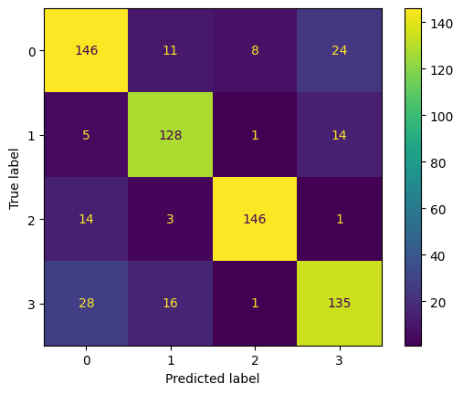
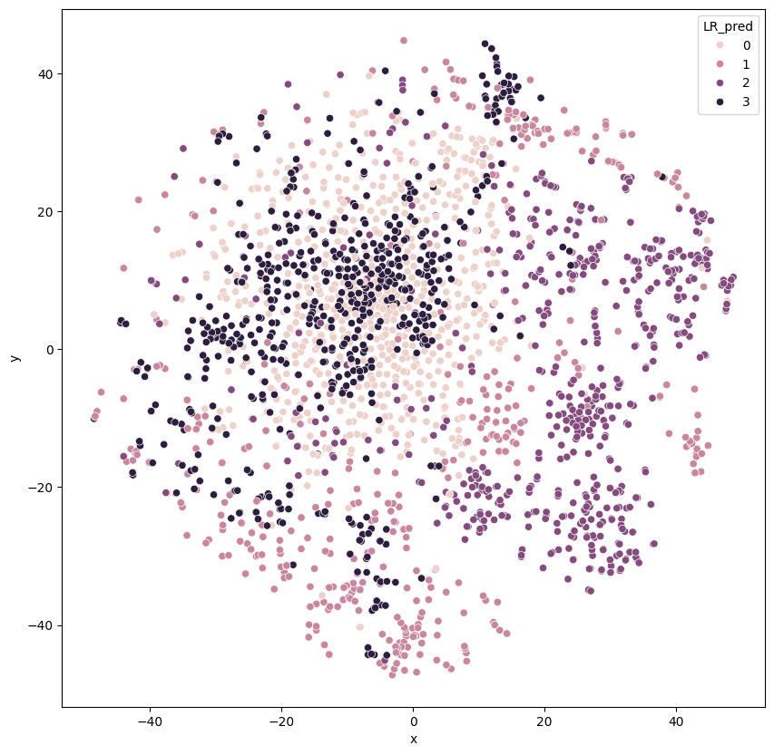
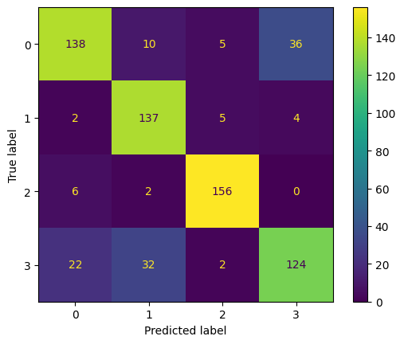
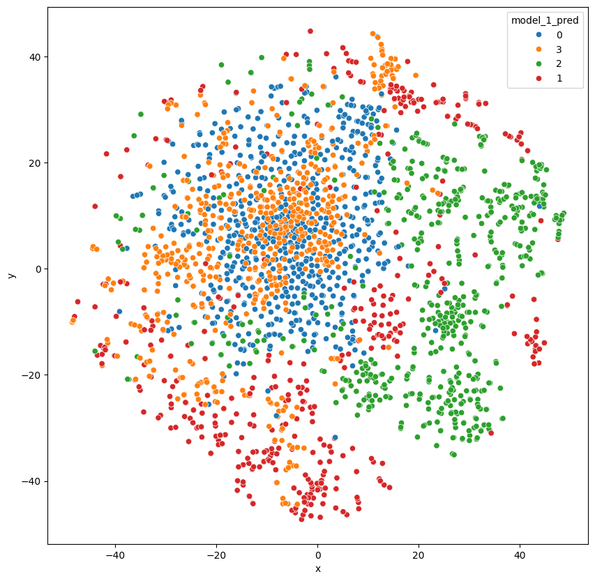
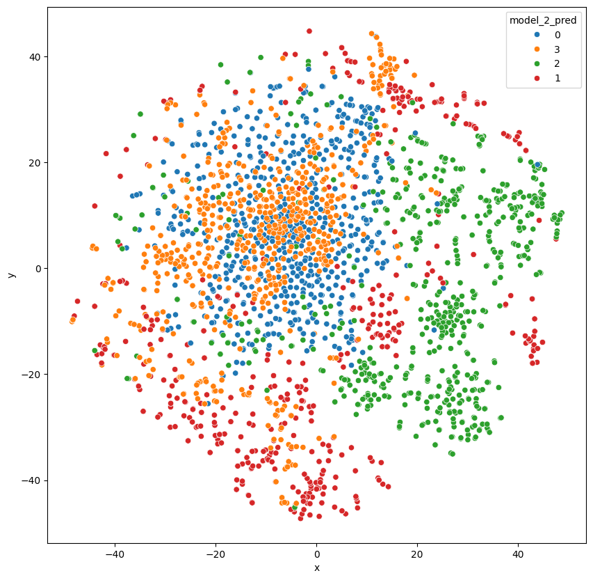

<a href="https://colab.research.google.com/github/dattali18/IR_Assignments/blob/main/Assignment.02/notebooks/IR_02_Classification_Doc2Vec.ipynb" target="_parent"></a>

# IR Assignment 2

## Classification

### **Objective**:
- Build classifiers to predict the journal group.

### **Algorithms**:
- **Artificial Neural Network (ANN)** (two architectures provided):
  - ANN Architecture 1: RELU activation layers.
  - ANN Architecture 2: GELU activation layers.
- **Other Classifiers**: Naive Bayes (NB), Support Vector Machine (SVM), Logistic Regression (LoR), Random Forest (RF).

### **Tasks**:
- Perform 10-fold cross-validation for all classifiers (except ANN).
- Identify and rank the top 20 most important features for NB, RF, SVM, LoR.
- Write explanations for feature importance in a README document and include the ranked lists in an Excel file.
- Check what is the top 20 most important features for the ANN models.

### **ANN Specifics**:
- Split data: Train (80%, with 10% validation from the train set) and Test (20%).
- Use the given ANN architectures with specific configurations:
  - Maximum 15 epochs.
  - Batch size: 32.
  - Early stopping after 3 validation iterations without improvement.
  - Save the best model (ModelCheckpoint).


```python
import warnings

warnings.filterwarnings("ignore")
```


```python
doc2vec_link = "https://github.com/dattali18/IR_Assignments/blob/main/Assignment.02/data/doc2vec/doc2vec_vectors.csv?raw=true"
```


```python
import pandas as pd

df_original = pd.read_csv(doc2vec_link)

df = pd.DataFrame()
df['Sheet'] = df_original['Sheet']

df['vector'] = df_original.iloc[:, 2:].values.tolist()


cluster_map = {'A-J': 0, 'BBC': 1, 'J-P': 2, 'NY-T': 3}
df['cluster'] = df['Sheet'].map(cluster_map)

df.head()
```


<div id="df-22b76b87-35da-49d2-8cfb-fde4639eb5da" class="colab-df-container">
<div>
<style scoped>
.dataframe tbody tr th:only-of-type {
	vertical-align: middle;
}

.dataframe tbody tr th {
	vertical-align: top;
}

.dataframe thead th {
	text-align: right;
}
</style>
<table border="1" class="dataframe">
<thead>
<tr style="text-align: right;">
  <th></th>
  <th>Sheet</th>
  <th>vector</th>
  <th>cluster</th>
</tr>
</thead>
<tbody>
<tr>
  <th>0</th>
  <td>A-J</td>
  <td>[-0.323680430650711, 0.5360641479492188, -0.05...</td>
  <td>0</td>
</tr>
<tr>
  <th>1</th>
  <td>A-J</td>
  <td>[-0.1454735696315765, 0.5806173086166382, 0.05...</td>
  <td>0</td>
</tr>
<tr>
  <th>2</th>
  <td>A-J</td>
  <td>[-0.1526012271642685, 0.4343386590480804, 0.47...</td>
  <td>0</td>
</tr>
<tr>
  <th>3</th>
  <td>A-J</td>
  <td>[-0.6122026443481445, 0.287306398153305, 0.622...</td>
  <td>0</td>
</tr>
<tr>
  <th>4</th>
  <td>A-J</td>
  <td>[-0.4187790155410766, 0.2314711958169937, 0.63...</td>
  <td>0</td>
</tr>
</tbody>
</table>
</div>
<div class="colab-df-buttons">

<div class="colab-df-container">
<button class="colab-df-convert" onclick="convertToInteractive('df-22b76b87-35da-49d2-8cfb-fde4639eb5da')"
		title="Convert this dataframe to an interactive table."
		style="display:none;">

<svg xmlns="http://www.w3.org/2000/svg" height="24px" viewBox="0 -960 960 960">
<path d="M120-120v-720h720v720H120Zm60-500h600v-160H180v160Zm220 220h160v-160H400v160Zm0 220h160v-160H400v160ZM180-400h160v-160H180v160Zm440 0h160v-160H620v160ZM180-180h160v-160H180v160Zm440 0h160v-160H620v160Z"/>
</svg>
</button>

<style>
.colab-df-container {
  display:flex;
  gap: 12px;
}

.colab-df-convert {
  background-color: #E8F0FE;
  border: none;
  border-radius: 50%;
  cursor: pointer;
  display: none;
  fill: #1967D2;
  height: 32px;
  padding: 0 0 0 0;
  width: 32px;
}

.colab-df-convert:hover {
  background-color: #E2EBFA;
  box-shadow: 0px 1px 2px rgba(60, 64, 67, 0.3), 0px 1px 3px 1px rgba(60, 64, 67, 0.15);
  fill: #174EA6;
}

.colab-df-buttons div {
  margin-bottom: 4px;
}

[theme=dark] .colab-df-convert {
  background-color: #3B4455;
  fill: #D2E3FC;
}

[theme=dark] .colab-df-convert:hover {
  background-color: #434B5C;
  box-shadow: 0px 1px 3px 1px rgba(0, 0, 0, 0.15);
  filter: drop-shadow(0px 1px 2px rgba(0, 0, 0, 0.3));
  fill: #FFFFFF;
}
</style>

<script>
  const buttonEl =
	document.querySelector('#df-22b76b87-35da-49d2-8cfb-fde4639eb5da button.colab-df-convert');
  buttonEl.style.display =
	google.colab.kernel.accessAllowed ? 'block' : 'none';

  async function convertToInteractive(key) {
	const element = document.querySelector('#df-22b76b87-35da-49d2-8cfb-fde4639eb5da');
	const dataTable =
	  await google.colab.kernel.invokeFunction('convertToInteractive',
												[key], {});
	if (!dataTable) return;

	const docLinkHtml = 'Like what you see? Visit the ' +
	  '<a target="_blank" href=https://colab.research.google.com/notebooks/data_table.ipynb>data table notebook</a>'
	  + ' to learn more about interactive tables.';
	element.innerHTML = '';
	dataTable['output_type'] = 'display_data';
	await google.colab.output.renderOutput(dataTable, element);
	const docLink = document.createElement('div');
	docLink.innerHTML = docLinkHtml;
	element.appendChild(docLink);
  }
</script>
</div>


<div id="df-b486f712-29f0-4ec3-b18d-2d82d4d31fd4">
<button class="colab-df-quickchart" onclick="quickchart('df-b486f712-29f0-4ec3-b18d-2d82d4d31fd4')"
		title="Suggest charts"
		style="display:none;">

<svg xmlns="http://www.w3.org/2000/svg" height="24px"viewBox="0 0 24 24"
 width="24px">
<g>
	<path d="M19 3H5c-1.1 0-2 .9-2 2v14c0 1.1.9 2 2 2h14c1.1 0 2-.9 2-2V5c0-1.1-.9-2-2-2zM9 17H7v-7h2v7zm4 0h-2V7h2v10zm4 0h-2v-4h2v4z"/>
</g>
</svg>
</button>

<style>
.colab-df-quickchart {
  --bg-color: #E8F0FE;
  --fill-color: #1967D2;
  --hover-bg-color: #E2EBFA;
  --hover-fill-color: #174EA6;
  --disabled-fill-color: #AAA;
  --disabled-bg-color: #DDD;
}

[theme=dark] .colab-df-quickchart {
  --bg-color: #3B4455;
  --fill-color: #D2E3FC;
  --hover-bg-color: #434B5C;
  --hover-fill-color: #FFFFFF;
  --disabled-bg-color: #3B4455;
  --disabled-fill-color: #666;
}

.colab-df-quickchart {
background-color: var(--bg-color);
border: none;
border-radius: 50%;
cursor: pointer;
display: none;
fill: var(--fill-color);
height: 32px;
padding: 0;
width: 32px;
}

.colab-df-quickchart:hover {
background-color: var(--hover-bg-color);
box-shadow: 0 1px 2px rgba(60, 64, 67, 0.3), 0 1px 3px 1px rgba(60, 64, 67, 0.15);
fill: var(--button-hover-fill-color);
}

.colab-df-quickchart-complete:disabled,
.colab-df-quickchart-complete:disabled:hover {
background-color: var(--disabled-bg-color);
fill: var(--disabled-fill-color);
box-shadow: none;
}

.colab-df-spinner {
border: 2px solid var(--fill-color);
border-color: transparent;
border-bottom-color: var(--fill-color);
animation:
  spin 1s steps(1) infinite;
}

@keyframes spin {
0% {
  border-color: transparent;
  border-bottom-color: var(--fill-color);
  border-left-color: var(--fill-color);
}
20% {
  border-color: transparent;
  border-left-color: var(--fill-color);
  border-top-color: var(--fill-color);
}
30% {
  border-color: transparent;
  border-left-color: var(--fill-color);
  border-top-color: var(--fill-color);
  border-right-color: var(--fill-color);
}
40% {
  border-color: transparent;
  border-right-color: var(--fill-color);
  border-top-color: var(--fill-color);
}
60% {
  border-color: transparent;
  border-right-color: var(--fill-color);
}
80% {
  border-color: transparent;
  border-right-color: var(--fill-color);
  border-bottom-color: var(--fill-color);
}
90% {
  border-color: transparent;
  border-bottom-color: var(--fill-color);
}
}
</style>

<script>
async function quickchart(key) {
  const quickchartButtonEl =
	document.querySelector('#' + key + ' button');
  quickchartButtonEl.disabled = true;  // To prevent multiple clicks.
  quickchartButtonEl.classList.add('colab-df-spinner');
  try {
	const charts = await google.colab.kernel.invokeFunction(
		'suggestCharts', [key], {});
  } catch (error) {
	console.error('Error during call to suggestCharts:', error);
  }
  quickchartButtonEl.classList.remove('colab-df-spinner');
  quickchartButtonEl.classList.add('colab-df-quickchart-complete');
}
(() => {
  let quickchartButtonEl =
	document.querySelector('#df-b486f712-29f0-4ec3-b18d-2d82d4d31fd4 button');
  quickchartButtonEl.style.display =
	google.colab.kernel.accessAllowed ? 'block' : 'none';
})();
</script>
</div>

</div>
</div>


```python
# standerdize the data mean=0 std=1
import numpy as np

from sklearn.preprocessing import StandardScaler

scaler = StandardScaler()

# apply to each line of the df

df['std_vector'] = df['vector'].apply(lambda x: scaler.fit_transform(np.array(x).reshape(-1, 1)).flatten())
df['std_vector'].head()
```


<div>
<style scoped>
.dataframe tbody tr th:only-of-type {
	vertical-align: middle;
}

.dataframe tbody tr th {
	vertical-align: top;
}

.dataframe thead th {
	text-align: right;
}
</style>
<table border="1" class="dataframe">
<thead>
<tr style="text-align: right;">
  <th></th>
  <th>std_vector</th>
</tr>
</thead>
<tbody>
<tr>
  <th>0</th>
  <td>[-0.8898444679243975, 1.5867284496581213, -0.1...</td>
</tr>
<tr>
  <th>1</th>
  <td>[-0.45412855563660753, 1.5962898513829487, 0.1...</td>
</tr>
<tr>
  <th>2</th>
  <td>[-0.4265908635369363, 1.2374741265373976, 1.35...</td>
</tr>
<tr>
  <th>3</th>
  <td>[-1.7774307627408343, 0.8400083803083657, 1.81...</td>
</tr>
<tr>
  <th>4</th>
  <td>[-1.315865498091188, 0.6433641277978894, 1.857...</td>
</tr>
</tbody>
</table>
</div><br><label><b>dtype:</b> object</label>


```python
# visualize the real cluster using t-SNE

from sklearn.manifold import TSNE

tsne = TSNE(n_components=2, random_state=0)

# transofrm the df['vector'] to dataframe with freatuer 0 - 99 for
df_copy = df['std_vector'].apply(pd.Series)

df_tsne = tsne.fit_transform(df_copy)

df_tsne = pd.DataFrame(df_tsne, columns=['x', 'y'])

df_tsne['cluster'] = df['cluster']
```


```python
# plot the data
import matplotlib.pyplot as plt
import seaborn as sns

plt.figure(figsize=(10, 10))

sns.scatterplot(data=df_tsne, x="x", y="y", hue="cluster")

plt.show()

# save the data
df.to_csv("doc2vec_tsne.csv", index=False)
```





```python
# import all the the needed libraries NaiveBayes, SVM, LoR, RF
data = df['std_vector'].tolist()
```


```python
data = np.array(data)
```


```python
type(data)
```


numpy.ndarray


```python
data.shape
```


(2346, 300)


## Naive Bayes Classifier


```python
# naive bayes
from sklearn.model_selection import train_test_split
from sklearn.naive_bayes import GaussianNB

X = data
y = df['cluster'].to_numpy()

X_train, X_test, y_train, y_test = train_test_split(X, y, test_size=0.29, random_state=42)

print("X_train shape:", X_train.shape)
print("y_train shape:", y_train.shape)
print("X_train type:", type(X_train))
print("y_train type:", type(y_train))
```

X_train shape: (1665, 300)
y_train shape: (1665,)
X_train type: <class 'numpy.ndarray'>
y_train type: <class 'numpy.ndarray'>


```python
# use Naive Bayes with 10-fold cross validation
from sklearn.model_selection import cross_val_score

gnb = GaussianNB()

scores = cross_val_score(gnb, X_train, y_train, cv=10)

print("Accuracy: %0.2f (+/- %0.2f)" % (scores.mean(), scores.std() * 2))
```

Accuracy: 0.83 (+/- 0.04)


```python
from sklearn.metrics import ConfusionMatrixDisplay

gnb.fit(X_train, y_train)

disp = ConfusionMatrixDisplay.from_estimator(gnb, X_test, y_test)

disp.plot()

plt.show()
```





```python
# get the calssification report for all X from the model and color the results using the tsne plot
df_tsne['NB_pred'] = gnb.predict(X)


plt.figure(figsize=(10, 10))

#  add title
plt.title("Naive Bayes Classifier")

sns.scatterplot(data=df_tsne, x="x", y="y", hue="NB_pred")

plt.show()
```





## SVM - Support Vector Machine


```python
# use SVM with 10-fold cross validation
from sklearn.svm import SVC

svc = SVC()

scores = cross_val_score(svc, X_train, y_train, cv=10)

print("Accuracy: %0.2f (+/- %0.2f)" % (scores.mean(), scores.std() * 2))
```

Accuracy: 0.92 (+/- 0.04)


```python
# same as NB

svc.fit(X_train, y_train)

disp = ConfusionMatrixDisplay.from_estimator(svc, X_test, y_test)

disp.plot()

plt.show()
```





```python
# get the calssification report for all X from the model and color the results using the tsne plot
df_tsne["SVM_pred"] = svc.predict(X)


plt.figure(figsize=(10, 10))

sns.scatterplot(data=df_tsne, x="x", y="y", hue="SVM_pred")

plt.show()
```





## Logistic Regression


```python
# use Logistic Regression with 10-fold cross validation

from sklearn.linear_model import LogisticRegression

lr = LogisticRegression()

scores = cross_val_score(lr, X_train, y_train, cv=10)

print("Accuracy: %0.2f (+/- %0.2f)" % (scores.mean(), scores.std() * 2))
```

Accuracy: 0.85 (+/- 0.08)


```python
# same

# visualize the results of the classification for all the X

lr.fit(X_train, y_train)

disp = ConfusionMatrixDisplay.from_estimator(lr, X_test, y_test)

disp.plot()

plt.show()
```





```python
# plot the results using tsne

df_tsne["LR_pred"] = lr.predict(X)

plt.figure(figsize=(10, 10))

sns.scatterplot(data=df_tsne, x="x", y="y", hue="LR_pred")

plt.show()
```





# RF - Random Forest Classifier


```python
# use Random Forest with 10-fold cross validation

from sklearn.ensemble import RandomForestClassifier

rf = RandomForestClassifier()

scores = cross_val_score(rf, X_train, y_train, cv=10)

print("Accuracy: %0.2f (+/- %0.2f)" % (scores.mean(), scores.std() * 2))
```

Accuracy: 0.84 (+/- 0.04)


```python
# same

# visualize the results of the classification for all the X

rf.fit(X_train, y_train)

disp = ConfusionMatrixDisplay.from_estimator(rf, X_test, y_test)

disp.plot()

plt.show()
```





```python
# plot the results using tsne

df_tsne["RF_pred"] = rf.predict(X)

plt.figure(figsize=(10, 10))

sns.scatterplot(data=df_tsne, x="x", y="y", hue="RF_pred")

plt.show()
```


# ANN - Artificial Neural Network Classifier

We will build a NN using `tensorflow` and `keras` to classify the journal group.

The architecture of the NN is as follows:

- Embedding layer with 100 input dimensions.
- Hidden layer with 10 node and `relu` activation function.
- Hidden layer with 10 node and `relu` activation function.
- Hidden layer with 7 node and `relu` activation function.
- Output layer with 4 nodes and `softmax` activation function. (4 classes)

Seconde architecture:

- Embedding layer with 100 input dimensions.
- Hidden layer with 10 node and `gelu` activation function.
- Hidden layer with 10 node and `gelu` activation function.
- Hidden layer with 7 node and `gelu` activation function.
- Output layer with 4 nodes and `softmax` activation function. (4 classes)


```python
X = X.astype(np.float32)
y = y.astype(int)
```


```python
from sklearn.model_selection import train_test_split

X_train, X_test, y_train, y_test = train_test_split(X, y, test_size=0.2, random_state=42)
```


```python
from tensorflow.keras.models import Sequential

from tensorflow.keras.layers import Dense

model_1 = Sequential([
Dense(100, activation='relu', input_shape=(X.shape[1],)),
Dense(10, activation='relu'),
Dense(10, activation='relu'),
Dense(7, activation='relu'),
Dense(4, activation='softmax')
])

# compile the model
model_1.compile(optimizer='adam',
			loss='sparse_categorical_crossentropy',
			metrics=['accuracy'])

# fit the model
history = model_1.fit(X_train, y_train, epochs=15, batch_size=32, validation_split=0.2)
```

Epoch 1/15
47/47 ━━━━━━━━━━━━━━━━━━━━ 5s 58ms/step - accuracy: 0.3530 - loss: 1.2607 - val_accuracy: 0.5798 - val_loss: 0.8239
Epoch 2/15
47/47 ━━━━━━━━━━━━━━━━━━━━ 2s 3ms/step - accuracy: 0.6984 - loss: 0.7063 - val_accuracy: 0.8484 - val_loss: 0.4531
Epoch 3/15
47/47 ━━━━━━━━━━━━━━━━━━━━ 0s 2ms/step - accuracy: 0.8873 - loss: 0.4004 - val_accuracy: 0.8564 - val_loss: 0.4015
Epoch 4/15
47/47 ━━━━━━━━━━━━━━━━━━━━ 0s 2ms/step - accuracy: 0.9307 - loss: 0.2542 - val_accuracy: 0.8670 - val_loss: 0.3343
Epoch 5/15
47/47 ━━━━━━━━━━━━━━━━━━━━ 0s 3ms/step - accuracy: 0.9468 - loss: 0.2004 - val_accuracy: 0.8537 - val_loss: 0.3318
Epoch 6/15
47/47 ━━━━━━━━━━━━━━━━━━━━ 0s 2ms/step - accuracy: 0.9660 - loss: 0.1545 - val_accuracy: 0.8963 - val_loss: 0.2902
Epoch 7/15
47/47 ━━━━━━━━━━━━━━━━━━━━ 0s 2ms/step - accuracy: 0.9752 - loss: 0.1049 - val_accuracy: 0.8883 - val_loss: 0.2940
Epoch 8/15
47/47 ━━━━━━━━━━━━━━━━━━━━ 0s 2ms/step - accuracy: 0.9820 - loss: 0.0940 - val_accuracy: 0.8883 - val_loss: 0.2912
Epoch 9/15
47/47 ━━━━━━━━━━━━━━━━━━━━ 0s 3ms/step - accuracy: 0.9934 - loss: 0.0620 - val_accuracy: 0.8644 - val_loss: 0.3780
Epoch 10/15
47/47 ━━━━━━━━━━━━━━━━━━━━ 0s 2ms/step - accuracy: 0.9866 - loss: 0.0643 - val_accuracy: 0.8777 - val_loss: 0.3307
Epoch 11/15
47/47 ━━━━━━━━━━━━━━━━━━━━ 0s 3ms/step - accuracy: 0.9948 - loss: 0.0389 - val_accuracy: 0.8856 - val_loss: 0.3092
Epoch 12/15
47/47 ━━━━━━━━━━━━━━━━━━━━ 0s 2ms/step - accuracy: 0.9959 - loss: 0.0356 - val_accuracy: 0.8803 - val_loss: 0.3336
Epoch 13/15
47/47 ━━━━━━━━━━━━━━━━━━━━ 0s 3ms/step - accuracy: 0.9947 - loss: 0.0273 - val_accuracy: 0.8936 - val_loss: 0.3098
Epoch 14/15
47/47 ━━━━━━━━━━━━━━━━━━━━ 0s 2ms/step - accuracy: 0.9925 - loss: 0.0278 - val_accuracy: 0.8830 - val_loss: 0.3687
Epoch 15/15
47/47 ━━━━━━━━━━━━━━━━━━━━ 0s 2ms/step - accuracy: 0.9957 - loss: 0.0182 - val_accuracy: 0.8910 - val_loss: 0.3305


```python
# model 2

model_2 = Sequential(
[
	Dense(100, activation="gelu", input_shape=(X.shape[1],)),
	Dense(10, activation="gelu"),
	Dense(10, activation="gelu"),
	Dense(7, activation="gelu"),
	Dense(4, activation="softmax"),
]
)

# compile the model
model_2.compile(optimizer='adam',
			loss='sparse_categorical_crossentropy',
			metrics=['accuracy'])

# fit the model
history = model_2.fit(X_train, y_train, epochs=15, batch_size=32, validation_split=0.2)
```

Epoch 1/15
47/47 ━━━━━━━━━━━━━━━━━━━━ 5s 56ms/step - accuracy: 0.4231 - loss: 1.2205 - val_accuracy: 0.7154 - val_loss: 0.7140
Epoch 2/15
47/47 ━━━━━━━━━━━━━━━━━━━━ 2s 2ms/step - accuracy: 0.6909 - loss: 0.6797 - val_accuracy: 0.8085 - val_loss: 0.5021
Epoch 3/15
47/47 ━━━━━━━━━━━━━━━━━━━━ 0s 3ms/step - accuracy: 0.8397 - loss: 0.4421 - val_accuracy: 0.8112 - val_loss: 0.4669
Epoch 4/15
47/47 ━━━━━━━━━━━━━━━━━━━━ 0s 3ms/step - accuracy: 0.8843 - loss: 0.3324 - val_accuracy: 0.8537 - val_loss: 0.4077
Epoch 5/15
47/47 ━━━━━━━━━━━━━━━━━━━━ 0s 2ms/step - accuracy: 0.9090 - loss: 0.2515 - val_accuracy: 0.8590 - val_loss: 0.3766
Epoch 6/15
47/47 ━━━━━━━━━━━━━━━━━━━━ 0s 2ms/step - accuracy: 0.9432 - loss: 0.1861 - val_accuracy: 0.8777 - val_loss: 0.3692
Epoch 7/15
47/47 ━━━━━━━━━━━━━━━━━━━━ 0s 3ms/step - accuracy: 0.9625 - loss: 0.1302 - val_accuracy: 0.8777 - val_loss: 0.3958
Epoch 8/15
47/47 ━━━━━━━━━━━━━━━━━━━━ 0s 3ms/step - accuracy: 0.9643 - loss: 0.1245 - val_accuracy: 0.8670 - val_loss: 0.4503
Epoch 9/15
47/47 ━━━━━━━━━━━━━━━━━━━━ 0s 4ms/step - accuracy: 0.9836 - loss: 0.0732 - val_accuracy: 0.8723 - val_loss: 0.4587
Epoch 10/15
47/47 ━━━━━━━━━━━━━━━━━━━━ 0s 4ms/step - accuracy: 0.9923 - loss: 0.0416 - val_accuracy: 0.8830 - val_loss: 0.4429
Epoch 11/15
47/47 ━━━━━━━━━━━━━━━━━━━━ 0s 5ms/step - accuracy: 0.9980 - loss: 0.0223 - val_accuracy: 0.8777 - val_loss: 0.4709
Epoch 12/15
47/47 ━━━━━━━━━━━━━━━━━━━━ 0s 5ms/step - accuracy: 0.9978 - loss: 0.0218 - val_accuracy: 0.8723 - val_loss: 0.5317
Epoch 13/15
47/47 ━━━━━━━━━━━━━━━━━━━━ 0s 5ms/step - accuracy: 0.9978 - loss: 0.0172 - val_accuracy: 0.8856 - val_loss: 0.4959
Epoch 14/15
47/47 ━━━━━━━━━━━━━━━━━━━━ 0s 4ms/step - accuracy: 0.9977 - loss: 0.0108 - val_accuracy: 0.8883 - val_loss: 0.5403
Epoch 15/15
47/47 ━━━━━━━━━━━━━━━━━━━━ 0s 5ms/step - accuracy: 1.0000 - loss: 0.0058 - val_accuracy: 0.8883 - val_loss: 0.5357


```python
# check the accuracy of the models

# model 1
loss, accuracy = model_1.evaluate(X_test, y_test)

print("Model 1 Accuracy: ", accuracy)

# model 2

loss, accuracy = model_2.evaluate(X_test, y_test)

print("Model 2 Accuracy: ", accuracy)
```

15/15 ━━━━━━━━━━━━━━━━━━━━ 0s 34ms/step - accuracy: 0.8843 - loss: 0.3632
Model 1 Accuracy:  0.8808510899543762
15/15 ━━━━━━━━━━━━━━━━━━━━ 1s 35ms/step - accuracy: 0.8401 - loss: 0.5523
Model 2 Accuracy:  0.8510638475418091


```python
# plot the prediction for model 1

predictions = model_1.predict(X)

# Convert probabilities to class labels
predicted_classes = np.argmax(predictions, axis=1)


df_tsne["model_1_pred"] = [str(cls) for cls in predicted_classes]

plt.figure(figsize=(10, 10))

sns.scatterplot(data=df_tsne, x="x", y="y", hue="model_1_pred")

plt.show()
```

74/74 ━━━━━━━━━━━━━━━━━━━━ 0s 3ms/step





```python
# plot the prediction for model 1

predictions = model_2.predict(X)

# Convert probabilities to class labels
predicted_classes = np.argmax(predictions, axis=1)


df_tsne["model_2_pred"] = [str(cls) for cls in predicted_classes]

plt.figure(figsize=(10, 10))

sns.scatterplot(data=df_tsne, x="x", y="y", hue="model_2_pred")

plt.show()
```

74/74 ━━━━━━━━━━━━━━━━━━━━ 0s 3ms/step





```python
# save the model into a file

model_1.save("model_1_doc2vec.h5")

model_2.save("model_2_doc2vec.h5")
```

WARNING:absl:You are saving your model as an HDF5 file via `model.save()` or `keras.saving.save_model(model)`. This file format is considered legacy. We recommend using instead the native Keras format, e.g. `model.save('my_model.keras')` or `keras.saving.save_model(model, 'my_model.keras')`. 
WARNING:absl:You are saving your model as an HDF5 file via `model.save()` or `keras.saving.save_model(model)`. This file format is considered legacy. We recommend using instead the native Keras format, e.g. `model.save('my_model.keras')` or `keras.saving.save_model(model, 'my_model.keras')`. 

