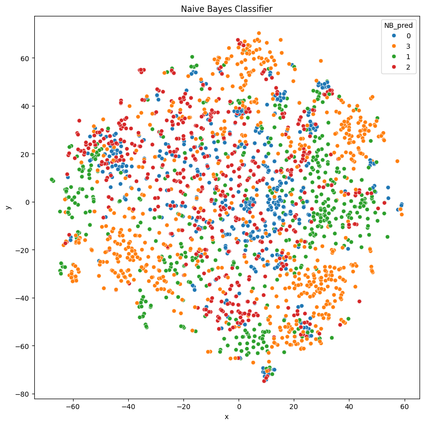

<a href="https://colab.research.google.com/github/dattali18/IR_Assignments/blob/main/Assignment.02/notebooks/IR_02_Classification_TFIDF-lemma.ipynb" target="_parent"></a>

# IR Assignment 2

## Classification

### **Objective**:
- Build classifiers to predict the journal group.

### **Algorithms**:
- **Artificial Neural Network (ANN)** (two architectures provided):
- ANN Architecture 1: RELU activation layers.
- ANN Architecture 2: GELU activation layers.
- **Other Classifiers**: Naive Bayes (NB), Support Vector Machine (SVM), Logistic Regression (LoR), Random Forest (RF).

### **Tasks**:
- Perform 10-fold cross-validation for all classifiers (except ANN).
- Identify and rank the top 20 most important features for NB, RF, SVM, LoR.
- Write explanations for feature importance in a README document and include the ranked lists in an Excel file.
- Check what is the top 20 most important features for NB, SVM, LoR, RF.

### **ANN Specifics**:
- Split data: Train (80%, with 10% validation from the train set) and Test (20%).
- Use the given ANN architectures with specific configurations:
- Maximum 15 epochs.
- Batch size: 32.
- Early stopping after 3 validation iterations without improvement.
- Save the best model (ModelCheckpoint).


```python
import warnings

warnings.filterwarnings("ignore")
```


```python
import pandas as pd

df_aj = pd.read_excel("bm25_lemma_A-J.xlsx")
df_bbc = pd.read_excel("bm25_lemma_BBC.xlsx")
df_nyt = pd.read_excel("bm25_lemma_NY-T.xlsx")
df_jp = pd.read_excel("bm25_lemma_J-P.xlsx")

df_aj.head()
```


<div id="df-ae269a5c-4c3a-4727-b13d-a021259a4cef" class="colab-df-container">
<div>
<style scoped>
.dataframe tbody tr th:only-of-type {
vertical-align: middle;
}

.dataframe tbody tr th {
vertical-align: top;
}

.dataframe thead th {
text-align: right;
}
</style>
<table border="1" class="dataframe">
<thead>
<tr style="text-align: right;">
<th></th>
<th>DocumentIndex</th>
<th>israel</th>
<th>say</th>
<th>gaza</th>
<th>israeli</th>
<th>hamas</th>
<th>war</th>
<th>palestinian</th>
<th>people</th>
<th>attack</th>
<th>...</th>
<th>disengagement</th>
<th>organizations</th>
<th>reprehensible</th>
<th>unintentional</th>
<th>kindertransport</th>
<th>parliamentarian</th>
<th>counterprotester</th>
<th>indiscriminately</th>
<th>south.newsonline</th>
<th>interdisciplinary</th>
</tr>
</thead>
<tbody>
<tr>
<th>0</th>
<td>0</td>
<td>0.000000</td>
<td>0.608707</td>
<td>1.853189</td>
<td>0.341663</td>
<td>0.0</td>
<td>0.016103</td>
<td>0.000000</td>
<td>0.0</td>
<td>0.0</td>
<td>...</td>
<td>0.0</td>
<td>0</td>
<td>0</td>
<td>0</td>
<td>0</td>
<td>0</td>
<td>0</td>
<td>0</td>
<td>0</td>
<td>0</td>
</tr>
<tr>
<th>1</th>
<td>1</td>
<td>1.840231</td>
<td>0.000000</td>
<td>0.000000</td>
<td>0.338359</td>
<td>0.0</td>
<td>0.000000</td>
<td>0.000000</td>
<td>0.0</td>
<td>0.0</td>
<td>...</td>
<td>0.0</td>
<td>0</td>
<td>0</td>
<td>0</td>
<td>0</td>
<td>0</td>
<td>0</td>
<td>0</td>
<td>0</td>
<td>0</td>
</tr>
<tr>
<th>2</th>
<td>2</td>
<td>0.000000</td>
<td>0.000000</td>
<td>1.934942</td>
<td>0.597895</td>
<td>0.0</td>
<td>0.000000</td>
<td>0.000000</td>
<td>0.0</td>
<td>0.0</td>
<td>...</td>
<td>0.0</td>
<td>0</td>
<td>0</td>
<td>0</td>
<td>0</td>
<td>0</td>
<td>0</td>
<td>0</td>
<td>0</td>
<td>0</td>
</tr>
<tr>
<th>3</th>
<td>3</td>
<td>1.248123</td>
<td>0.000000</td>
<td>1.248123</td>
<td>0.000000</td>
<td>0.0</td>
<td>0.015644</td>
<td>1.617242</td>
<td>0.0</td>
<td>0.0</td>
<td>...</td>
<td>0.0</td>
<td>0</td>
<td>0</td>
<td>0</td>
<td>0</td>
<td>0</td>
<td>0</td>
<td>0</td>
<td>0</td>
<td>0</td>
</tr>
<tr>
<th>4</th>
<td>4</td>
<td>0.000000</td>
<td>0.705080</td>
<td>2.055867</td>
<td>0.546761</td>
<td>0.0</td>
<td>0.000000</td>
<td>0.000000</td>
<td>0.0</td>
<td>0.0</td>
<td>...</td>
<td>0.0</td>
<td>0</td>
<td>0</td>
<td>0</td>
<td>0</td>
<td>0</td>
<td>0</td>
<td>0</td>
<td>0</td>
<td>0</td>
</tr>
</tbody>
</table>
<p>5 rows × 6199 columns</p>
</div>
<div class="colab-df-buttons">

<div class="colab-df-container">
<button class="colab-df-convert" onclick="convertToInteractive('df-ae269a5c-4c3a-4727-b13d-a021259a4cef')"
	title="Convert this dataframe to an interactive table."
	style="display:none;">

<svg xmlns="http://www.w3.org/2000/svg" height="24px" viewBox="0 -960 960 960">
<path d="M120-120v-720h720v720H120Zm60-500h600v-160H180v160Zm220 220h160v-160H400v160Zm0 220h160v-160H400v160ZM180-400h160v-160H180v160Zm440 0h160v-160H620v160ZM180-180h160v-160H180v160Zm440 0h160v-160H620v160Z"/>
</svg>
</button>

<style>
.colab-df-container {
display:flex;
gap: 12px;
}

.colab-df-convert {
background-color: #E8F0FE;
border: none;
border-radius: 50%;
cursor: pointer;
display: none;
fill: #1967D2;
height: 32px;
padding: 0 0 0 0;
width: 32px;
}

.colab-df-convert:hover {
background-color: #E2EBFA;
box-shadow: 0px 1px 2px rgba(60, 64, 67, 0.3), 0px 1px 3px 1px rgba(60, 64, 67, 0.15);
fill: #174EA6;
}

.colab-df-buttons div {
margin-bottom: 4px;
}

[theme=dark] .colab-df-convert {
background-color: #3B4455;
fill: #D2E3FC;
}

[theme=dark] .colab-df-convert:hover {
background-color: #434B5C;
box-shadow: 0px 1px 3px 1px rgba(0, 0, 0, 0.15);
filter: drop-shadow(0px 1px 2px rgba(0, 0, 0, 0.3));
fill: #FFFFFF;
}
</style>

<script>
const buttonEl =
document.querySelector('#df-ae269a5c-4c3a-4727-b13d-a021259a4cef button.colab-df-convert');
buttonEl.style.display =
google.colab.kernel.accessAllowed ? 'block' : 'none';

async function convertToInteractive(key) {
const element = document.querySelector('#df-ae269a5c-4c3a-4727-b13d-a021259a4cef');
const dataTable =
  await google.colab.kernel.invokeFunction('convertToInteractive',
											[key], {});
if (!dataTable) return;

const docLinkHtml = 'Like what you see? Visit the ' +
  '<a target="_blank" href=https://colab.research.google.com/notebooks/data_table.ipynb>data table notebook</a>'
  + ' to learn more about interactive tables.';
element.innerHTML = '';
dataTable['output_type'] = 'display_data';
await google.colab.output.renderOutput(dataTable, element);
const docLink = document.createElement('div');
docLink.innerHTML = docLinkHtml;
element.appendChild(docLink);
}
</script>
</div>


<div id="df-72118c74-c208-4fb9-9c9c-3e0722c817b1">
<button class="colab-df-quickchart" onclick="quickchart('df-72118c74-c208-4fb9-9c9c-3e0722c817b1')"
	title="Suggest charts"
	style="display:none;">

<svg xmlns="http://www.w3.org/2000/svg" height="24px"viewBox="0 0 24 24"
width="24px">
<g>
<path d="M19 3H5c-1.1 0-2 .9-2 2v14c0 1.1.9 2 2 2h14c1.1 0 2-.9 2-2V5c0-1.1-.9-2-2-2zM9 17H7v-7h2v7zm4 0h-2V7h2v10zm4 0h-2v-4h2v4z"/>
</g>
</svg>
</button>

<style>
.colab-df-quickchart {
--bg-color: #E8F0FE;
--fill-color: #1967D2;
--hover-bg-color: #E2EBFA;
--hover-fill-color: #174EA6;
--disabled-fill-color: #AAA;
--disabled-bg-color: #DDD;
}

[theme=dark] .colab-df-quickchart {
--bg-color: #3B4455;
--fill-color: #D2E3FC;
--hover-bg-color: #434B5C;
--hover-fill-color: #FFFFFF;
--disabled-bg-color: #3B4455;
--disabled-fill-color: #666;
}

.colab-df-quickchart {
background-color: var(--bg-color);
border: none;
border-radius: 50%;
cursor: pointer;
display: none;
fill: var(--fill-color);
height: 32px;
padding: 0;
width: 32px;
}

.colab-df-quickchart:hover {
background-color: var(--hover-bg-color);
box-shadow: 0 1px 2px rgba(60, 64, 67, 0.3), 0 1px 3px 1px rgba(60, 64, 67, 0.15);
fill: var(--button-hover-fill-color);
}

.colab-df-quickchart-complete:disabled,
.colab-df-quickchart-complete:disabled:hover {
background-color: var(--disabled-bg-color);
fill: var(--disabled-fill-color);
box-shadow: none;
}

.colab-df-spinner {
border: 2px solid var(--fill-color);
border-color: transparent;
border-bottom-color: var(--fill-color);
animation:
spin 1s steps(1) infinite;
}

@keyframes spin {
0% {
border-color: transparent;
border-bottom-color: var(--fill-color);
border-left-color: var(--fill-color);
}
20% {
border-color: transparent;
border-left-color: var(--fill-color);
border-top-color: var(--fill-color);
}
30% {
border-color: transparent;
border-left-color: var(--fill-color);
border-top-color: var(--fill-color);
border-right-color: var(--fill-color);
}
40% {
border-color: transparent;
border-right-color: var(--fill-color);
border-top-color: var(--fill-color);
}
60% {
border-color: transparent;
border-right-color: var(--fill-color);
}
80% {
border-color: transparent;
border-right-color: var(--fill-color);
border-bottom-color: var(--fill-color);
}
90% {
border-color: transparent;
border-bottom-color: var(--fill-color);
}
}
</style>

<script>
async function quickchart(key) {
const quickchartButtonEl =
document.querySelector('#' + key + ' button');
quickchartButtonEl.disabled = true;  // To prevent multiple clicks.
quickchartButtonEl.classList.add('colab-df-spinner');
try {
const charts = await google.colab.kernel.invokeFunction(
	'suggestCharts', [key], {});
} catch (error) {
console.error('Error during call to suggestCharts:', error);
}
quickchartButtonEl.classList.remove('colab-df-spinner');
quickchartButtonEl.classList.add('colab-df-quickchart-complete');
}
(() => {
let quickchartButtonEl =
document.querySelector('#df-72118c74-c208-4fb9-9c9c-3e0722c817b1 button');
quickchartButtonEl.style.display =
google.colab.kernel.accessAllowed ? 'block' : 'none';
})();
</script>
</div>

</div>
</div>


```python
# df_bbc = pd.read_excel("data/bm25_clean_BBC.xlsx")
# df_nyt = pd.read_excel("data/bm25_clean_NY-T.xlsx")
# df_jp = pd.read_excel("data/bm25_clean_J-P.xlsx")

print(df_bbc.shape)
print(df_nyt.shape)
print(df_jp.shape)
print(df_aj.shape)
```

(549, 6199)
(599, 6199)
(599, 6199)
(599, 6199)


```python
# create a new df where we concat all the 4 other df but before we add a 'sheet'
# col with aj for aj etc
# remove the DocumentIndex col
# and instead add an id of aj_<index> bbc_<index>

# create an id col
df_aj['id'] = 'aj_' + df_aj['DocumentIndex'].astype(str)
df_bbc['id'] = 'bbc_' + df_bbc['DocumentIndex'].astype(str)
df_nyt['id'] = 'nyt_' + df_nyt['DocumentIndex'].astype(str)
df_jp['id'] = 'jp_' + df_jp['DocumentIndex'].astype(str)

# remove the DocumentIndex col
df_aj = df_aj.drop(columns=['DocumentIndex'])
df_bbc = df_bbc.drop(columns=['DocumentIndex'])
df_nyt = df_nyt.drop(columns=['DocumentIndex'])
df_jp = df_jp.drop(columns=['DocumentIndex'])

# add an sheet col
df_aj['Sheet'] = 'A-J'
df_bbc['Sheet'] = 'BBC'
df_nyt['Sheet'] = 'NY-T'
df_jp['Sheet'] = 'J-P'

# concat all the 4 df
df = pd.concat([df_aj, df_bbc, df_nyt, df_jp])

df.shape
```


(2346, 6200)


```python
# reorder the col to have id and Sheet col to the start
df = df[['id', 'Sheet'] + [col for col in df.columns if col not in ['id', 'Sheet']]]

df.head()
```


<div id="df-62d54864-1b44-44ac-a183-abbd3becdd14" class="colab-df-container">
<div>
<style scoped>
.dataframe tbody tr th:only-of-type {
vertical-align: middle;
}

.dataframe tbody tr th {
vertical-align: top;
}

.dataframe thead th {
text-align: right;
}
</style>
<table border="1" class="dataframe">
<thead>
<tr style="text-align: right;">
<th></th>
<th>id</th>
<th>Sheet</th>
<th>israel</th>
<th>say</th>
<th>gaza</th>
<th>israeli</th>
<th>hamas</th>
<th>war</th>
<th>palestinian</th>
<th>people</th>
<th>...</th>
<th>disengagement</th>
<th>organizations</th>
<th>reprehensible</th>
<th>unintentional</th>
<th>kindertransport</th>
<th>parliamentarian</th>
<th>counterprotester</th>
<th>indiscriminately</th>
<th>south.newsonline</th>
<th>interdisciplinary</th>
</tr>
</thead>
<tbody>
<tr>
<th>0</th>
<td>aj_0</td>
<td>A-J</td>
<td>0.000000</td>
<td>0.608707</td>
<td>1.853189</td>
<td>0.341663</td>
<td>0.0</td>
<td>0.016103</td>
<td>0.000000</td>
<td>0.0</td>
<td>...</td>
<td>0.0</td>
<td>0.0</td>
<td>0.0</td>
<td>0.0</td>
<td>0.0</td>
<td>0.0</td>
<td>0.0</td>
<td>0.0</td>
<td>0</td>
<td>0.0</td>
</tr>
<tr>
<th>1</th>
<td>aj_1</td>
<td>A-J</td>
<td>1.840231</td>
<td>0.000000</td>
<td>0.000000</td>
<td>0.338359</td>
<td>0.0</td>
<td>0.000000</td>
<td>0.000000</td>
<td>0.0</td>
<td>...</td>
<td>0.0</td>
<td>0.0</td>
<td>0.0</td>
<td>0.0</td>
<td>0.0</td>
<td>0.0</td>
<td>0.0</td>
<td>0.0</td>
<td>0</td>
<td>0.0</td>
</tr>
<tr>
<th>2</th>
<td>aj_2</td>
<td>A-J</td>
<td>0.000000</td>
<td>0.000000</td>
<td>1.934942</td>
<td>0.597895</td>
<td>0.0</td>
<td>0.000000</td>
<td>0.000000</td>
<td>0.0</td>
<td>...</td>
<td>0.0</td>
<td>0.0</td>
<td>0.0</td>
<td>0.0</td>
<td>0.0</td>
<td>0.0</td>
<td>0.0</td>
<td>0.0</td>
<td>0</td>
<td>0.0</td>
</tr>
<tr>
<th>3</th>
<td>aj_3</td>
<td>A-J</td>
<td>1.248123</td>
<td>0.000000</td>
<td>1.248123</td>
<td>0.000000</td>
<td>0.0</td>
<td>0.015644</td>
<td>1.617242</td>
<td>0.0</td>
<td>...</td>
<td>0.0</td>
<td>0.0</td>
<td>0.0</td>
<td>0.0</td>
<td>0.0</td>
<td>0.0</td>
<td>0.0</td>
<td>0.0</td>
<td>0</td>
<td>0.0</td>
</tr>
<tr>
<th>4</th>
<td>aj_4</td>
<td>A-J</td>
<td>0.000000</td>
<td>0.705080</td>
<td>2.055867</td>
<td>0.546761</td>
<td>0.0</td>
<td>0.000000</td>
<td>0.000000</td>
<td>0.0</td>
<td>...</td>
<td>0.0</td>
<td>0.0</td>
<td>0.0</td>
<td>0.0</td>
<td>0.0</td>
<td>0.0</td>
<td>0.0</td>
<td>0.0</td>
<td>0</td>
<td>0.0</td>
</tr>
</tbody>
</table>
<p>5 rows × 6200 columns</p>
</div>
<div class="colab-df-buttons">

<div class="colab-df-container">
<button class="colab-df-convert" onclick="convertToInteractive('df-62d54864-1b44-44ac-a183-abbd3becdd14')"
	title="Convert this dataframe to an interactive table."
	style="display:none;">

<svg xmlns="http://www.w3.org/2000/svg" height="24px" viewBox="0 -960 960 960">
<path d="M120-120v-720h720v720H120Zm60-500h600v-160H180v160Zm220 220h160v-160H400v160Zm0 220h160v-160H400v160ZM180-400h160v-160H180v160Zm440 0h160v-160H620v160ZM180-180h160v-160H180v160Zm440 0h160v-160H620v160Z"/>
</svg>
</button>

<style>
.colab-df-container {
display:flex;
gap: 12px;
}

.colab-df-convert {
background-color: #E8F0FE;
border: none;
border-radius: 50%;
cursor: pointer;
display: none;
fill: #1967D2;
height: 32px;
padding: 0 0 0 0;
width: 32px;
}

.colab-df-convert:hover {
background-color: #E2EBFA;
box-shadow: 0px 1px 2px rgba(60, 64, 67, 0.3), 0px 1px 3px 1px rgba(60, 64, 67, 0.15);
fill: #174EA6;
}

.colab-df-buttons div {
margin-bottom: 4px;
}

[theme=dark] .colab-df-convert {
background-color: #3B4455;
fill: #D2E3FC;
}

[theme=dark] .colab-df-convert:hover {
background-color: #434B5C;
box-shadow: 0px 1px 3px 1px rgba(0, 0, 0, 0.15);
filter: drop-shadow(0px 1px 2px rgba(0, 0, 0, 0.3));
fill: #FFFFFF;
}
</style>

<script>
const buttonEl =
document.querySelector('#df-62d54864-1b44-44ac-a183-abbd3becdd14 button.colab-df-convert');
buttonEl.style.display =
google.colab.kernel.accessAllowed ? 'block' : 'none';

async function convertToInteractive(key) {
const element = document.querySelector('#df-62d54864-1b44-44ac-a183-abbd3becdd14');
const dataTable =
  await google.colab.kernel.invokeFunction('convertToInteractive',
											[key], {});
if (!dataTable) return;

const docLinkHtml = 'Like what you see? Visit the ' +
  '<a target="_blank" href=https://colab.research.google.com/notebooks/data_table.ipynb>data table notebook</a>'
  + ' to learn more about interactive tables.';
element.innerHTML = '';
dataTable['output_type'] = 'display_data';
await google.colab.output.renderOutput(dataTable, element);
const docLink = document.createElement('div');
docLink.innerHTML = docLinkHtml;
element.appendChild(docLink);
}
</script>
</div>


<div id="df-56030526-9483-461b-b407-f87c01aaa17c">
<button class="colab-df-quickchart" onclick="quickchart('df-56030526-9483-461b-b407-f87c01aaa17c')"
	title="Suggest charts"
	style="display:none;">

<svg xmlns="http://www.w3.org/2000/svg" height="24px"viewBox="0 0 24 24"
width="24px">
<g>
<path d="M19 3H5c-1.1 0-2 .9-2 2v14c0 1.1.9 2 2 2h14c1.1 0 2-.9 2-2V5c0-1.1-.9-2-2-2zM9 17H7v-7h2v7zm4 0h-2V7h2v10zm4 0h-2v-4h2v4z"/>
</g>
</svg>
</button>

<style>
.colab-df-quickchart {
--bg-color: #E8F0FE;
--fill-color: #1967D2;
--hover-bg-color: #E2EBFA;
--hover-fill-color: #174EA6;
--disabled-fill-color: #AAA;
--disabled-bg-color: #DDD;
}

[theme=dark] .colab-df-quickchart {
--bg-color: #3B4455;
--fill-color: #D2E3FC;
--hover-bg-color: #434B5C;
--hover-fill-color: #FFFFFF;
--disabled-bg-color: #3B4455;
--disabled-fill-color: #666;
}

.colab-df-quickchart {
background-color: var(--bg-color);
border: none;
border-radius: 50%;
cursor: pointer;
display: none;
fill: var(--fill-color);
height: 32px;
padding: 0;
width: 32px;
}

.colab-df-quickchart:hover {
background-color: var(--hover-bg-color);
box-shadow: 0 1px 2px rgba(60, 64, 67, 0.3), 0 1px 3px 1px rgba(60, 64, 67, 0.15);
fill: var(--button-hover-fill-color);
}

.colab-df-quickchart-complete:disabled,
.colab-df-quickchart-complete:disabled:hover {
background-color: var(--disabled-bg-color);
fill: var(--disabled-fill-color);
box-shadow: none;
}

.colab-df-spinner {
border: 2px solid var(--fill-color);
border-color: transparent;
border-bottom-color: var(--fill-color);
animation:
spin 1s steps(1) infinite;
}

@keyframes spin {
0% {
border-color: transparent;
border-bottom-color: var(--fill-color);
border-left-color: var(--fill-color);
}
20% {
border-color: transparent;
border-left-color: var(--fill-color);
border-top-color: var(--fill-color);
}
30% {
border-color: transparent;
border-left-color: var(--fill-color);
border-top-color: var(--fill-color);
border-right-color: var(--fill-color);
}
40% {
border-color: transparent;
border-right-color: var(--fill-color);
border-top-color: var(--fill-color);
}
60% {
border-color: transparent;
border-right-color: var(--fill-color);
}
80% {
border-color: transparent;
border-right-color: var(--fill-color);
border-bottom-color: var(--fill-color);
}
90% {
border-color: transparent;
border-bottom-color: var(--fill-color);
}
}
</style>

<script>
async function quickchart(key) {
const quickchartButtonEl =
document.querySelector('#' + key + ' button');
quickchartButtonEl.disabled = true;  // To prevent multiple clicks.
quickchartButtonEl.classList.add('colab-df-spinner');
try {
const charts = await google.colab.kernel.invokeFunction(
	'suggestCharts', [key], {});
} catch (error) {
console.error('Error during call to suggestCharts:', error);
}
quickchartButtonEl.classList.remove('colab-df-spinner');
quickchartButtonEl.classList.add('colab-df-quickchart-complete');
}
(() => {
let quickchartButtonEl =
document.querySelector('#df-56030526-9483-461b-b407-f87c01aaa17c button');
quickchartButtonEl.style.display =
google.colab.kernel.accessAllowed ? 'block' : 'none';
})();
</script>
</div>

</div>
</div>


```python
# create the vector col
df['vector'] = df.iloc[:, 2:].values.tolist()

df.head()
```


<div id="df-f857c073-ce37-4ee1-8a45-9b4785860d2c" class="colab-df-container">
<div>
<style scoped>
.dataframe tbody tr th:only-of-type {
vertical-align: middle;
}

.dataframe tbody tr th {
vertical-align: top;
}

.dataframe thead th {
text-align: right;
}
</style>
<table border="1" class="dataframe">
<thead>
<tr style="text-align: right;">
<th></th>
<th>id</th>
<th>Sheet</th>
<th>israel</th>
<th>say</th>
<th>gaza</th>
<th>israeli</th>
<th>hamas</th>
<th>war</th>
<th>palestinian</th>
<th>people</th>
<th>...</th>
<th>organizations</th>
<th>reprehensible</th>
<th>unintentional</th>
<th>kindertransport</th>
<th>parliamentarian</th>
<th>counterprotester</th>
<th>indiscriminately</th>
<th>south.newsonline</th>
<th>interdisciplinary</th>
<th>vector</th>
</tr>
</thead>
<tbody>
<tr>
<th>0</th>
<td>aj_0</td>
<td>A-J</td>
<td>0.000000</td>
<td>0.608707</td>
<td>1.853189</td>
<td>0.341663</td>
<td>0.0</td>
<td>0.016103</td>
<td>0.000000</td>
<td>0.0</td>
<td>...</td>
<td>0.0</td>
<td>0.0</td>
<td>0.0</td>
<td>0.0</td>
<td>0.0</td>
<td>0.0</td>
<td>0.0</td>
<td>0</td>
<td>0.0</td>
<td>[0.0, 0.6087072614680464, 1.853189492129971, 0...</td>
</tr>
<tr>
<th>1</th>
<td>aj_1</td>
<td>A-J</td>
<td>1.840231</td>
<td>0.000000</td>
<td>0.000000</td>
<td>0.338359</td>
<td>0.0</td>
<td>0.000000</td>
<td>0.000000</td>
<td>0.0</td>
<td>...</td>
<td>0.0</td>
<td>0.0</td>
<td>0.0</td>
<td>0.0</td>
<td>0.0</td>
<td>0.0</td>
<td>0.0</td>
<td>0</td>
<td>0.0</td>
<td>[1.840230999134734, 0.0, 0.0, 0.33835908243251...</td>
</tr>
<tr>
<th>2</th>
<td>aj_2</td>
<td>A-J</td>
<td>0.000000</td>
<td>0.000000</td>
<td>1.934942</td>
<td>0.597895</td>
<td>0.0</td>
<td>0.000000</td>
<td>0.000000</td>
<td>0.0</td>
<td>...</td>
<td>0.0</td>
<td>0.0</td>
<td>0.0</td>
<td>0.0</td>
<td>0.0</td>
<td>0.0</td>
<td>0.0</td>
<td>0</td>
<td>0.0</td>
<td>[0.0, 0.0, 1.934942053833065, 0.59789531808691...</td>
</tr>
<tr>
<th>3</th>
<td>aj_3</td>
<td>A-J</td>
<td>1.248123</td>
<td>0.000000</td>
<td>1.248123</td>
<td>0.000000</td>
<td>0.0</td>
<td>0.015644</td>
<td>1.617242</td>
<td>0.0</td>
<td>...</td>
<td>0.0</td>
<td>0.0</td>
<td>0.0</td>
<td>0.0</td>
<td>0.0</td>
<td>0.0</td>
<td>0.0</td>
<td>0</td>
<td>0.0</td>
<td>[1.248122821342216, 0.0, 1.248122821342216, 0....</td>
</tr>
<tr>
<th>4</th>
<td>aj_4</td>
<td>A-J</td>
<td>0.000000</td>
<td>0.705080</td>
<td>2.055867</td>
<td>0.546761</td>
<td>0.0</td>
<td>0.000000</td>
<td>0.000000</td>
<td>0.0</td>
<td>...</td>
<td>0.0</td>
<td>0.0</td>
<td>0.0</td>
<td>0.0</td>
<td>0.0</td>
<td>0.0</td>
<td>0.0</td>
<td>0</td>
<td>0.0</td>
<td>[0.0, 0.705079824655657, 2.055866819660789, 0....</td>
</tr>
</tbody>
</table>
<p>5 rows × 6201 columns</p>
</div>
<div class="colab-df-buttons">

<div class="colab-df-container">
<button class="colab-df-convert" onclick="convertToInteractive('df-f857c073-ce37-4ee1-8a45-9b4785860d2c')"
	title="Convert this dataframe to an interactive table."
	style="display:none;">

<svg xmlns="http://www.w3.org/2000/svg" height="24px" viewBox="0 -960 960 960">
<path d="M120-120v-720h720v720H120Zm60-500h600v-160H180v160Zm220 220h160v-160H400v160Zm0 220h160v-160H400v160ZM180-400h160v-160H180v160Zm440 0h160v-160H620v160ZM180-180h160v-160H180v160Zm440 0h160v-160H620v160Z"/>
</svg>
</button>

<style>
.colab-df-container {
display:flex;
gap: 12px;
}

.colab-df-convert {
background-color: #E8F0FE;
border: none;
border-radius: 50%;
cursor: pointer;
display: none;
fill: #1967D2;
height: 32px;
padding: 0 0 0 0;
width: 32px;
}

.colab-df-convert:hover {
background-color: #E2EBFA;
box-shadow: 0px 1px 2px rgba(60, 64, 67, 0.3), 0px 1px 3px 1px rgba(60, 64, 67, 0.15);
fill: #174EA6;
}

.colab-df-buttons div {
margin-bottom: 4px;
}

[theme=dark] .colab-df-convert {
background-color: #3B4455;
fill: #D2E3FC;
}

[theme=dark] .colab-df-convert:hover {
background-color: #434B5C;
box-shadow: 0px 1px 3px 1px rgba(0, 0, 0, 0.15);
filter: drop-shadow(0px 1px 2px rgba(0, 0, 0, 0.3));
fill: #FFFFFF;
}
</style>

<script>
const buttonEl =
document.querySelector('#df-f857c073-ce37-4ee1-8a45-9b4785860d2c button.colab-df-convert');
buttonEl.style.display =
google.colab.kernel.accessAllowed ? 'block' : 'none';

async function convertToInteractive(key) {
const element = document.querySelector('#df-f857c073-ce37-4ee1-8a45-9b4785860d2c');
const dataTable =
  await google.colab.kernel.invokeFunction('convertToInteractive',
											[key], {});
if (!dataTable) return;

const docLinkHtml = 'Like what you see? Visit the ' +
  '<a target="_blank" href=https://colab.research.google.com/notebooks/data_table.ipynb>data table notebook</a>'
  + ' to learn more about interactive tables.';
element.innerHTML = '';
dataTable['output_type'] = 'display_data';
await google.colab.output.renderOutput(dataTable, element);
const docLink = document.createElement('div');
docLink.innerHTML = docLinkHtml;
element.appendChild(docLink);
}
</script>
</div>


<div id="df-95e9fe76-4291-4f61-be01-827f38dde288">
<button class="colab-df-quickchart" onclick="quickchart('df-95e9fe76-4291-4f61-be01-827f38dde288')"
	title="Suggest charts"
	style="display:none;">

<svg xmlns="http://www.w3.org/2000/svg" height="24px"viewBox="0 0 24 24"
width="24px">
<g>
<path d="M19 3H5c-1.1 0-2 .9-2 2v14c0 1.1.9 2 2 2h14c1.1 0 2-.9 2-2V5c0-1.1-.9-2-2-2zM9 17H7v-7h2v7zm4 0h-2V7h2v10zm4 0h-2v-4h2v4z"/>
</g>
</svg>
</button>

<style>
.colab-df-quickchart {
--bg-color: #E8F0FE;
--fill-color: #1967D2;
--hover-bg-color: #E2EBFA;
--hover-fill-color: #174EA6;
--disabled-fill-color: #AAA;
--disabled-bg-color: #DDD;
}

[theme=dark] .colab-df-quickchart {
--bg-color: #3B4455;
--fill-color: #D2E3FC;
--hover-bg-color: #434B5C;
--hover-fill-color: #FFFFFF;
--disabled-bg-color: #3B4455;
--disabled-fill-color: #666;
}

.colab-df-quickchart {
background-color: var(--bg-color);
border: none;
border-radius: 50%;
cursor: pointer;
display: none;
fill: var(--fill-color);
height: 32px;
padding: 0;
width: 32px;
}

.colab-df-quickchart:hover {
background-color: var(--hover-bg-color);
box-shadow: 0 1px 2px rgba(60, 64, 67, 0.3), 0 1px 3px 1px rgba(60, 64, 67, 0.15);
fill: var(--button-hover-fill-color);
}

.colab-df-quickchart-complete:disabled,
.colab-df-quickchart-complete:disabled:hover {
background-color: var(--disabled-bg-color);
fill: var(--disabled-fill-color);
box-shadow: none;
}

.colab-df-spinner {
border: 2px solid var(--fill-color);
border-color: transparent;
border-bottom-color: var(--fill-color);
animation:
spin 1s steps(1) infinite;
}

@keyframes spin {
0% {
border-color: transparent;
border-bottom-color: var(--fill-color);
border-left-color: var(--fill-color);
}
20% {
border-color: transparent;
border-left-color: var(--fill-color);
border-top-color: var(--fill-color);
}
30% {
border-color: transparent;
border-left-color: var(--fill-color);
border-top-color: var(--fill-color);
border-right-color: var(--fill-color);
}
40% {
border-color: transparent;
border-right-color: var(--fill-color);
border-top-color: var(--fill-color);
}
60% {
border-color: transparent;
border-right-color: var(--fill-color);
}
80% {
border-color: transparent;
border-right-color: var(--fill-color);
border-bottom-color: var(--fill-color);
}
90% {
border-color: transparent;
border-bottom-color: var(--fill-color);
}
}
</style>

<script>
async function quickchart(key) {
const quickchartButtonEl =
document.querySelector('#' + key + ' button');
quickchartButtonEl.disabled = true;  // To prevent multiple clicks.
quickchartButtonEl.classList.add('colab-df-spinner');
try {
const charts = await google.colab.kernel.invokeFunction(
	'suggestCharts', [key], {});
} catch (error) {
console.error('Error during call to suggestCharts:', error);
}
quickchartButtonEl.classList.remove('colab-df-spinner');
quickchartButtonEl.classList.add('colab-df-quickchart-complete');
}
(() => {
let quickchartButtonEl =
document.querySelector('#df-95e9fe76-4291-4f61-be01-827f38dde288 button');
quickchartButtonEl.style.display =
google.colab.kernel.accessAllowed ? 'block' : 'none';
})();
</script>
</div>

</div>
</div>


```python
# standerdize the data mean=0 std=1
import numpy as np

from sklearn.preprocessing import StandardScaler

scaler = StandardScaler()

# apply to each line of the df

df['std_vector'] = df['vector'].apply(lambda x: scaler.fit_transform(np.array(x).reshape(-1, 1)).flatten())
df['std_vector'].head()
```


<div>
<style scoped>
.dataframe tbody tr th:only-of-type {
vertical-align: middle;
}

.dataframe tbody tr th {
vertical-align: top;
}

.dataframe thead th {
text-align: right;
}
</style>
<table border="1" class="dataframe">
<thead>
<tr style="text-align: right;">
<th></th>
<th>std_vector</th>
</tr>
</thead>
<tbody>
<tr>
<th>0</th>
<td>[-0.06111568208121147, 1.8181979344637045, 5.6...</td>
</tr>
<tr>
<th>1</th>
<td>[6.817879904133084, -0.07009259968963384, -0.0...</td>
</tr>
<tr>
<th>2</th>
<td>[-0.06708451430912732, -0.06708451430912732, 7...</td>
</tr>
<tr>
<th>3</th>
<td>[4.339409504687963, -0.06208607680136964, 4.33...</td>
</tr>
<tr>
<th>4</th>
<td>[-0.06034887738404957, 2.6997511450036713, 7.9...</td>
</tr>
</tbody>
</table>
</div><br><label><b>dtype:</b> object</label>


```python
# visualize the real cluster using t-SNE

from sklearn.manifold import TSNE

tsne = TSNE(n_components=2, random_state=0)

# transofrm the df['vector'] to dataframe with freatuer 0 - 99 for
df_copy = df['std_vector'].apply(pd.Series)

df_tsne = tsne.fit_transform(df_copy)

df_tsne = pd.DataFrame(df_tsne, columns=['x', 'y'])
```


```python
# plot the data
import matplotlib.pyplot as plt
import seaborn as sns

df_tsne['cluster'] = df['Sheet'].values

plt.figure(figsize=(10, 10))

sns.scatterplot(data=df_tsne, x="x", y="y", hue="cluster")

plt.show()
```


```python
# import all the the needed libraries NaiveBayes, SVM, LoR, RF
data = df['std_vector'].tolist()
```


```python
data = np.array(data)
```


```python
type(data)
```


numpy.ndarray


```python
data.shape
```


(2346, 6198)


```python
df['cluster'] = df['Sheet'].map({'A-J': 0, 'BBC': 1, 'NY-T': 2, 'J-P': 3})
```

## Naive Bayes Classifier


```python
# naive bayes
from sklearn.model_selection import train_test_split
from sklearn.naive_bayes import GaussianNB

X = data
y = df['cluster'].to_numpy()

X_train, X_test, y_train, y_test = train_test_split(X, y, test_size=0.29, random_state=42)

print("X_train shape:", X_train.shape)
print("y_train shape:", y_train.shape)
print("X_train type:", type(X_train))
print("y_train type:", type(y_train))
```

X_train shape: (1665, 6198)
y_train shape: (1665,)
X_train type: <class 'numpy.ndarray'>
y_train type: <class 'numpy.ndarray'>


```python
# use Naive Bayes with 10-fold cross validation
from sklearn.model_selection import cross_val_score

gnb = GaussianNB()

scores = cross_val_score(gnb, X_train, y_train, cv=10)

print("Accuracy: %0.2f (+/- %0.2f)" % (scores.mean(), scores.std() * 2))
```

Accuracy: 0.60 (+/- 0.05)


```python
from sklearn.metrics import ConfusionMatrixDisplay

gnb.fit(X_train, y_train)

disp = ConfusionMatrixDisplay.from_estimator(gnb, X_test, y_test)

disp.plot()

plt.show()
```


```python
# get the calssification report for all X from the model and color the results using the tsne plot
df_tsne['NB_pred'] = gnb.predict(X)
df_tsne['NB_pred'] = df_tsne['NB_pred'].map(str)


plt.figure(figsize=(10, 10))

#  add title
plt.title("Naive Bayes Classifier")

sns.scatterplot(data=df_tsne, x="x", y="y", hue="NB_pred")

plt.show()
```





```python
# get the top 20 atributes by the highest weight
theta = gnb.theta_

for k in range(4):
print(f"Printing top 20 attribute for group k={k}")
top20_theta = np.argsort(theta[k])[-20:]
cols = df.columns[2:-1]
for i in top20_theta:
print(f"Feature {i}: {cols[i]}")
```

Printing top 20 attribute for group k=0
Feature 62: city
Feature 112: protest
Feature 1: say
Feature 158: student
Feature 89: hospital
Feature 154: arrest
Feature 22: day
Feature 23: force
Feature 116: university
Feature 45: rafah
Feature 17: us
Feature 21: palestinians
Feature 39: al
Feature 58: un
Feature 74: continue
Feature 6: palestinian
Feature 8: attack
Feature 12: kill
Feature 0: israel
Feature 2: gaza
Printing top 20 attribute for group k=1
Feature 6: palestinian
Feature 49: october
Feature 23: force
Feature 13: one
Feature 25: call
Feature 76: bbc
Feature 31: tell
Feature 10: would
Feature 14: military
Feature 11: also
Feature 15: take
Feature 8: attack
Feature 5: war
Feature 12: kill
Feature 7: people
Feature 4: hamas
Feature 3: israeli
Feature 2: gaza
Feature 0: israel
Feature 1: say
Printing top 20 attribute for group k=2
Feature 623: trump
Feature 1: say
Feature 14: military
Feature 1319: u.n
Feature 12: kill
Feature 5: war
Feature 3: israeli
Feature 112: protest
Feature 4: hamas
Feature 47: new
Feature 8: attack
Feature 548: cease
Feature 43: strike
Feature 64: fire
Feature 29: netanyahu
Feature 1006: u.s
Feature 55: biden
Feature 16: aid
Feature 37: iran
Feature 0: israel
Printing top 20 attribute for group k=3
Feature 64: fire
Feature 39: al
Feature 208: near
Feature 394: morning
Feature 136: target
Feature 71: operation
Feature 176: rocket
Feature 9: nbsp
Feature 43: strike
Feature 79: police
Feature 26: include
Feature 27: two
Feature 15: take
Feature 10: would
Feature 13: one
Feature 24: year
Feature 11: also
Feature 3: israeli
Feature 1: say
Feature 0: israel


## SVM - Support Vector Machine


```python
# use SVM with 10-fold cross validation
from sklearn.svm import SVC

svc = SVC()

scores = cross_val_score(svc, X_train, y_train, cv=10)

print("Accuracy: %0.2f (+/- %0.2f)" % (scores.mean(), scores.std() * 2))
```

Accuracy: 0.93 (+/- 0.04)


```python
# same as NB

svc.fit(X_train, y_train)

disp = ConfusionMatrixDisplay.from_estimator(svc, X_test, y_test)

disp.plot()

plt.show()
```


```python
# get the calssification report for all X from the model and color the results using the tsne plot
df_tsne["SVM_pred"] = svc.predict(X)
df_tsne["SVM_pred"] = df_tsne["SVM_pred"].map(str)


plt.figure(figsize=(10, 10))

sns.scatterplot(data=df_tsne, x="x", y="y", hue="SVM_pred")

plt.show()
```


```python
weights = svc._get_coef()

# get the top 20 attributes per class

top20_attr = np.argsort(weights)[:, -20:]

for j in top20_attr[i]:
print(f"Feature {j}: {df.columns[j+2]}")
```

Feature 40: official
Feature 2310: kingdom
Feature 162: launch
Feature 24: year
Feature 48: country
Feature 45: rafah
Feature 35: government
Feature 74: continue
Feature 29: netanyahu
Feature 32: state
Feature 43: strike
Feature 62: city
Feature 39: al
Feature 50: international
Feature 59: world
Feature 16: aid
Feature 34: report
Feature 58: un
Feature 2: gaza
Feature 21: palestinians


## Logistic Regression


```python
# use Logistic Regression with 10-fold cross validation

from sklearn.linear_model import LogisticRegression

lr = LogisticRegression()

scores = cross_val_score(lr, X_train, y_train, cv=10)

print("Accuracy: %0.2f (+/- %0.2f)" % (scores.mean(), scores.std() * 2))
```

Accuracy: 0.91 (+/- 0.06)


```python
# same

# visualize the results of the classification for all the X

lr.fit(X_train, y_train)

disp = ConfusionMatrixDisplay.from_estimator(lr, X_test, y_test)

disp.plot()

plt.show()
```


```python
# plot the results using tsne

df_tsne["LR_pred"] = lr.predict(X)
df_tsne["LR_pred"] = df_tsne["LR_pred"].map(str)

plt.figure(figsize=(10, 10))

sns.scatterplot(data=df_tsne, x="x", y="y", hue="LR_pred")

plt.show()
```


```python
# get the top 20 attribute per weight

weights = lr.coef_

top20_attr = np.argsort(weights)[:, -20:]

for j in top20_attr[i]:
print(f"Feature {j}: {df.columns[j+2]}")
```

Feature 300: defence
Feature 1800: occupied
Feature 102: ceasefire
Feature 436: joe
Feature 2310: kingdom
Feature 59: world
Feature 250: chief
Feature 243: uk
Feature 357: states
Feature 304: palestine
Feature 1841: guide
Feature 34: report
Feature 48: country
Feature 487: anti
Feature 50: international
Feature 32: state
Feature 958: icj
Feature 17: us
Feature 58: un
Feature 2: gaza


# RF - Random Forest Classifier


```python
# use Random Forest with 10-fold cross validation

from sklearn.ensemble import RandomForestClassifier

rf = RandomForestClassifier()

scores = cross_val_score(rf, X_train, y_train, cv=10)

print("Accuracy: %0.2f (+/- %0.2f)" % (scores.mean(), scores.std() * 2))
```

Accuracy: 0.98 (+/- 0.03)


```python
# same

# visualize the results of the classification for all the X

rf.fit(X_train, y_train)

disp = ConfusionMatrixDisplay.from_estimator(rf, X_test, y_test)

disp.plot()

plt.show()
```


```python
# plot the results using tsne

df_tsne["RF_pred"] = rf.predict(X)
df_tsne["RF_pred"] = df_tsne["RF_pred"].map(str)

plt.figure(figsize=(10, 10))

sns.scatterplot(data=df_tsne, x="x", y="y", hue="RF_pred")

plt.show()
```


# ANN - Artificial Neural Network Classifier

We will build a NN using `tensorflow` and `keras` to classify the journal group.

The architecture of the NN is as follows:

- Embedding layer with 100 input dimensions.
- Hidden layer with 10 node and `relu` activation function.
- Hidden layer with 10 node and `relu` activation function.
- Hidden layer with 7 node and `relu` activation function.
- Output layer with 4 nodes and `softmax` activation function. (4 classes)

Seconde architecture:

- Embedding layer with 100 input dimensions.
- Hidden layer with 10 node and `gelu` activation function.
- Hidden layer with 10 node and `gelu` activation function.
- Hidden layer with 7 node and `gelu` activation function.
- Output layer with 4 nodes and `softmax` activation function. (4 classes)


```python
X = X.astype(np.float32)
y = y.astype(int)
```


```python
from sklearn.model_selection import train_test_split

X_train, X_test, y_train, y_test = train_test_split(X, y, test_size=0.2, random_state=42)
```


```python
from tensorflow.keras.models import Sequential

from tensorflow.keras.layers import Dense

model_1 = Sequential([
Dense(100, activation='relu', input_shape=(X.shape[1],)),
Dense(10, activation='relu'),
Dense(10, activation='relu'),
Dense(7, activation='relu'),
Dense(4, activation='softmax')
])

# compile the model
model_1.compile(optimizer='adam',
		loss='sparse_categorical_crossentropy',
		metrics=['accuracy'])

# fit the model
history = model_1.fit(X_train, y_train, epochs=15, batch_size=32, validation_split=0.2)
```

Epoch 1/15
47/47 ━━━━━━━━━━━━━━━━━━━━ 8s 98ms/step - accuracy: 0.3559 - loss: 1.3030 - val_accuracy: 0.6702 - val_loss: 0.9104
Epoch 2/15
47/47 ━━━━━━━━━━━━━━━━━━━━ 4s 3ms/step - accuracy: 0.7326 - loss: 0.7399 - val_accuracy: 0.8537 - val_loss: 0.4765
Epoch 3/15
47/47 ━━━━━━━━━━━━━━━━━━━━ 0s 3ms/step - accuracy: 0.9299 - loss: 0.2036 - val_accuracy: 0.8830 - val_loss: 0.3752
Epoch 4/15
47/47 ━━━━━━━━━━━━━━━━━━━━ 0s 4ms/step - accuracy: 0.9751 - loss: 0.0646 - val_accuracy: 0.8936 - val_loss: 0.3656
Epoch 5/15
47/47 ━━━━━━━━━━━━━━━━━━━━ 0s 3ms/step - accuracy: 0.9773 - loss: 0.0433 - val_accuracy: 0.8590 - val_loss: 0.4153
Epoch 6/15
47/47 ━━━━━━━━━━━━━━━━━━━━ 0s 3ms/step - accuracy: 0.9874 - loss: 0.0268 - val_accuracy: 0.8644 - val_loss: 0.4384
Epoch 7/15
47/47 ━━━━━━━━━━━━━━━━━━━━ 0s 3ms/step - accuracy: 0.9945 - loss: 0.0143 - val_accuracy: 0.8830 - val_loss: 0.4421
Epoch 8/15
47/47 ━━━━━━━━━━━━━━━━━━━━ 0s 4ms/step - accuracy: 0.9930 - loss: 0.0126 - val_accuracy: 0.8830 - val_loss: 0.4281
Epoch 9/15
47/47 ━━━━━━━━━━━━━━━━━━━━ 0s 3ms/step - accuracy: 0.9935 - loss: 0.0137 - val_accuracy: 0.8777 - val_loss: 0.4540
Epoch 10/15
47/47 ━━━━━━━━━━━━━━━━━━━━ 0s 3ms/step - accuracy: 0.9988 - loss: 0.0059 - val_accuracy: 0.8803 - val_loss: 0.4531
Epoch 11/15
47/47 ━━━━━━━━━━━━━━━━━━━━ 0s 3ms/step - accuracy: 0.9995 - loss: 0.0048 - val_accuracy: 0.8723 - val_loss: 0.4593
Epoch 12/15
47/47 ━━━━━━━━━━━━━━━━━━━━ 0s 3ms/step - accuracy: 1.0000 - loss: 0.0026 - val_accuracy: 0.8723 - val_loss: 0.4746
Epoch 13/15
47/47 ━━━━━━━━━━━━━━━━━━━━ 0s 3ms/step - accuracy: 0.9983 - loss: 0.0041 - val_accuracy: 0.8723 - val_loss: 0.4887
Epoch 14/15
47/47 ━━━━━━━━━━━━━━━━━━━━ 0s 3ms/step - accuracy: 0.9992 - loss: 0.0026 - val_accuracy: 0.8697 - val_loss: 0.4964
Epoch 15/15
47/47 ━━━━━━━━━━━━━━━━━━━━ 0s 3ms/step - accuracy: 0.9997 - loss: 0.0016 - val_accuracy: 0.8697 - val_loss: 0.5035


```python
# model 2

model_2 = Sequential(
[
Dense(100, activation="gelu", input_shape=(X.shape[1],)),
Dense(10, activation="gelu"),
Dense(10, activation="gelu"),
Dense(7, activation="gelu"),
Dense(4, activation="softmax"),
]
)

# compile the model
model_2.compile(optimizer='adam',
		loss='sparse_categorical_crossentropy',
		metrics=['accuracy'])

# fit the model
history = model_2.fit(X_train, y_train, epochs=15, batch_size=32, validation_split=0.2)
```

Epoch 1/15
47/47 ━━━━━━━━━━━━━━━━━━━━ 7s 100ms/step - accuracy: 0.4332 - loss: 1.2011 - val_accuracy: 0.7766 - val_loss: 0.6309
Epoch 2/15
47/47 ━━━━━━━━━━━━━━━━━━━━ 5s 3ms/step - accuracy: 0.9318 - loss: 0.2934 - val_accuracy: 0.8351 - val_loss: 0.4277
Epoch 3/15
47/47 ━━━━━━━━━━━━━━━━━━━━ 0s 3ms/step - accuracy: 0.9942 - loss: 0.0411 - val_accuracy: 0.8404 - val_loss: 0.4190
Epoch 4/15
47/47 ━━━━━━━━━━━━━━━━━━━━ 0s 3ms/step - accuracy: 0.9963 - loss: 0.0135 - val_accuracy: 0.8511 - val_loss: 0.4447
Epoch 5/15
47/47 ━━━━━━━━━━━━━━━━━━━━ 0s 3ms/step - accuracy: 0.9967 - loss: 0.0112 - val_accuracy: 0.8617 - val_loss: 0.4231
Epoch 6/15
47/47 ━━━━━━━━━━━━━━━━━━━━ 0s 3ms/step - accuracy: 1.0000 - loss: 0.0030 - val_accuracy: 0.8590 - val_loss: 0.4430
Epoch 7/15
47/47 ━━━━━━━━━━━━━━━━━━━━ 0s 3ms/step - accuracy: 1.0000 - loss: 0.0013 - val_accuracy: 0.8590 - val_loss: 0.4505
Epoch 8/15
47/47 ━━━━━━━━━━━━━━━━━━━━ 0s 3ms/step - accuracy: 1.0000 - loss: 8.9089e-04 - val_accuracy: 0.8590 - val_loss: 0.4577
Epoch 9/15
47/47 ━━━━━━━━━━━━━━━━━━━━ 0s 3ms/step - accuracy: 1.0000 - loss: 8.4366e-04 - val_accuracy: 0.8590 - val_loss: 0.4641
Epoch 10/15
47/47 ━━━━━━━━━━━━━━━━━━━━ 0s 3ms/step - accuracy: 1.0000 - loss: 6.9478e-04 - val_accuracy: 0.8564 - val_loss: 0.4700
Epoch 11/15
47/47 ━━━━━━━━━━━━━━━━━━━━ 0s 3ms/step - accuracy: 1.0000 - loss: 4.9077e-04 - val_accuracy: 0.8537 - val_loss: 0.4749
Epoch 12/15
47/47 ━━━━━━━━━━━━━━━━━━━━ 0s 3ms/step - accuracy: 1.0000 - loss: 4.0492e-04 - val_accuracy: 0.8537 - val_loss: 0.4795
Epoch 13/15
47/47 ━━━━━━━━━━━━━━━━━━━━ 0s 3ms/step - accuracy: 1.0000 - loss: 3.2777e-04 - val_accuracy: 0.8537 - val_loss: 0.4839
Epoch 14/15
47/47 ━━━━━━━━━━━━━━━━━━━━ 0s 3ms/step - accuracy: 1.0000 - loss: 3.1186e-04 - val_accuracy: 0.8537 - val_loss: 0.4879
Epoch 15/15
47/47 ━━━━━━━━━━━━━━━━━━━━ 0s 3ms/step - accuracy: 1.0000 - loss: 2.5069e-04 - val_accuracy: 0.8511 - val_loss: 0.4919


```python
# check the accuracy of the models

# model 1
loss, accuracy = model_1.evaluate(X_test, y_test)

print("Model 1 Accuracy: ", accuracy)

# model 2

loss, accuracy = model_2.evaluate(X_test, y_test)

print("Model 2 Accuracy: ", accuracy)
```

15/15 ━━━━━━━━━━━━━━━━━━━━ 1s 58ms/step - accuracy: 0.8711 - loss: 0.4473
Model 1 Accuracy:  0.8553191423416138
15/15 ━━━━━━━━━━━━━━━━━━━━ 1s 43ms/step - accuracy: 0.8495 - loss: 0.4969
Model 2 Accuracy:  0.8425531983375549


```python
# plot the prediction for model 1

predictions = model_1.predict(X)

# Convert probabilities to class labels
predicted_classes = np.argmax(predictions, axis=1)


df_tsne["model_1_pred"] = [str(cls) for cls in predicted_classes]

plt.figure(figsize=(10, 10))

sns.scatterplot(data=df_tsne, x="x", y="y", hue="model_1_pred")

plt.show()
```

74/74 ━━━━━━━━━━━━━━━━━━━━ 1s 7ms/step


```python
# plot the prediction for model 1

predictions = model_2.predict(X)

# Convert probabilities to class labels
predicted_classes = np.argmax(predictions, axis=1)


df_tsne["model_2_pred"] = [str(cls) for cls in predicted_classes]

plt.figure(figsize=(10, 10))

sns.scatterplot(data=df_tsne, x="x", y="y", hue="model_2_pred")

plt.show()
```

74/74 ━━━━━━━━━━━━━━━━━━━━ 1s 7ms/step


```python
# save the model into a file

model_1.save("model_1_tfidf-lemma.h5")

model_2.save("model_2_tfidf-lemma.h5")
```

WARNING:absl:You are saving your model as an HDF5 file via `model.save()` or `keras.saving.save_model(model)`. This file format is considered legacy. We recommend using instead the native Keras format, e.g. `model.save('my_model.keras')` or `keras.saving.save_model(model, 'my_model.keras')`. 
WARNING:absl:You are saving your model as an HDF5 file via `model.save()` or `keras.saving.save_model(model)`. This file format is considered legacy. We recommend using instead the native Keras format, e.g. `model.save('my_model.keras')` or `keras.saving.save_model(model, 'my_model.keras')`. 

