<a href="https://colab.research.google.com/github/dattali18/IR_Assignments/blob/main/Assignment.02/notebooks/IR_02_Classification_TFIDF.ipynb" target="_parent"></a>

# IR Assignment 2

## Classification

### **Objective**:
- Build classifiers to predict the journal group.

### **Algorithms**:
- **Artificial Neural Network (ANN)** (two architectures provided):
  - ANN Architecture 1: RELU activation layers.
  - ANN Architecture 2: GELU activation layers.
- **Other Classifiers**: Naive Bayes (NB), Support Vector Machine (SVM), Logistic Regression (LoR), Random Forest (RF).

### **Tasks**:
- Perform 10-fold cross-validation for all classifiers (except ANN).
- Identify and rank the top 20 most important features for NB, RF, SVM, LoR.
- Write explanations for feature importance in a README document and include the ranked lists in an Excel file.
- Check what is the top 20 most important features for the ANN models.

### **ANN Specifics**:
- Split data: Train (80%, with 10% validation from the train set) and Test (20%).
- Use the given ANN architectures with specific configurations:
  - Maximum 15 epochs.
  - Batch size: 32.
  - Early stopping after 3 validation iterations without improvement.
  - Save the best model (ModelCheckpoint).


```python
import warnings

warnings.filterwarnings("ignore")
```


```python
import pandas as pd

df_aj = pd.read_excel("data/bm25_clean_A-J.xlsx")
df_bbc = pd.read_excel("data/bm25_clean_BBC.xlsx")
df_nyt = pd.read_excel("data/bm25_clean_NY-T.xlsx")
df_jp = pd.read_excel("data/bm25_clean_J-P.xlsx")

df_aj.head()
```


<div id="df-7ece8899-f974-403d-8141-d7a314eb91ce" class="colab-df-container">
<div>
<style scoped>
.dataframe tbody tr th:only-of-type {
	vertical-align: middle;
}

.dataframe tbody tr th {
	vertical-align: top;
}

.dataframe thead th {
	text-align: right;
}
</style>
<table border="1" class="dataframe">
<thead>
<tr style="text-align: right;">
  <th></th>
  <th>DocumentIndex</th>
  <th>israel</th>
  <th>said</th>
  <th>gaza</th>
  <th>israeli</th>
  <th>hamas</th>
  <th>rsquo</th>
  <th>ldquo</th>
  <th>rdquo</th>
  <th>war</th>
  <th>...</th>
  <th>inconsistencies</th>
  <th>kindertransport</th>
  <th>longest-serving</th>
  <th>indiscriminately</th>
  <th>american-supplied</th>
  <th>behind-the-scenes</th>
  <th>counterproductive</th>
  <th>counterprotesters</th>
  <th>interdisciplinary</th>
  <th>counter-protesters</th>
</tr>
</thead>
<tbody>
<tr>
  <th>0</th>
  <td>0</td>
  <td>0.00000</td>
  <td>0.0</td>
  <td>1.893326</td>
  <td>0.373610</td>
  <td>0.0</td>
  <td>0</td>
  <td>0</td>
  <td>0</td>
  <td>0.0000</td>
  <td>...</td>
  <td>0</td>
  <td>0</td>
  <td>0</td>
  <td>0</td>
  <td>0</td>
  <td>0.0</td>
  <td>0</td>
  <td>0</td>
  <td>0</td>
  <td>0.0</td>
</tr>
<tr>
  <th>1</th>
  <td>1</td>
  <td>0.18534</td>
  <td>0.0</td>
  <td>0.000000</td>
  <td>0.377472</td>
  <td>0.0</td>
  <td>0</td>
  <td>0</td>
  <td>0</td>
  <td>0.0000</td>
  <td>...</td>
  <td>0</td>
  <td>0</td>
  <td>0</td>
  <td>0</td>
  <td>0</td>
  <td>0.0</td>
  <td>0</td>
  <td>0</td>
  <td>0</td>
  <td>0.0</td>
</tr>
<tr>
  <th>2</th>
  <td>2</td>
  <td>0.00000</td>
  <td>0.0</td>
  <td>1.950967</td>
  <td>0.648199</td>
  <td>0.0</td>
  <td>0</td>
  <td>0</td>
  <td>0</td>
  <td>0.0000</td>
  <td>...</td>
  <td>0</td>
  <td>0</td>
  <td>0</td>
  <td>0</td>
  <td>0</td>
  <td>0.0</td>
  <td>0</td>
  <td>0</td>
  <td>0</td>
  <td>0.0</td>
</tr>
<tr>
  <th>3</th>
  <td>3</td>
  <td>0.00000</td>
  <td>0.0</td>
  <td>1.338546</td>
  <td>0.000000</td>
  <td>0.0</td>
  <td>0</td>
  <td>0</td>
  <td>0</td>
  <td>0.0557</td>
  <td>...</td>
  <td>0</td>
  <td>0</td>
  <td>0</td>
  <td>0</td>
  <td>0</td>
  <td>0.0</td>
  <td>0</td>
  <td>0</td>
  <td>0</td>
  <td>0.0</td>
</tr>
<tr>
  <th>4</th>
  <td>4</td>
  <td>0.00000</td>
  <td>0.0</td>
  <td>2.077459</td>
  <td>0.591964</td>
  <td>0.0</td>
  <td>0</td>
  <td>0</td>
  <td>0</td>
  <td>0.0000</td>
  <td>...</td>
  <td>0</td>
  <td>0</td>
  <td>0</td>
  <td>0</td>
  <td>0</td>
  <td>0.0</td>
  <td>0</td>
  <td>0</td>
  <td>0</td>
  <td>0.0</td>
</tr>
</tbody>
</table>
<p>5 rows × 7975 columns</p>
</div>
<div class="colab-df-buttons">

<div class="colab-df-container">
<button class="colab-df-convert" onclick="convertToInteractive('df-7ece8899-f974-403d-8141-d7a314eb91ce')"
		title="Convert this dataframe to an interactive table."
		style="display:none;">

<svg xmlns="http://www.w3.org/2000/svg" height="24px" viewBox="0 -960 960 960">
<path d="M120-120v-720h720v720H120Zm60-500h600v-160H180v160Zm220 220h160v-160H400v160Zm0 220h160v-160H400v160ZM180-400h160v-160H180v160Zm440 0h160v-160H620v160ZM180-180h160v-160H180v160Zm440 0h160v-160H620v160Z"/>
</svg>
</button>

<style>
.colab-df-container {
  display:flex;
  gap: 12px;
}

.colab-df-convert {
  background-color: #E8F0FE;
  border: none;
  border-radius: 50%;
  cursor: pointer;
  display: none;
  fill: #1967D2;
  height: 32px;
  padding: 0 0 0 0;
  width: 32px;
}

.colab-df-convert:hover {
  background-color: #E2EBFA;
  box-shadow: 0px 1px 2px rgba(60, 64, 67, 0.3), 0px 1px 3px 1px rgba(60, 64, 67, 0.15);
  fill: #174EA6;
}

.colab-df-buttons div {
  margin-bottom: 4px;
}

[theme=dark] .colab-df-convert {
  background-color: #3B4455;
  fill: #D2E3FC;
}

[theme=dark] .colab-df-convert:hover {
  background-color: #434B5C;
  box-shadow: 0px 1px 3px 1px rgba(0, 0, 0, 0.15);
  filter: drop-shadow(0px 1px 2px rgba(0, 0, 0, 0.3));
  fill: #FFFFFF;
}
</style>

<script>
  const buttonEl =
	document.querySelector('#df-7ece8899-f974-403d-8141-d7a314eb91ce button.colab-df-convert');
  buttonEl.style.display =
	google.colab.kernel.accessAllowed ? 'block' : 'none';

  async function convertToInteractive(key) {
	const element = document.querySelector('#df-7ece8899-f974-403d-8141-d7a314eb91ce');
	const dataTable =
	  await google.colab.kernel.invokeFunction('convertToInteractive',
												[key], {});
	if (!dataTable) return;

	const docLinkHtml = 'Like what you see? Visit the ' +
	  '<a target="_blank" href=https://colab.research.google.com/notebooks/data_table.ipynb>data table notebook</a>'
	  + ' to learn more about interactive tables.';
	element.innerHTML = '';
	dataTable['output_type'] = 'display_data';
	await google.colab.output.renderOutput(dataTable, element);
	const docLink = document.createElement('div');
	docLink.innerHTML = docLinkHtml;
	element.appendChild(docLink);
  }
</script>
</div>


<div id="df-d401c43e-6f5a-49fe-b68f-5f420c03be67">
<button class="colab-df-quickchart" onclick="quickchart('df-d401c43e-6f5a-49fe-b68f-5f420c03be67')"
		title="Suggest charts"
		style="display:none;">

<svg xmlns="http://www.w3.org/2000/svg" height="24px"viewBox="0 0 24 24"
 width="24px">
<g>
	<path d="M19 3H5c-1.1 0-2 .9-2 2v14c0 1.1.9 2 2 2h14c1.1 0 2-.9 2-2V5c0-1.1-.9-2-2-2zM9 17H7v-7h2v7zm4 0h-2V7h2v10zm4 0h-2v-4h2v4z"/>
</g>
</svg>
</button>

<style>
.colab-df-quickchart {
  --bg-color: #E8F0FE;
  --fill-color: #1967D2;
  --hover-bg-color: #E2EBFA;
  --hover-fill-color: #174EA6;
  --disabled-fill-color: #AAA;
  --disabled-bg-color: #DDD;
}

[theme=dark] .colab-df-quickchart {
  --bg-color: #3B4455;
  --fill-color: #D2E3FC;
  --hover-bg-color: #434B5C;
  --hover-fill-color: #FFFFFF;
  --disabled-bg-color: #3B4455;
  --disabled-fill-color: #666;
}

.colab-df-quickchart {
background-color: var(--bg-color);
border: none;
border-radius: 50%;
cursor: pointer;
display: none;
fill: var(--fill-color);
height: 32px;
padding: 0;
width: 32px;
}

.colab-df-quickchart:hover {
background-color: var(--hover-bg-color);
box-shadow: 0 1px 2px rgba(60, 64, 67, 0.3), 0 1px 3px 1px rgba(60, 64, 67, 0.15);
fill: var(--button-hover-fill-color);
}

.colab-df-quickchart-complete:disabled,
.colab-df-quickchart-complete:disabled:hover {
background-color: var(--disabled-bg-color);
fill: var(--disabled-fill-color);
box-shadow: none;
}

.colab-df-spinner {
border: 2px solid var(--fill-color);
border-color: transparent;
border-bottom-color: var(--fill-color);
animation:
  spin 1s steps(1) infinite;
}

@keyframes spin {
0% {
  border-color: transparent;
  border-bottom-color: var(--fill-color);
  border-left-color: var(--fill-color);
}
20% {
  border-color: transparent;
  border-left-color: var(--fill-color);
  border-top-color: var(--fill-color);
}
30% {
  border-color: transparent;
  border-left-color: var(--fill-color);
  border-top-color: var(--fill-color);
  border-right-color: var(--fill-color);
}
40% {
  border-color: transparent;
  border-right-color: var(--fill-color);
  border-top-color: var(--fill-color);
}
60% {
  border-color: transparent;
  border-right-color: var(--fill-color);
}
80% {
  border-color: transparent;
  border-right-color: var(--fill-color);
  border-bottom-color: var(--fill-color);
}
90% {
  border-color: transparent;
  border-bottom-color: var(--fill-color);
}
}
</style>

<script>
async function quickchart(key) {
  const quickchartButtonEl =
	document.querySelector('#' + key + ' button');
  quickchartButtonEl.disabled = true;  // To prevent multiple clicks.
  quickchartButtonEl.classList.add('colab-df-spinner');
  try {
	const charts = await google.colab.kernel.invokeFunction(
		'suggestCharts', [key], {});
  } catch (error) {
	console.error('Error during call to suggestCharts:', error);
  }
  quickchartButtonEl.classList.remove('colab-df-spinner');
  quickchartButtonEl.classList.add('colab-df-quickchart-complete');
}
(() => {
  let quickchartButtonEl =
	document.querySelector('#df-d401c43e-6f5a-49fe-b68f-5f420c03be67 button');
  quickchartButtonEl.style.display =
	google.colab.kernel.accessAllowed ? 'block' : 'none';
})();
</script>
</div>

</div>
</div>


```python
# df_bbc = pd.read_excel("data/bm25_clean_BBC.xlsx")
# df_nyt = pd.read_excel("data/bm25_clean_NY-T.xlsx")
# df_jp = pd.read_excel("data/bm25_clean_J-P.xlsx")

print(df_bbc.shape)
print(df_nyt.shape)
print(df_jp.shape)
```

(549, 7975)
(599, 7975)
(599, 7975)


```python
# create a new df where we concat all the 4 other df but before we add a 'sheet'
# col with aj for aj etc
# remove the DocumentIndex col
# and instead add an id of aj_<index> bbc_<index>

# create an id col
df_aj['id'] = 'aj_' + df_aj['DocumentIndex'].astype(str)
df_bbc['id'] = 'bbc_' + df_bbc['DocumentIndex'].astype(str)
df_nyt['id'] = 'nyt_' + df_nyt['DocumentIndex'].astype(str)
df_jp['id'] = 'jp_' + df_jp['DocumentIndex'].astype(str)

# remove the DocumentIndex col
df_aj = df_aj.drop(columns=['DocumentIndex'])
df_bbc = df_bbc.drop(columns=['DocumentIndex'])
df_nyt = df_nyt.drop(columns=['DocumentIndex'])
df_jp = df_jp.drop(columns=['DocumentIndex'])

# add an sheet col
df_aj['Sheet'] = 'A-J'
df_bbc['Sheet'] = 'BBC'
df_nyt['Sheet'] = 'NY-T'
df_jp['Sheet'] = 'J-P'

# concat all the 4 df
df = pd.concat([df_aj, df_bbc, df_nyt, df_jp])

df.shape
```


(2346, 7976)


```python
# reorder the col to have id and Sheet col to the start
df = df[['id', 'Sheet'] + [col for col in df.columns if col not in ['id', 'Sheet']]]

df.head()
```


<div id="df-436beda5-6193-424e-b9df-eabd8bd9f38d" class="colab-df-container">
<div>
<style scoped>
.dataframe tbody tr th:only-of-type {
	vertical-align: middle;
}

.dataframe tbody tr th {
	vertical-align: top;
}

.dataframe thead th {
	text-align: right;
}
</style>
<table border="1" class="dataframe">
<thead>
<tr style="text-align: right;">
  <th></th>
  <th>id</th>
  <th>Sheet</th>
  <th>israel</th>
  <th>said</th>
  <th>gaza</th>
  <th>israeli</th>
  <th>hamas</th>
  <th>rsquo</th>
  <th>ldquo</th>
  <th>rdquo</th>
  <th>...</th>
  <th>inconsistencies</th>
  <th>kindertransport</th>
  <th>longest-serving</th>
  <th>indiscriminately</th>
  <th>american-supplied</th>
  <th>behind-the-scenes</th>
  <th>counterproductive</th>
  <th>counterprotesters</th>
  <th>interdisciplinary</th>
  <th>counter-protesters</th>
</tr>
</thead>
<tbody>
<tr>
  <th>0</th>
  <td>aj_0</td>
  <td>A-J</td>
  <td>0.00000</td>
  <td>0.0</td>
  <td>1.893326</td>
  <td>0.373610</td>
  <td>0.0</td>
  <td>0.0</td>
  <td>0.0</td>
  <td>0.0</td>
  <td>...</td>
  <td>0.0</td>
  <td>0.0</td>
  <td>0.0</td>
  <td>0.0</td>
  <td>0.0</td>
  <td>0.0</td>
  <td>0.0</td>
  <td>0.0</td>
  <td>0.0</td>
  <td>0.0</td>
</tr>
<tr>
  <th>1</th>
  <td>aj_1</td>
  <td>A-J</td>
  <td>0.18534</td>
  <td>0.0</td>
  <td>0.000000</td>
  <td>0.377472</td>
  <td>0.0</td>
  <td>0.0</td>
  <td>0.0</td>
  <td>0.0</td>
  <td>...</td>
  <td>0.0</td>
  <td>0.0</td>
  <td>0.0</td>
  <td>0.0</td>
  <td>0.0</td>
  <td>0.0</td>
  <td>0.0</td>
  <td>0.0</td>
  <td>0.0</td>
  <td>0.0</td>
</tr>
<tr>
  <th>2</th>
  <td>aj_2</td>
  <td>A-J</td>
  <td>0.00000</td>
  <td>0.0</td>
  <td>1.950967</td>
  <td>0.648199</td>
  <td>0.0</td>
  <td>0.0</td>
  <td>0.0</td>
  <td>0.0</td>
  <td>...</td>
  <td>0.0</td>
  <td>0.0</td>
  <td>0.0</td>
  <td>0.0</td>
  <td>0.0</td>
  <td>0.0</td>
  <td>0.0</td>
  <td>0.0</td>
  <td>0.0</td>
  <td>0.0</td>
</tr>
<tr>
  <th>3</th>
  <td>aj_3</td>
  <td>A-J</td>
  <td>0.00000</td>
  <td>0.0</td>
  <td>1.338546</td>
  <td>0.000000</td>
  <td>0.0</td>
  <td>0.0</td>
  <td>0.0</td>
  <td>0.0</td>
  <td>...</td>
  <td>0.0</td>
  <td>0.0</td>
  <td>0.0</td>
  <td>0.0</td>
  <td>0.0</td>
  <td>0.0</td>
  <td>0.0</td>
  <td>0.0</td>
  <td>0.0</td>
  <td>0.0</td>
</tr>
<tr>
  <th>4</th>
  <td>aj_4</td>
  <td>A-J</td>
  <td>0.00000</td>
  <td>0.0</td>
  <td>2.077459</td>
  <td>0.591964</td>
  <td>0.0</td>
  <td>0.0</td>
  <td>0.0</td>
  <td>0.0</td>
  <td>...</td>
  <td>0.0</td>
  <td>0.0</td>
  <td>0.0</td>
  <td>0.0</td>
  <td>0.0</td>
  <td>0.0</td>
  <td>0.0</td>
  <td>0.0</td>
  <td>0.0</td>
  <td>0.0</td>
</tr>
</tbody>
</table>
<p>5 rows × 7976 columns</p>
</div>
<div class="colab-df-buttons">

<div class="colab-df-container">
<button class="colab-df-convert" onclick="convertToInteractive('df-436beda5-6193-424e-b9df-eabd8bd9f38d')"
		title="Convert this dataframe to an interactive table."
		style="display:none;">

<svg xmlns="http://www.w3.org/2000/svg" height="24px" viewBox="0 -960 960 960">
<path d="M120-120v-720h720v720H120Zm60-500h600v-160H180v160Zm220 220h160v-160H400v160Zm0 220h160v-160H400v160ZM180-400h160v-160H180v160Zm440 0h160v-160H620v160ZM180-180h160v-160H180v160Zm440 0h160v-160H620v160Z"/>
</svg>
</button>

<style>
.colab-df-container {
  display:flex;
  gap: 12px;
}

.colab-df-convert {
  background-color: #E8F0FE;
  border: none;
  border-radius: 50%;
  cursor: pointer;
  display: none;
  fill: #1967D2;
  height: 32px;
  padding: 0 0 0 0;
  width: 32px;
}

.colab-df-convert:hover {
  background-color: #E2EBFA;
  box-shadow: 0px 1px 2px rgba(60, 64, 67, 0.3), 0px 1px 3px 1px rgba(60, 64, 67, 0.15);
  fill: #174EA6;
}

.colab-df-buttons div {
  margin-bottom: 4px;
}

[theme=dark] .colab-df-convert {
  background-color: #3B4455;
  fill: #D2E3FC;
}

[theme=dark] .colab-df-convert:hover {
  background-color: #434B5C;
  box-shadow: 0px 1px 3px 1px rgba(0, 0, 0, 0.15);
  filter: drop-shadow(0px 1px 2px rgba(0, 0, 0, 0.3));
  fill: #FFFFFF;
}
</style>

<script>
  const buttonEl =
	document.querySelector('#df-436beda5-6193-424e-b9df-eabd8bd9f38d button.colab-df-convert');
  buttonEl.style.display =
	google.colab.kernel.accessAllowed ? 'block' : 'none';

  async function convertToInteractive(key) {
	const element = document.querySelector('#df-436beda5-6193-424e-b9df-eabd8bd9f38d');
	const dataTable =
	  await google.colab.kernel.invokeFunction('convertToInteractive',
												[key], {});
	if (!dataTable) return;

	const docLinkHtml = 'Like what you see? Visit the ' +
	  '<a target="_blank" href=https://colab.research.google.com/notebooks/data_table.ipynb>data table notebook</a>'
	  + ' to learn more about interactive tables.';
	element.innerHTML = '';
	dataTable['output_type'] = 'display_data';
	await google.colab.output.renderOutput(dataTable, element);
	const docLink = document.createElement('div');
	docLink.innerHTML = docLinkHtml;
	element.appendChild(docLink);
  }
</script>
</div>


<div id="df-0974c8a3-d8d9-493b-a0a6-fe4ee7375728">
<button class="colab-df-quickchart" onclick="quickchart('df-0974c8a3-d8d9-493b-a0a6-fe4ee7375728')"
		title="Suggest charts"
		style="display:none;">

<svg xmlns="http://www.w3.org/2000/svg" height="24px"viewBox="0 0 24 24"
 width="24px">
<g>
	<path d="M19 3H5c-1.1 0-2 .9-2 2v14c0 1.1.9 2 2 2h14c1.1 0 2-.9 2-2V5c0-1.1-.9-2-2-2zM9 17H7v-7h2v7zm4 0h-2V7h2v10zm4 0h-2v-4h2v4z"/>
</g>
</svg>
</button>

<style>
.colab-df-quickchart {
  --bg-color: #E8F0FE;
  --fill-color: #1967D2;
  --hover-bg-color: #E2EBFA;
  --hover-fill-color: #174EA6;
  --disabled-fill-color: #AAA;
  --disabled-bg-color: #DDD;
}

[theme=dark] .colab-df-quickchart {
  --bg-color: #3B4455;
  --fill-color: #D2E3FC;
  --hover-bg-color: #434B5C;
  --hover-fill-color: #FFFFFF;
  --disabled-bg-color: #3B4455;
  --disabled-fill-color: #666;
}

.colab-df-quickchart {
background-color: var(--bg-color);
border: none;
border-radius: 50%;
cursor: pointer;
display: none;
fill: var(--fill-color);
height: 32px;
padding: 0;
width: 32px;
}

.colab-df-quickchart:hover {
background-color: var(--hover-bg-color);
box-shadow: 0 1px 2px rgba(60, 64, 67, 0.3), 0 1px 3px 1px rgba(60, 64, 67, 0.15);
fill: var(--button-hover-fill-color);
}

.colab-df-quickchart-complete:disabled,
.colab-df-quickchart-complete:disabled:hover {
background-color: var(--disabled-bg-color);
fill: var(--disabled-fill-color);
box-shadow: none;
}

.colab-df-spinner {
border: 2px solid var(--fill-color);
border-color: transparent;
border-bottom-color: var(--fill-color);
animation:
  spin 1s steps(1) infinite;
}

@keyframes spin {
0% {
  border-color: transparent;
  border-bottom-color: var(--fill-color);
  border-left-color: var(--fill-color);
}
20% {
  border-color: transparent;
  border-left-color: var(--fill-color);
  border-top-color: var(--fill-color);
}
30% {
  border-color: transparent;
  border-left-color: var(--fill-color);
  border-top-color: var(--fill-color);
  border-right-color: var(--fill-color);
}
40% {
  border-color: transparent;
  border-right-color: var(--fill-color);
  border-top-color: var(--fill-color);
}
60% {
  border-color: transparent;
  border-right-color: var(--fill-color);
}
80% {
  border-color: transparent;
  border-right-color: var(--fill-color);
  border-bottom-color: var(--fill-color);
}
90% {
  border-color: transparent;
  border-bottom-color: var(--fill-color);
}
}
</style>

<script>
async function quickchart(key) {
  const quickchartButtonEl =
	document.querySelector('#' + key + ' button');
  quickchartButtonEl.disabled = true;  // To prevent multiple clicks.
  quickchartButtonEl.classList.add('colab-df-spinner');
  try {
	const charts = await google.colab.kernel.invokeFunction(
		'suggestCharts', [key], {});
  } catch (error) {
	console.error('Error during call to suggestCharts:', error);
  }
  quickchartButtonEl.classList.remove('colab-df-spinner');
  quickchartButtonEl.classList.add('colab-df-quickchart-complete');
}
(() => {
  let quickchartButtonEl =
	document.querySelector('#df-0974c8a3-d8d9-493b-a0a6-fe4ee7375728 button');
  quickchartButtonEl.style.display =
	google.colab.kernel.accessAllowed ? 'block' : 'none';
})();
</script>
</div>

</div>
</div>


```python
# create the vector col
df['vector'] = df.iloc[:, 2:].values.tolist()

df.head()
```


<div id="df-cf366a4a-aef9-403f-8ae6-7461d90cf938" class="colab-df-container">
<div>
<style scoped>
.dataframe tbody tr th:only-of-type {
	vertical-align: middle;
}

.dataframe tbody tr th {
	vertical-align: top;
}

.dataframe thead th {
	text-align: right;
}
</style>
<table border="1" class="dataframe">
<thead>
<tr style="text-align: right;">
  <th></th>
  <th>id</th>
  <th>Sheet</th>
  <th>israel</th>
  <th>said</th>
  <th>gaza</th>
  <th>israeli</th>
  <th>hamas</th>
  <th>rsquo</th>
  <th>ldquo</th>
  <th>rdquo</th>
  <th>...</th>
  <th>kindertransport</th>
  <th>longest-serving</th>
  <th>indiscriminately</th>
  <th>american-supplied</th>
  <th>behind-the-scenes</th>
  <th>counterproductive</th>
  <th>counterprotesters</th>
  <th>interdisciplinary</th>
  <th>counter-protesters</th>
  <th>vector</th>
</tr>
</thead>
<tbody>
<tr>
  <th>0</th>
  <td>aj_0</td>
  <td>A-J</td>
  <td>0.00000</td>
  <td>0.0</td>
  <td>1.893326</td>
  <td>0.373610</td>
  <td>0.0</td>
  <td>0.0</td>
  <td>0.0</td>
  <td>0.0</td>
  <td>...</td>
  <td>0.0</td>
  <td>0.0</td>
  <td>0.0</td>
  <td>0.0</td>
  <td>0.0</td>
  <td>0.0</td>
  <td>0.0</td>
  <td>0.0</td>
  <td>0.0</td>
  <td>[0.0, 0.0, 1.893326376881906, 0.37361009867568...</td>
</tr>
<tr>
  <th>1</th>
  <td>aj_1</td>
  <td>A-J</td>
  <td>0.18534</td>
  <td>0.0</td>
  <td>0.000000</td>
  <td>0.377472</td>
  <td>0.0</td>
  <td>0.0</td>
  <td>0.0</td>
  <td>0.0</td>
  <td>...</td>
  <td>0.0</td>
  <td>0.0</td>
  <td>0.0</td>
  <td>0.0</td>
  <td>0.0</td>
  <td>0.0</td>
  <td>0.0</td>
  <td>0.0</td>
  <td>0.0</td>
  <td>[0.1853396197512515, 0.0, 0.0, 0.3774716369817...</td>
</tr>
<tr>
  <th>2</th>
  <td>aj_2</td>
  <td>A-J</td>
  <td>0.00000</td>
  <td>0.0</td>
  <td>1.950967</td>
  <td>0.648199</td>
  <td>0.0</td>
  <td>0.0</td>
  <td>0.0</td>
  <td>0.0</td>
  <td>...</td>
  <td>0.0</td>
  <td>0.0</td>
  <td>0.0</td>
  <td>0.0</td>
  <td>0.0</td>
  <td>0.0</td>
  <td>0.0</td>
  <td>0.0</td>
  <td>0.0</td>
  <td>[0.0, 0.0, 1.950966635001597, 0.64819920982025...</td>
</tr>
<tr>
  <th>3</th>
  <td>aj_3</td>
  <td>A-J</td>
  <td>0.00000</td>
  <td>0.0</td>
  <td>1.338546</td>
  <td>0.000000</td>
  <td>0.0</td>
  <td>0.0</td>
  <td>0.0</td>
  <td>0.0</td>
  <td>...</td>
  <td>0.0</td>
  <td>0.0</td>
  <td>0.0</td>
  <td>0.0</td>
  <td>0.0</td>
  <td>0.0</td>
  <td>0.0</td>
  <td>0.0</td>
  <td>0.0</td>
  <td>[0.0, 0.0, 1.338545880678982, 0.0, 0.0, 0.0, 0...</td>
</tr>
<tr>
  <th>4</th>
  <td>aj_4</td>
  <td>A-J</td>
  <td>0.00000</td>
  <td>0.0</td>
  <td>2.077459</td>
  <td>0.591964</td>
  <td>0.0</td>
  <td>0.0</td>
  <td>0.0</td>
  <td>0.0</td>
  <td>...</td>
  <td>0.0</td>
  <td>0.0</td>
  <td>0.0</td>
  <td>0.0</td>
  <td>0.0</td>
  <td>0.0</td>
  <td>0.0</td>
  <td>0.0</td>
  <td>0.0</td>
  <td>[0.0, 0.0, 2.07745855842562, 0.591964341640264...</td>
</tr>
</tbody>
</table>
<p>5 rows × 7977 columns</p>
</div>
<div class="colab-df-buttons">

<div class="colab-df-container">
<button class="colab-df-convert" onclick="convertToInteractive('df-cf366a4a-aef9-403f-8ae6-7461d90cf938')"
		title="Convert this dataframe to an interactive table."
		style="display:none;">

<svg xmlns="http://www.w3.org/2000/svg" height="24px" viewBox="0 -960 960 960">
<path d="M120-120v-720h720v720H120Zm60-500h600v-160H180v160Zm220 220h160v-160H400v160Zm0 220h160v-160H400v160ZM180-400h160v-160H180v160Zm440 0h160v-160H620v160ZM180-180h160v-160H180v160Zm440 0h160v-160H620v160Z"/>
</svg>
</button>

<style>
.colab-df-container {
  display:flex;
  gap: 12px;
}

.colab-df-convert {
  background-color: #E8F0FE;
  border: none;
  border-radius: 50%;
  cursor: pointer;
  display: none;
  fill: #1967D2;
  height: 32px;
  padding: 0 0 0 0;
  width: 32px;
}

.colab-df-convert:hover {
  background-color: #E2EBFA;
  box-shadow: 0px 1px 2px rgba(60, 64, 67, 0.3), 0px 1px 3px 1px rgba(60, 64, 67, 0.15);
  fill: #174EA6;
}

.colab-df-buttons div {
  margin-bottom: 4px;
}

[theme=dark] .colab-df-convert {
  background-color: #3B4455;
  fill: #D2E3FC;
}

[theme=dark] .colab-df-convert:hover {
  background-color: #434B5C;
  box-shadow: 0px 1px 3px 1px rgba(0, 0, 0, 0.15);
  filter: drop-shadow(0px 1px 2px rgba(0, 0, 0, 0.3));
  fill: #FFFFFF;
}
</style>

<script>
  const buttonEl =
	document.querySelector('#df-cf366a4a-aef9-403f-8ae6-7461d90cf938 button.colab-df-convert');
  buttonEl.style.display =
	google.colab.kernel.accessAllowed ? 'block' : 'none';

  async function convertToInteractive(key) {
	const element = document.querySelector('#df-cf366a4a-aef9-403f-8ae6-7461d90cf938');
	const dataTable =
	  await google.colab.kernel.invokeFunction('convertToInteractive',
												[key], {});
	if (!dataTable) return;

	const docLinkHtml = 'Like what you see? Visit the ' +
	  '<a target="_blank" href=https://colab.research.google.com/notebooks/data_table.ipynb>data table notebook</a>'
	  + ' to learn more about interactive tables.';
	element.innerHTML = '';
	dataTable['output_type'] = 'display_data';
	await google.colab.output.renderOutput(dataTable, element);
	const docLink = document.createElement('div');
	docLink.innerHTML = docLinkHtml;
	element.appendChild(docLink);
  }
</script>
</div>


<div id="df-15eebd5e-a58d-47b0-8b58-c7d7055488f5">
<button class="colab-df-quickchart" onclick="quickchart('df-15eebd5e-a58d-47b0-8b58-c7d7055488f5')"
		title="Suggest charts"
		style="display:none;">

<svg xmlns="http://www.w3.org/2000/svg" height="24px"viewBox="0 0 24 24"
 width="24px">
<g>
	<path d="M19 3H5c-1.1 0-2 .9-2 2v14c0 1.1.9 2 2 2h14c1.1 0 2-.9 2-2V5c0-1.1-.9-2-2-2zM9 17H7v-7h2v7zm4 0h-2V7h2v10zm4 0h-2v-4h2v4z"/>
</g>
</svg>
</button>

<style>
.colab-df-quickchart {
  --bg-color: #E8F0FE;
  --fill-color: #1967D2;
  --hover-bg-color: #E2EBFA;
  --hover-fill-color: #174EA6;
  --disabled-fill-color: #AAA;
  --disabled-bg-color: #DDD;
}

[theme=dark] .colab-df-quickchart {
  --bg-color: #3B4455;
  --fill-color: #D2E3FC;
  --hover-bg-color: #434B5C;
  --hover-fill-color: #FFFFFF;
  --disabled-bg-color: #3B4455;
  --disabled-fill-color: #666;
}

.colab-df-quickchart {
background-color: var(--bg-color);
border: none;
border-radius: 50%;
cursor: pointer;
display: none;
fill: var(--fill-color);
height: 32px;
padding: 0;
width: 32px;
}

.colab-df-quickchart:hover {
background-color: var(--hover-bg-color);
box-shadow: 0 1px 2px rgba(60, 64, 67, 0.3), 0 1px 3px 1px rgba(60, 64, 67, 0.15);
fill: var(--button-hover-fill-color);
}

.colab-df-quickchart-complete:disabled,
.colab-df-quickchart-complete:disabled:hover {
background-color: var(--disabled-bg-color);
fill: var(--disabled-fill-color);
box-shadow: none;
}

.colab-df-spinner {
border: 2px solid var(--fill-color);
border-color: transparent;
border-bottom-color: var(--fill-color);
animation:
  spin 1s steps(1) infinite;
}

@keyframes spin {
0% {
  border-color: transparent;
  border-bottom-color: var(--fill-color);
  border-left-color: var(--fill-color);
}
20% {
  border-color: transparent;
  border-left-color: var(--fill-color);
  border-top-color: var(--fill-color);
}
30% {
  border-color: transparent;
  border-left-color: var(--fill-color);
  border-top-color: var(--fill-color);
  border-right-color: var(--fill-color);
}
40% {
  border-color: transparent;
  border-right-color: var(--fill-color);
  border-top-color: var(--fill-color);
}
60% {
  border-color: transparent;
  border-right-color: var(--fill-color);
}
80% {
  border-color: transparent;
  border-right-color: var(--fill-color);
  border-bottom-color: var(--fill-color);
}
90% {
  border-color: transparent;
  border-bottom-color: var(--fill-color);
}
}
</style>

<script>
async function quickchart(key) {
  const quickchartButtonEl =
	document.querySelector('#' + key + ' button');
  quickchartButtonEl.disabled = true;  // To prevent multiple clicks.
  quickchartButtonEl.classList.add('colab-df-spinner');
  try {
	const charts = await google.colab.kernel.invokeFunction(
		'suggestCharts', [key], {});
  } catch (error) {
	console.error('Error during call to suggestCharts:', error);
  }
  quickchartButtonEl.classList.remove('colab-df-spinner');
  quickchartButtonEl.classList.add('colab-df-quickchart-complete');
}
(() => {
  let quickchartButtonEl =
	document.querySelector('#df-15eebd5e-a58d-47b0-8b58-c7d7055488f5 button');
  quickchartButtonEl.style.display =
	google.colab.kernel.accessAllowed ? 'block' : 'none';
})();
</script>
</div>

</div>
</div>


```python
# standerdize the data mean=0 std=1
import numpy as np

from sklearn.preprocessing import StandardScaler

scaler = StandardScaler()

# apply to each line of the df

df['std_vector'] = df['vector'].apply(lambda x: scaler.fit_transform(np.array(x).reshape(-1, 1)).flatten())
df['std_vector'].head()
```


<div>
<style scoped>
.dataframe tbody tr th:only-of-type {
	vertical-align: middle;
}

.dataframe tbody tr th {
	vertical-align: top;
}

.dataframe thead th {
	text-align: right;
}
</style>
<table border="1" class="dataframe">
<thead>
<tr style="text-align: right;">
  <th></th>
  <th>std_vector</th>
</tr>
</thead>
<tbody>
<tr>
  <th>0</th>
  <td>[-0.054619953467782575, -0.054619953467782575,...</td>
</tr>
<tr>
  <th>1</th>
  <td>[0.7424595017498579, -0.05817892126005486, -0....</td>
</tr>
<tr>
  <th>2</th>
  <td>[-0.05898953471048584, -0.05898953471048584, 8...</td>
</tr>
<tr>
  <th>3</th>
  <td>[-0.055352259781569685, -0.055352259781569685,...</td>
</tr>
<tr>
  <th>4</th>
  <td>[-0.053095707056546, -0.053095707056546, 8.296...</td>
</tr>
</tbody>
</table>
</div><br><label><b>dtype:</b> object</label>


```python
# visualize the real cluster using t-SNE

from sklearn.manifold import TSNE

tsne = TSNE(n_components=2, random_state=0)

# transofrm the df['vector'] to dataframe with freatuer 0 - 99 for
df_copy = df['std_vector'].apply(pd.Series)

df_tsne = tsne.fit_transform(df_copy)

df_tsne = pd.DataFrame(df_tsne, columns=['x', 'y'])
```


---------------------------------------------------------------------------

KeyError                                  Traceback (most recent call last)

/usr/local/lib/python3.10/dist-packages/pandas/core/indexes/base.py in get_loc(self, key)
   3804         try:
-> 3805             return self._engine.get_loc(casted_key)
   3806         except KeyError as err:


index.pyx in pandas._libs.index.IndexEngine.get_loc()


index.pyx in pandas._libs.index.IndexEngine.get_loc()


pandas/_libs/hashtable_class_helper.pxi in pandas._libs.hashtable.PyObjectHashTable.get_item()


pandas/_libs/hashtable_class_helper.pxi in pandas._libs.hashtable.PyObjectHashTable.get_item()


KeyError: 'cluster'


The above exception was the direct cause of the following exception:


KeyError                                  Traceback (most recent call last)

<ipython-input-9-096daa9c9048> in <cell line: 14>()
	 12 df_tsne = pd.DataFrame(df_tsne, columns=['x', 'y'])
	 13 
---> 14 df_tsne['cluster'] = df['cluster']


/usr/local/lib/python3.10/dist-packages/pandas/core/frame.py in __getitem__(self, key)
   4100             if self.columns.nlevels > 1:
   4101                 return self._getitem_multilevel(key)
-> 4102             indexer = self.columns.get_loc(key)
   4103             if is_integer(indexer):
   4104                 indexer = [indexer]


/usr/local/lib/python3.10/dist-packages/pandas/core/indexes/base.py in get_loc(self, key)
   3810             ):
   3811                 raise InvalidIndexError(key)
-> 3812             raise KeyError(key) from err
   3813         except TypeError:
   3814             # If we have a listlike key, _check_indexing_error will raise


KeyError: 'cluster'


```python
# plot the data
import matplotlib.pyplot as plt
import seaborn as sns

df_tsne['cluster'] = df['Sheet'].values

plt.figure(figsize=(10, 10))

sns.scatterplot(data=df_tsne, x="x", y="y", hue="cluster")

plt.show()
```


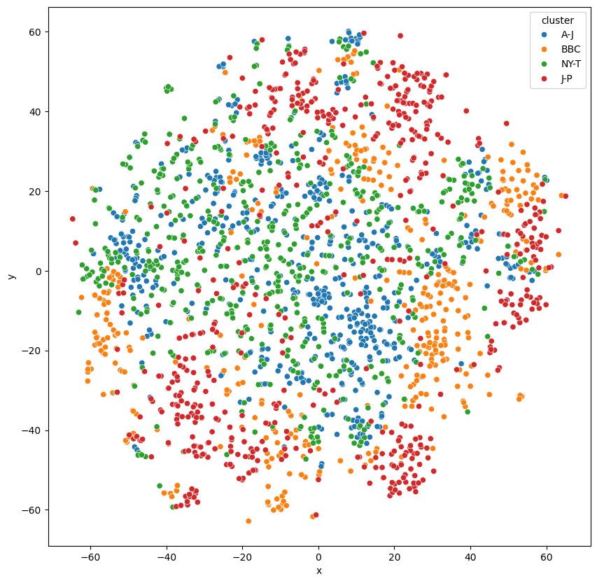


```python
# import all the the needed libraries NaiveBayes, SVM, LoR, RF
data = df['std_vector'].tolist()
```


```python
data = np.array(data)
```


```python
type(data)
```


numpy.ndarray


```python
data.shape
```


(2346, 7974)


```python
df['cluster'] = df['Sheet'].map({'A-J': 0, 'BBC': 1, 'NY-T': 2, 'J-P': 3})
```

## Naive Bayes Classifier


```python
# naive bayes
from sklearn.model_selection import train_test_split
from sklearn.naive_bayes import GaussianNB

X = data
y = df['cluster'].to_numpy()

X_train, X_test, y_train, y_test = train_test_split(X, y, test_size=0.29, random_state=42)

print("X_train shape:", X_train.shape)
print("y_train shape:", y_train.shape)
print("X_train type:", type(X_train))
print("y_train type:", type(y_train))
```

X_train shape: (1665, 7974)
y_train shape: (1665,)
X_train type: <class 'numpy.ndarray'>
y_train type: <class 'numpy.ndarray'>


```python
# use Naive Bayes with 10-fold cross validation
from sklearn.model_selection import cross_val_score

gnb = GaussianNB()

scores = cross_val_score(gnb, X_train, y_train, cv=10)

print("Accuracy: %0.2f (+/- %0.2f)" % (scores.mean(), scores.std() * 2))
```

Accuracy: 0.54 (+/- 0.08)


```python
from sklearn.metrics import ConfusionMatrixDisplay

gnb.fit(X_train, y_train)

disp = ConfusionMatrixDisplay.from_estimator(gnb, X_test, y_test)

disp.plot()

plt.show()
```


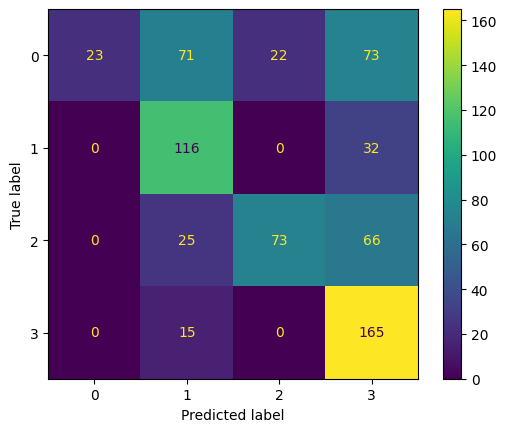


```python
# get the calssification report for all X from the model and color the results using the tsne plot
df_tsne['NB_pred'] = gnb.predict(X)


plt.figure(figsize=(10, 10))

#  add title
plt.title("Naive Bayes Classifier")

sns.scatterplot(data=df_tsne, x="x", y="y", hue="NB_pred")

plt.show()
```


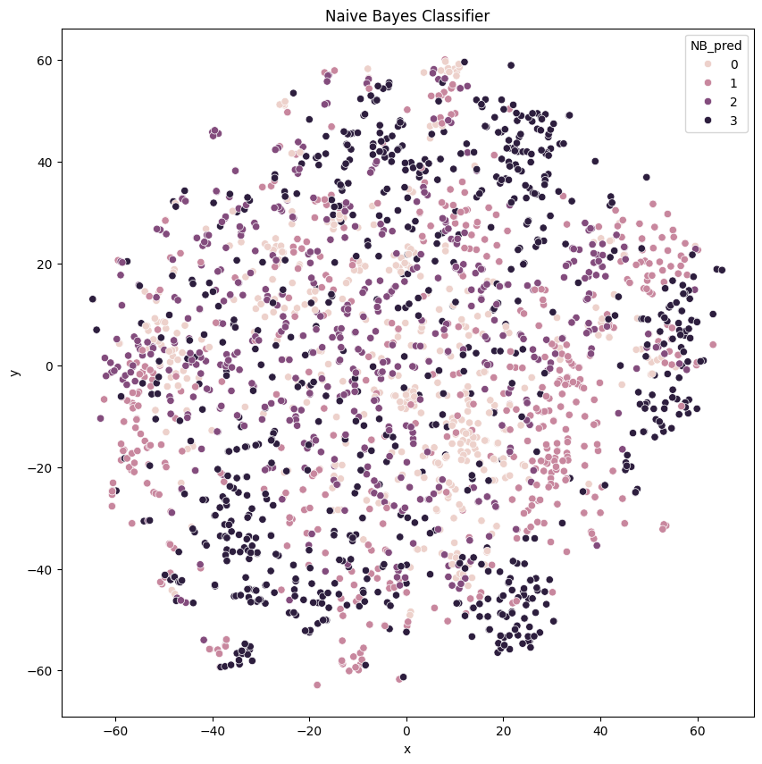


## SVM - Support Vector Machine


```python
# use SVM with 10-fold cross validation
from sklearn.svm import SVC

svc = SVC()

scores = cross_val_score(svc, X_train, y_train, cv=10)

print("Accuracy: %0.2f (+/- %0.2f)" % (scores.mean(), scores.std() * 2))
```

Accuracy: 0.91 (+/- 0.06)


```python
# same as NB

svc.fit(X_train, y_train)

disp = ConfusionMatrixDisplay.from_estimator(svc, X_test, y_test)

disp.plot()

plt.show()
```


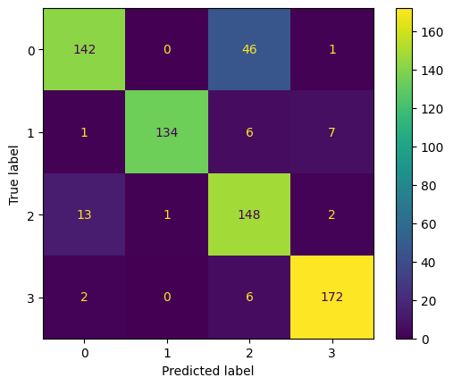


```python
# get the calssification report for all X from the model and color the results using the tsne plot
df_tsne["SVM_pred"] = svc.predict(X)


plt.figure(figsize=(10, 10))

sns.scatterplot(data=df_tsne, x="x", y="y", hue="SVM_pred")

plt.show()
```


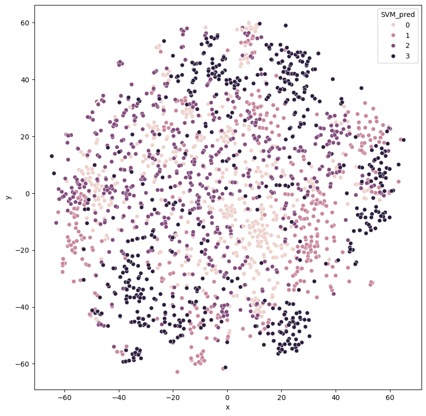


## Logistic Regression


```python
# use Logistic Regression with 10-fold cross validation

from sklearn.linear_model import LogisticRegression

lr = LogisticRegression()

scores = cross_val_score(lr, X_train, y_train, cv=10)

print("Accuracy: %0.2f (+/- %0.2f)" % (scores.mean(), scores.std() * 2))
```

Accuracy: 0.90 (+/- 0.05)


```python
# same

# visualize the results of the classification for all the X

lr.fit(X_train, y_train)

disp = ConfusionMatrixDisplay.from_estimator(lr, X_test, y_test)

disp.plot()

plt.show()
```


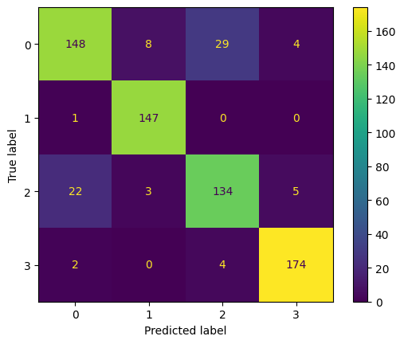


```python
# plot the results using tsne

df_tsne["LR_pred"] = lr.predict(X)

plt.figure(figsize=(10, 10))

sns.scatterplot(data=df_tsne, x="x", y="y", hue="LR_pred")

plt.show()
```


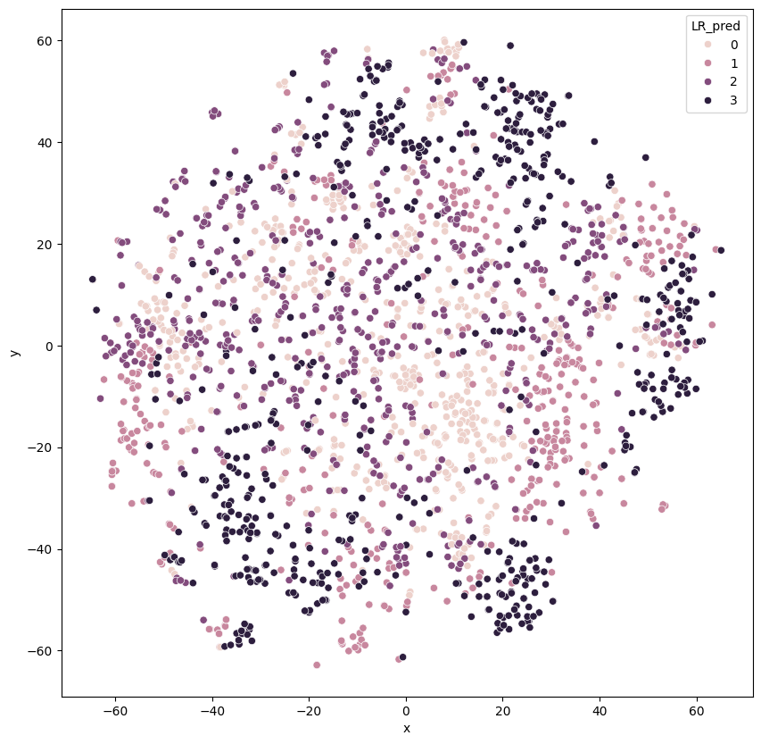


# RF - Random Forest Classifier


```python
# use Random Forest with 10-fold cross validation

from sklearn.ensemble import RandomForestClassifier

rf = RandomForestClassifier()

scores = cross_val_score(rf, X_train, y_train, cv=10)

print("Accuracy: %0.2f (+/- %0.2f)" % (scores.mean(), scores.std() * 2))
```

Accuracy: 0.97 (+/- 0.03)


```python
# same

# visualize the results of the classification for all the X

rf.fit(X_train, y_train)

disp = ConfusionMatrixDisplay.from_estimator(rf, X_test, y_test)

disp.plot()

plt.show()
```


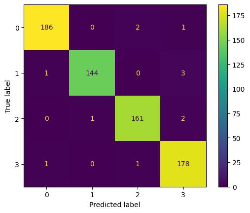


```python
# plot the results using tsne

df_tsne["RF_pred"] = rf.predict(X)

plt.figure(figsize=(10, 10))

sns.scatterplot(data=df_tsne, x="x", y="y", hue="RF_pred")

plt.show()
```


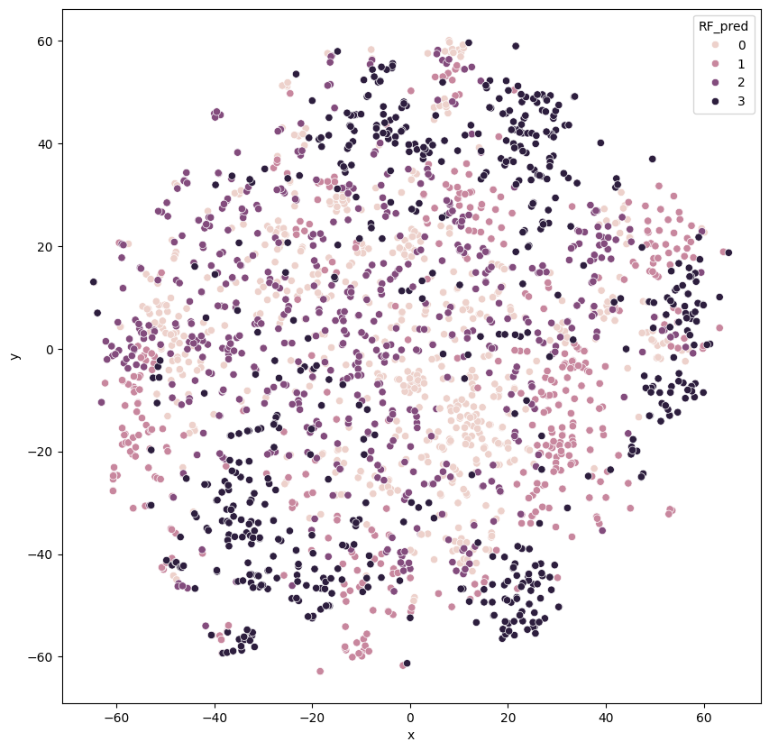


# ANN - Artificial Neural Network Classifier

We will build a NN using `tensorflow` and `keras` to classify the journal group.

The architecture of the NN is as follows:

- Embedding layer with 100 input dimensions.
- Hidden layer with 10 node and `relu` activation function.
- Hidden layer with 10 node and `relu` activation function.
- Hidden layer with 7 node and `relu` activation function.
- Output layer with 4 nodes and `softmax` activation function. (4 classes)

Seconde architecture:

- Embedding layer with 100 input dimensions.
- Hidden layer with 10 node and `gelu` activation function.
- Hidden layer with 10 node and `gelu` activation function.
- Hidden layer with 7 node and `gelu` activation function.
- Output layer with 4 nodes and `softmax` activation function. (4 classes)


```python
X = X.astype(np.float32)
y = y.astype(int)
```


```python
from sklearn.model_selection import train_test_split

X_train, X_test, y_train, y_test = train_test_split(X, y, test_size=0.2, random_state=42)
```


```python
from tensorflow.keras.models import Sequential

from tensorflow.keras.layers import Dense

model_1 = Sequential([
Dense(100, activation='relu', input_shape=(X.shape[1],)),
Dense(10, activation='relu'),
Dense(10, activation='relu'),
Dense(7, activation='relu'),
Dense(4, activation='softmax')
])

# compile the model
model_1.compile(optimizer='adam',
			loss='sparse_categorical_crossentropy',
			metrics=['accuracy'])

# fit the model
history = model_1.fit(X_train, y_train, epochs=15, batch_size=32, validation_split=0.2)
```

Epoch 1/15
47/47 ━━━━━━━━━━━━━━━━━━━━ 8s 100ms/step - accuracy: 0.2841 - loss: 1.3525 - val_accuracy: 0.4229 - val_loss: 1.1422
Epoch 2/15
47/47 ━━━━━━━━━━━━━━━━━━━━ 0s 4ms/step - accuracy: 0.5456 - loss: 1.0109 - val_accuracy: 0.7633 - val_loss: 0.8064
Epoch 3/15
47/47 ━━━━━━━━━━━━━━━━━━━━ 0s 4ms/step - accuracy: 0.8108 - loss: 0.6264 - val_accuracy: 0.8590 - val_loss: 0.6165
Epoch 4/15
47/47 ━━━━━━━━━━━━━━━━━━━━ 0s 4ms/step - accuracy: 0.9537 - loss: 0.3358 - val_accuracy: 0.8644 - val_loss: 0.4471
Epoch 5/15
47/47 ━━━━━━━━━━━━━━━━━━━━ 0s 3ms/step - accuracy: 0.9864 - loss: 0.0720 - val_accuracy: 0.8803 - val_loss: 0.4162
Epoch 6/15
47/47 ━━━━━━━━━━━━━━━━━━━━ 0s 4ms/step - accuracy: 0.9930 - loss: 0.0293 - val_accuracy: 0.8856 - val_loss: 0.3877
Epoch 7/15
47/47 ━━━━━━━━━━━━━━━━━━━━ 0s 3ms/step - accuracy: 0.9973 - loss: 0.0127 - val_accuracy: 0.8750 - val_loss: 0.4221
Epoch 8/15
47/47 ━━━━━━━━━━━━━━━━━━━━ 0s 3ms/step - accuracy: 0.9938 - loss: 0.0136 - val_accuracy: 0.8723 - val_loss: 0.5134
Epoch 9/15
47/47 ━━━━━━━━━━━━━━━━━━━━ 0s 3ms/step - accuracy: 0.9965 - loss: 0.0121 - val_accuracy: 0.8670 - val_loss: 0.5098
Epoch 10/15
47/47 ━━━━━━━━━━━━━━━━━━━━ 0s 3ms/step - accuracy: 0.9996 - loss: 0.0041 - val_accuracy: 0.8723 - val_loss: 0.5169
Epoch 11/15
47/47 ━━━━━━━━━━━━━━━━━━━━ 0s 3ms/step - accuracy: 1.0000 - loss: 0.0025 - val_accuracy: 0.8697 - val_loss: 0.5517
Epoch 12/15
47/47 ━━━━━━━━━━━━━━━━━━━━ 0s 3ms/step - accuracy: 0.9997 - loss: 0.0033 - val_accuracy: 0.8670 - val_loss: 0.5502
Epoch 13/15
47/47 ━━━━━━━━━━━━━━━━━━━━ 0s 3ms/step - accuracy: 1.0000 - loss: 0.0017 - val_accuracy: 0.8644 - val_loss: 0.5727
Epoch 14/15
47/47 ━━━━━━━━━━━━━━━━━━━━ 0s 4ms/step - accuracy: 1.0000 - loss: 0.0011 - val_accuracy: 0.8644 - val_loss: 0.5795
Epoch 15/15
47/47 ━━━━━━━━━━━━━━━━━━━━ 0s 4ms/step - accuracy: 1.0000 - loss: 0.0012 - val_accuracy: 0.8644 - val_loss: 0.5917


```python
# model 2

model_2 = Sequential(
[
	Dense(100, activation="gelu", input_shape=(X.shape[1],)),
	Dense(10, activation="gelu"),
	Dense(10, activation="gelu"),
	Dense(7, activation="gelu"),
	Dense(4, activation="softmax"),
]
)

# compile the model
model_2.compile(optimizer='adam',
			loss='sparse_categorical_crossentropy',
			metrics=['accuracy'])

# fit the model
history = model_2.fit(X_train, y_train, epochs=15, batch_size=32, validation_split=0.2)
```

Epoch 1/15
47/47 ━━━━━━━━━━━━━━━━━━━━ 7s 94ms/step - accuracy: 0.3817 - loss: 1.2878 - val_accuracy: 0.6702 - val_loss: 0.9129
Epoch 2/15
47/47 ━━━━━━━━━━━━━━━━━━━━ 5s 3ms/step - accuracy: 0.7734 - loss: 0.6561 - val_accuracy: 0.7819 - val_loss: 0.6595
Epoch 3/15
47/47 ━━━━━━━━━━━━━━━━━━━━ 0s 4ms/step - accuracy: 0.9345 - loss: 0.2103 - val_accuracy: 0.8138 - val_loss: 0.6160
Epoch 4/15
47/47 ━━━━━━━━━━━━━━━━━━━━ 0s 3ms/step - accuracy: 0.9829 - loss: 0.0554 - val_accuracy: 0.8085 - val_loss: 0.7881
Epoch 5/15
47/47 ━━━━━━━━━━━━━━━━━━━━ 0s 3ms/step - accuracy: 0.9982 - loss: 0.0122 - val_accuracy: 0.7872 - val_loss: 0.7864
Epoch 6/15
47/47 ━━━━━━━━━━━━━━━━━━━━ 0s 3ms/step - accuracy: 0.9997 - loss: 0.0044 - val_accuracy: 0.7899 - val_loss: 0.7934
Epoch 7/15
47/47 ━━━━━━━━━━━━━━━━━━━━ 0s 3ms/step - accuracy: 0.9994 - loss: 0.0031 - val_accuracy: 0.7899 - val_loss: 0.8111
Epoch 8/15
47/47 ━━━━━━━━━━━━━━━━━━━━ 0s 3ms/step - accuracy: 0.9995 - loss: 0.0024 - val_accuracy: 0.7793 - val_loss: 0.8276
Epoch 9/15
47/47 ━━━━━━━━━━━━━━━━━━━━ 0s 3ms/step - accuracy: 0.9999 - loss: 0.0013 - val_accuracy: 0.7819 - val_loss: 0.8421
Epoch 10/15
47/47 ━━━━━━━━━━━━━━━━━━━━ 0s 3ms/step - accuracy: 1.0000 - loss: 0.0012 - val_accuracy: 0.7713 - val_loss: 0.8725
Epoch 11/15
47/47 ━━━━━━━━━━━━━━━━━━━━ 0s 3ms/step - accuracy: 1.0000 - loss: 0.0011 - val_accuracy: 0.7660 - val_loss: 0.9267
Epoch 12/15
47/47 ━━━━━━━━━━━━━━━━━━━━ 0s 3ms/step - accuracy: 1.0000 - loss: 5.7853e-04 - val_accuracy: 0.7766 - val_loss: 0.9119
Epoch 13/15
47/47 ━━━━━━━━━━━━━━━━━━━━ 0s 3ms/step - accuracy: 1.0000 - loss: 4.7868e-04 - val_accuracy: 0.7819 - val_loss: 0.9088
Epoch 14/15
47/47 ━━━━━━━━━━━━━━━━━━━━ 0s 4ms/step - accuracy: 1.0000 - loss: 4.0668e-04 - val_accuracy: 0.7819 - val_loss: 0.9123
Epoch 15/15
47/47 ━━━━━━━━━━━━━━━━━━━━ 0s 3ms/step - accuracy: 1.0000 - loss: 4.2925e-04 - val_accuracy: 0.7819 - val_loss: 0.9186


```python
# check the accuracy of the models

# model 1
loss, accuracy = model_1.evaluate(X_test, y_test)

print("Model 1 Accuracy: ", accuracy)

# model 2

loss, accuracy = model_2.evaluate(X_test, y_test)

print("Model 2 Accuracy: ", accuracy)
```

15/15 ━━━━━━━━━━━━━━━━━━━━ 1s 58ms/step - accuracy: 0.8138 - loss: 0.5658
Model 1 Accuracy:  0.8191489577293396
15/15 ━━━━━━━━━━━━━━━━━━━━ 1s 42ms/step - accuracy: 0.7848 - loss: 0.8849
Model 2 Accuracy:  0.785106360912323


```python
# plot the prediction for model 1

predictions = model_1.predict(X)

# Convert probabilities to class labels
predicted_classes = np.argmax(predictions, axis=1)


df_tsne["model_1_pred"] = [str(cls) for cls in predicted_classes]

plt.figure(figsize=(10, 10))

sns.scatterplot(data=df_tsne, x="x", y="y", hue="model_1_pred")

plt.show()
```

74/74 ━━━━━━━━━━━━━━━━━━━━ 1s 8ms/step


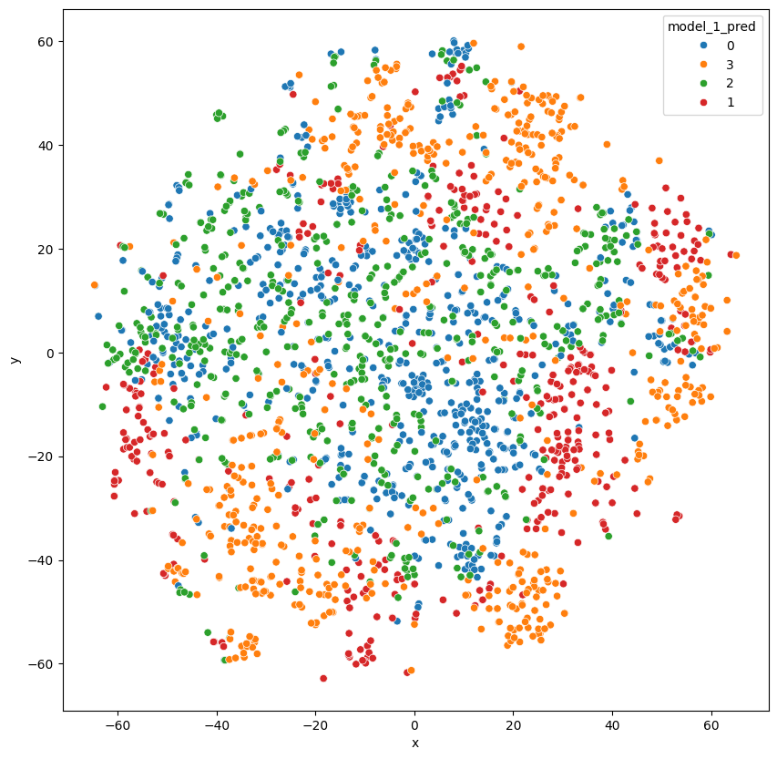


```python
# plot the prediction for model 1

predictions = model_2.predict(X)

# Convert probabilities to class labels
predicted_classes = np.argmax(predictions, axis=1)


df_tsne["model_2_pred"] = [str(cls) for cls in predicted_classes]

plt.figure(figsize=(10, 10))

sns.scatterplot(data=df_tsne, x="x", y="y", hue="model_2_pred")

plt.show()
```

74/74 ━━━━━━━━━━━━━━━━━━━━ 1s 7ms/step


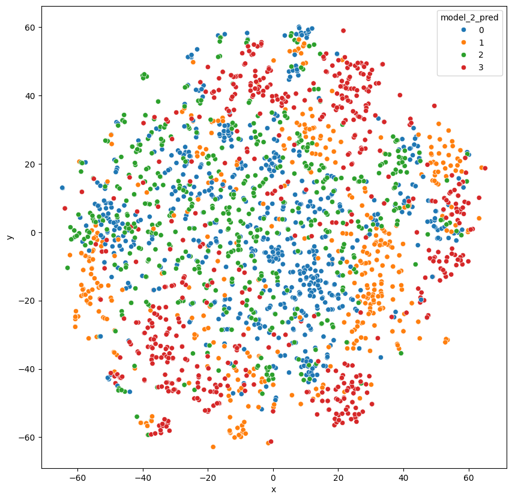


```python
# save the model into a file

model_1.save("model_1_doc2vec.h5")

model_2.save("model_2_doc2vec.h5")
```

WARNING:absl:You are saving your model as an HDF5 file via `model.save()` or `keras.saving.save_model(model)`. This file format is considered legacy. We recommend using instead the native Keras format, e.g. `model.save('my_model.keras')` or `keras.saving.save_model(model, 'my_model.keras')`. 
WARNING:absl:You are saving your model as an HDF5 file via `model.save()` or `keras.saving.save_model(model)`. This file format is considered legacy. We recommend using instead the native Keras format, e.g. `model.save('my_model.keras')` or `keras.saving.save_model(model, 'my_model.keras')`. 

