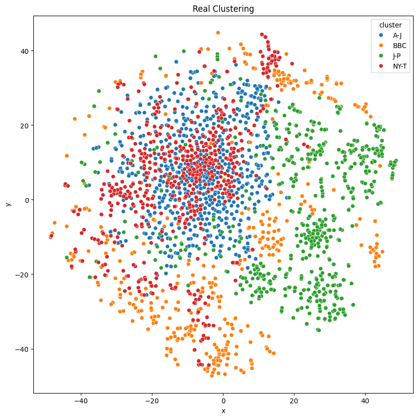
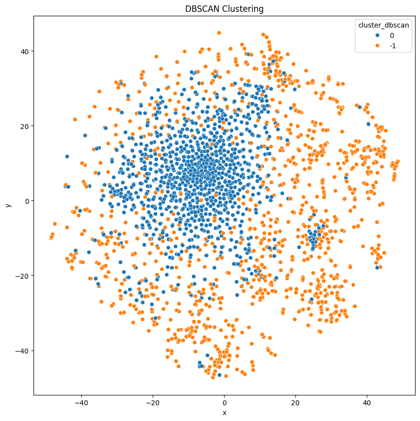
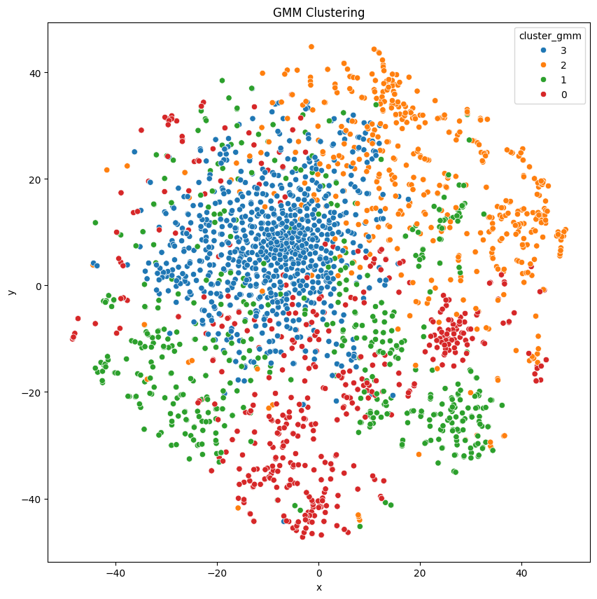

<a href="https://colab.research.google.com/github/dattali18/IR_Assignments/blob/main/Assignment.02/notebooks/IR_02_Clustering_Doc2Vec.ipynb" target="_parent"></a>

# Clustering

## 1. Objective

Take the document (meaning vector representation of the document, the ouput of the last assginment `Doc2Vec`, `BERT`, `Sentence-BERT`, times 4 group from each) and cluster them into groups and compare the results with the actuale division form each publication.

## 2. Input

4 Groups of matrices each line repesent a document in it's vector form, from:

1. `Doc2Vec`
2. `BERT`
3. `Sentence-BERT`

### 3. Task

- Combine the four matrices into a single matrix for each technique.
- Apply clustering using:
- **K-Means** (with `k=4` for 4 journals).
- **DBSCAN** (select `eps` and `min_samples` heuristically).
- **Gaussian Mixture Model**.
- Evaluate the clusters using:
- Metrics: Precision, Recall, F1-Score, Accuracy.
- Visualization: Use UMAP, t-SNE, or other tools (e.g., Seaborn).


### 4. Output

- The plot of the real clusters vs. the clusters from the 3 methods mentioned above.
- The metrics for each clustering method.

# Doc2Vec Matrices

We have 4 `.csv` files with each $(100, \approx 600)$ and we need to combine them into one big matrix and then cluster them.

## Plan

1. Download the files from my `GitHub`.
2. Add a `'cluster'` column for each file (`=0` for AJ etc...).
3. Cluster with `Kmeans` for `k=4`.
4. Write a function to find the right parameters for 4 clusters for `DBSCAN` (i.e. the `eps` and `min_samples` parameters).
5. Cluster with `DBSCAN`
6. Cluster with `GMM`
7. Use `t-SNE` to visualize the cluster in $\mathbb{R}^2$
8. Output the plot for each clustering methods + original
9. Measure each method using the metric mentioned above.


```python
import warnings

warnings.filterwarnings("ignore")
```

Download the files from my `GitHub`


```python
doc2vec_link = "https://github.com/dattali18/IR_Assignments/blob/main/Assignment.02/data/doc2vec/doc2vec_vectors.csv?raw=true"
```


```python
import pandas as pd

# download the data using the link
df_original = pd.read_csv(doc2vec_link)
df_original.head()
```


<div id="df-266d6e45-4d0d-403c-b4e2-064c7d293e05" class="colab-df-container">
<div>
<style scoped>
.dataframe tbody tr th:only-of-type {
	vertical-align: middle;
}

.dataframe tbody tr th {
	vertical-align: top;
}

.dataframe thead th {
	text-align: right;
}
</style>
<table border="1" class="dataframe">
<thead>
<tr style="text-align: right;">
  <th></th>
  <th>Sheet</th>
  <th>RowIndex</th>
  <th>Dim0</th>
  <th>Dim1</th>
  <th>Dim2</th>
  <th>Dim3</th>
  <th>Dim4</th>
  <th>Dim5</th>
  <th>Dim6</th>
  <th>Dim7</th>
  <th>...</th>
  <th>Dim290</th>
  <th>Dim291</th>
  <th>Dim292</th>
  <th>Dim293</th>
  <th>Dim294</th>
  <th>Dim295</th>
  <th>Dim296</th>
  <th>Dim297</th>
  <th>Dim298</th>
  <th>Dim299</th>
</tr>
</thead>
<tbody>
<tr>
  <th>0</th>
  <td>A-J</td>
  <td>0</td>
  <td>-0.323680</td>
  <td>0.536064</td>
  <td>-0.057541</td>
  <td>-0.086456</td>
  <td>-0.131206</td>
  <td>-0.565315</td>
  <td>0.091184</td>
  <td>0.368373</td>
  <td>...</td>
  <td>-0.037265</td>
  <td>0.056639</td>
  <td>0.215756</td>
  <td>-0.263049</td>
  <td>-0.204844</td>
  <td>0.068097</td>
  <td>0.245854</td>
  <td>-0.162075</td>
  <td>0.073809</td>
  <td>0.537919</td>
</tr>
<tr>
  <th>1</th>
  <td>A-J</td>
  <td>1</td>
  <td>-0.145474</td>
  <td>0.580617</td>
  <td>0.055538</td>
  <td>-0.136570</td>
  <td>-0.058198</td>
  <td>-0.529168</td>
  <td>0.381029</td>
  <td>0.835640</td>
  <td>...</td>
  <td>-0.481531</td>
  <td>0.365477</td>
  <td>-0.074856</td>
  <td>-0.033853</td>
  <td>-0.164452</td>
  <td>-0.202104</td>
  <td>-0.103379</td>
  <td>0.000104</td>
  <td>-0.368583</td>
  <td>-0.151190</td>
</tr>
<tr>
  <th>2</th>
  <td>A-J</td>
  <td>2</td>
  <td>-0.152601</td>
  <td>0.434339</td>
  <td>0.476579</td>
  <td>0.219742</td>
  <td>0.206865</td>
  <td>-0.808800</td>
  <td>0.463602</td>
  <td>0.788595</td>
  <td>...</td>
  <td>0.038521</td>
  <td>0.135275</td>
  <td>0.485610</td>
  <td>0.053291</td>
  <td>-0.023656</td>
  <td>-0.419926</td>
  <td>0.609322</td>
  <td>-0.238771</td>
  <td>0.237107</td>
  <td>-0.047717</td>
</tr>
<tr>
  <th>3</th>
  <td>A-J</td>
  <td>3</td>
  <td>-0.612203</td>
  <td>0.287306</td>
  <td>0.622638</td>
  <td>0.347806</td>
  <td>0.310982</td>
  <td>-0.528447</td>
  <td>0.356173</td>
  <td>0.113392</td>
  <td>...</td>
  <td>-0.246450</td>
  <td>0.215634</td>
  <td>0.300776</td>
  <td>-0.041372</td>
  <td>0.184252</td>
  <td>0.054860</td>
  <td>0.735316</td>
  <td>-0.073491</td>
  <td>0.210143</td>
  <td>-0.134298</td>
</tr>
<tr>
  <th>4</th>
  <td>A-J</td>
  <td>4</td>
  <td>-0.418779</td>
  <td>0.231471</td>
  <td>0.634521</td>
  <td>0.376488</td>
  <td>0.096662</td>
  <td>-0.396122</td>
  <td>0.530038</td>
  <td>0.292624</td>
  <td>...</td>
  <td>-0.199178</td>
  <td>0.173679</td>
  <td>0.205028</td>
  <td>0.295934</td>
  <td>0.149091</td>
  <td>0.267297</td>
  <td>0.484595</td>
  <td>-0.314126</td>
  <td>0.394436</td>
  <td>-0.279832</td>
</tr>
</tbody>
</table>
<p>5 rows × 302 columns</p>
</div>
<div class="colab-df-buttons">

<div class="colab-df-container">
<button class="colab-df-convert" onclick="convertToInteractive('df-266d6e45-4d0d-403c-b4e2-064c7d293e05')"
		title="Convert this dataframe to an interactive table."
		style="display:none;">

<svg xmlns="http://www.w3.org/2000/svg" height="24px" viewBox="0 -960 960 960">
<path d="M120-120v-720h720v720H120Zm60-500h600v-160H180v160Zm220 220h160v-160H400v160Zm0 220h160v-160H400v160ZM180-400h160v-160H180v160Zm440 0h160v-160H620v160ZM180-180h160v-160H180v160Zm440 0h160v-160H620v160Z"/>
</svg>
</button>

<style>
.colab-df-container {
  display:flex;
  gap: 12px;
}

.colab-df-convert {
  background-color: #E8F0FE;
  border: none;
  border-radius: 50%;
  cursor: pointer;
  display: none;
  fill: #1967D2;
  height: 32px;
  padding: 0 0 0 0;
  width: 32px;
}

.colab-df-convert:hover {
  background-color: #E2EBFA;
  box-shadow: 0px 1px 2px rgba(60, 64, 67, 0.3), 0px 1px 3px 1px rgba(60, 64, 67, 0.15);
  fill: #174EA6;
}

.colab-df-buttons div {
  margin-bottom: 4px;
}

[theme=dark] .colab-df-convert {
  background-color: #3B4455;
  fill: #D2E3FC;
}

[theme=dark] .colab-df-convert:hover {
  background-color: #434B5C;
  box-shadow: 0px 1px 3px 1px rgba(0, 0, 0, 0.15);
  filter: drop-shadow(0px 1px 2px rgba(0, 0, 0, 0.3));
  fill: #FFFFFF;
}
</style>

<script>
  const buttonEl =
	document.querySelector('#df-266d6e45-4d0d-403c-b4e2-064c7d293e05 button.colab-df-convert');
  buttonEl.style.display =
	google.colab.kernel.accessAllowed ? 'block' : 'none';

  async function convertToInteractive(key) {
	const element = document.querySelector('#df-266d6e45-4d0d-403c-b4e2-064c7d293e05');
	const dataTable =
	  await google.colab.kernel.invokeFunction('convertToInteractive',
												[key], {});
	if (!dataTable) return;

	const docLinkHtml = 'Like what you see? Visit the ' +
	  '<a target="_blank" href=https://colab.research.google.com/notebooks/data_table.ipynb>data table notebook</a>'
	  + ' to learn more about interactive tables.';
	element.innerHTML = '';
	dataTable['output_type'] = 'display_data';
	await google.colab.output.renderOutput(dataTable, element);
	const docLink = document.createElement('div');
	docLink.innerHTML = docLinkHtml;
	element.appendChild(docLink);
  }
</script>
</div>


<div id="df-5509d9f1-fd9f-483e-a72d-5479af1f70b7">
<button class="colab-df-quickchart" onclick="quickchart('df-5509d9f1-fd9f-483e-a72d-5479af1f70b7')"
		title="Suggest charts"
		style="display:none;">

<svg xmlns="http://www.w3.org/2000/svg" height="24px"viewBox="0 0 24 24"
 width="24px">
<g>
	<path d="M19 3H5c-1.1 0-2 .9-2 2v14c0 1.1.9 2 2 2h14c1.1 0 2-.9 2-2V5c0-1.1-.9-2-2-2zM9 17H7v-7h2v7zm4 0h-2V7h2v10zm4 0h-2v-4h2v4z"/>
</g>
</svg>
</button>

<style>
.colab-df-quickchart {
  --bg-color: #E8F0FE;
  --fill-color: #1967D2;
  --hover-bg-color: #E2EBFA;
  --hover-fill-color: #174EA6;
  --disabled-fill-color: #AAA;
  --disabled-bg-color: #DDD;
}

[theme=dark] .colab-df-quickchart {
  --bg-color: #3B4455;
  --fill-color: #D2E3FC;
  --hover-bg-color: #434B5C;
  --hover-fill-color: #FFFFFF;
  --disabled-bg-color: #3B4455;
  --disabled-fill-color: #666;
}

.colab-df-quickchart {
background-color: var(--bg-color);
border: none;
border-radius: 50%;
cursor: pointer;
display: none;
fill: var(--fill-color);
height: 32px;
padding: 0;
width: 32px;
}

.colab-df-quickchart:hover {
background-color: var(--hover-bg-color);
box-shadow: 0 1px 2px rgba(60, 64, 67, 0.3), 0 1px 3px 1px rgba(60, 64, 67, 0.15);
fill: var(--button-hover-fill-color);
}

.colab-df-quickchart-complete:disabled,
.colab-df-quickchart-complete:disabled:hover {
background-color: var(--disabled-bg-color);
fill: var(--disabled-fill-color);
box-shadow: none;
}

.colab-df-spinner {
border: 2px solid var(--fill-color);
border-color: transparent;
border-bottom-color: var(--fill-color);
animation:
  spin 1s steps(1) infinite;
}

@keyframes spin {
0% {
  border-color: transparent;
  border-bottom-color: var(--fill-color);
  border-left-color: var(--fill-color);
}
20% {
  border-color: transparent;
  border-left-color: var(--fill-color);
  border-top-color: var(--fill-color);
}
30% {
  border-color: transparent;
  border-left-color: var(--fill-color);
  border-top-color: var(--fill-color);
  border-right-color: var(--fill-color);
}
40% {
  border-color: transparent;
  border-right-color: var(--fill-color);
  border-top-color: var(--fill-color);
}
60% {
  border-color: transparent;
  border-right-color: var(--fill-color);
}
80% {
  border-color: transparent;
  border-right-color: var(--fill-color);
  border-bottom-color: var(--fill-color);
}
90% {
  border-color: transparent;
  border-bottom-color: var(--fill-color);
}
}
</style>

<script>
async function quickchart(key) {
  const quickchartButtonEl =
	document.querySelector('#' + key + ' button');
  quickchartButtonEl.disabled = true;  // To prevent multiple clicks.
  quickchartButtonEl.classList.add('colab-df-spinner');
  try {
	const charts = await google.colab.kernel.invokeFunction(
		'suggestCharts', [key], {});
  } catch (error) {
	console.error('Error during call to suggestCharts:', error);
  }
  quickchartButtonEl.classList.remove('colab-df-spinner');
  quickchartButtonEl.classList.add('colab-df-quickchart-complete');
}
(() => {
  let quickchartButtonEl =
	document.querySelector('#df-5509d9f1-fd9f-483e-a72d-5479af1f70b7 button');
  quickchartButtonEl.style.display =
	google.colab.kernel.accessAllowed ? 'block' : 'none';
})();
</script>
</div>

</div>
</div>


```python
# create a new df where whe have the following column
# 1. Sheet with the name 'A-J', 'BBC', 'J-P', 'NY-T'
# 2. vector the numpy vector represntation (get all the value from Dim0 - Dim299 and make a list from them)

df = pd.DataFrame()

df['Sheet'] = df_original['Sheet']

df['vector'] = df_original.iloc[:, 2:].values.tolist()

df.head()
```


<div id="df-4d7618bd-8077-4893-9efd-0baed4c38836" class="colab-df-container">
<div>
<style scoped>
.dataframe tbody tr th:only-of-type {
	vertical-align: middle;
}

.dataframe tbody tr th {
	vertical-align: top;
}

.dataframe thead th {
	text-align: right;
}
</style>
<table border="1" class="dataframe">
<thead>
<tr style="text-align: right;">
  <th></th>
  <th>Sheet</th>
  <th>vector</th>
</tr>
</thead>
<tbody>
<tr>
  <th>0</th>
  <td>A-J</td>
  <td>[-0.323680430650711, 0.5360641479492188, -0.05...</td>
</tr>
<tr>
  <th>1</th>
  <td>A-J</td>
  <td>[-0.1454735696315765, 0.5806173086166382, 0.05...</td>
</tr>
<tr>
  <th>2</th>
  <td>A-J</td>
  <td>[-0.1526012271642685, 0.4343386590480804, 0.47...</td>
</tr>
<tr>
  <th>3</th>
  <td>A-J</td>
  <td>[-0.6122026443481445, 0.287306398153305, 0.622...</td>
</tr>
<tr>
  <th>4</th>
  <td>A-J</td>
  <td>[-0.4187790155410766, 0.2314711958169937, 0.63...</td>
</tr>
</tbody>
</table>
</div>
<div class="colab-df-buttons">

<div class="colab-df-container">
<button class="colab-df-convert" onclick="convertToInteractive('df-4d7618bd-8077-4893-9efd-0baed4c38836')"
		title="Convert this dataframe to an interactive table."
		style="display:none;">

<svg xmlns="http://www.w3.org/2000/svg" height="24px" viewBox="0 -960 960 960">
<path d="M120-120v-720h720v720H120Zm60-500h600v-160H180v160Zm220 220h160v-160H400v160Zm0 220h160v-160H400v160ZM180-400h160v-160H180v160Zm440 0h160v-160H620v160ZM180-180h160v-160H180v160Zm440 0h160v-160H620v160Z"/>
</svg>
</button>

<style>
.colab-df-container {
  display:flex;
  gap: 12px;
}

.colab-df-convert {
  background-color: #E8F0FE;
  border: none;
  border-radius: 50%;
  cursor: pointer;
  display: none;
  fill: #1967D2;
  height: 32px;
  padding: 0 0 0 0;
  width: 32px;
}

.colab-df-convert:hover {
  background-color: #E2EBFA;
  box-shadow: 0px 1px 2px rgba(60, 64, 67, 0.3), 0px 1px 3px 1px rgba(60, 64, 67, 0.15);
  fill: #174EA6;
}

.colab-df-buttons div {
  margin-bottom: 4px;
}

[theme=dark] .colab-df-convert {
  background-color: #3B4455;
  fill: #D2E3FC;
}

[theme=dark] .colab-df-convert:hover {
  background-color: #434B5C;
  box-shadow: 0px 1px 3px 1px rgba(0, 0, 0, 0.15);
  filter: drop-shadow(0px 1px 2px rgba(0, 0, 0, 0.3));
  fill: #FFFFFF;
}
</style>

<script>
  const buttonEl =
	document.querySelector('#df-4d7618bd-8077-4893-9efd-0baed4c38836 button.colab-df-convert');
  buttonEl.style.display =
	google.colab.kernel.accessAllowed ? 'block' : 'none';

  async function convertToInteractive(key) {
	const element = document.querySelector('#df-4d7618bd-8077-4893-9efd-0baed4c38836');
	const dataTable =
	  await google.colab.kernel.invokeFunction('convertToInteractive',
												[key], {});
	if (!dataTable) return;

	const docLinkHtml = 'Like what you see? Visit the ' +
	  '<a target="_blank" href=https://colab.research.google.com/notebooks/data_table.ipynb>data table notebook</a>'
	  + ' to learn more about interactive tables.';
	element.innerHTML = '';
	dataTable['output_type'] = 'display_data';
	await google.colab.output.renderOutput(dataTable, element);
	const docLink = document.createElement('div');
	docLink.innerHTML = docLinkHtml;
	element.appendChild(docLink);
  }
</script>
</div>


<div id="df-59e8ae8e-e951-4d36-a480-22bdad433de5">
<button class="colab-df-quickchart" onclick="quickchart('df-59e8ae8e-e951-4d36-a480-22bdad433de5')"
		title="Suggest charts"
		style="display:none;">

<svg xmlns="http://www.w3.org/2000/svg" height="24px"viewBox="0 0 24 24"
 width="24px">
<g>
	<path d="M19 3H5c-1.1 0-2 .9-2 2v14c0 1.1.9 2 2 2h14c1.1 0 2-.9 2-2V5c0-1.1-.9-2-2-2zM9 17H7v-7h2v7zm4 0h-2V7h2v10zm4 0h-2v-4h2v4z"/>
</g>
</svg>
</button>

<style>
.colab-df-quickchart {
  --bg-color: #E8F0FE;
  --fill-color: #1967D2;
  --hover-bg-color: #E2EBFA;
  --hover-fill-color: #174EA6;
  --disabled-fill-color: #AAA;
  --disabled-bg-color: #DDD;
}

[theme=dark] .colab-df-quickchart {
  --bg-color: #3B4455;
  --fill-color: #D2E3FC;
  --hover-bg-color: #434B5C;
  --hover-fill-color: #FFFFFF;
  --disabled-bg-color: #3B4455;
  --disabled-fill-color: #666;
}

.colab-df-quickchart {
background-color: var(--bg-color);
border: none;
border-radius: 50%;
cursor: pointer;
display: none;
fill: var(--fill-color);
height: 32px;
padding: 0;
width: 32px;
}

.colab-df-quickchart:hover {
background-color: var(--hover-bg-color);
box-shadow: 0 1px 2px rgba(60, 64, 67, 0.3), 0 1px 3px 1px rgba(60, 64, 67, 0.15);
fill: var(--button-hover-fill-color);
}

.colab-df-quickchart-complete:disabled,
.colab-df-quickchart-complete:disabled:hover {
background-color: var(--disabled-bg-color);
fill: var(--disabled-fill-color);
box-shadow: none;
}

.colab-df-spinner {
border: 2px solid var(--fill-color);
border-color: transparent;
border-bottom-color: var(--fill-color);
animation:
  spin 1s steps(1) infinite;
}

@keyframes spin {
0% {
  border-color: transparent;
  border-bottom-color: var(--fill-color);
  border-left-color: var(--fill-color);
}
20% {
  border-color: transparent;
  border-left-color: var(--fill-color);
  border-top-color: var(--fill-color);
}
30% {
  border-color: transparent;
  border-left-color: var(--fill-color);
  border-top-color: var(--fill-color);
  border-right-color: var(--fill-color);
}
40% {
  border-color: transparent;
  border-right-color: var(--fill-color);
  border-top-color: var(--fill-color);
}
60% {
  border-color: transparent;
  border-right-color: var(--fill-color);
}
80% {
  border-color: transparent;
  border-right-color: var(--fill-color);
  border-bottom-color: var(--fill-color);
}
90% {
  border-color: transparent;
  border-bottom-color: var(--fill-color);
}
}
</style>

<script>
async function quickchart(key) {
  const quickchartButtonEl =
	document.querySelector('#' + key + ' button');
  quickchartButtonEl.disabled = true;  // To prevent multiple clicks.
  quickchartButtonEl.classList.add('colab-df-spinner');
  try {
	const charts = await google.colab.kernel.invokeFunction(
		'suggestCharts', [key], {});
  } catch (error) {
	console.error('Error during call to suggestCharts:', error);
  }
  quickchartButtonEl.classList.remove('colab-df-spinner');
  quickchartButtonEl.classList.add('colab-df-quickchart-complete');
}
(() => {
  let quickchartButtonEl =
	document.querySelector('#df-59e8ae8e-e951-4d36-a480-22bdad433de5 button');
  quickchartButtonEl.style.display =
	google.colab.kernel.accessAllowed ? 'block' : 'none';
})();
</script>
</div>

</div>
</div>


```python
# standerdize the data mean=0 std=1

from sklearn.preprocessing import StandardScaler
import numpy as np


scaler = StandardScaler()

# apply to each line of the df

df['std_vector'] = df['vector'].apply(lambda x: scaler.fit_transform(np.array(x).reshape(-1, 1)).flatten())
df['std_vector'].head()
```


<div>
<style scoped>
.dataframe tbody tr th:only-of-type {
	vertical-align: middle;
}

.dataframe tbody tr th {
	vertical-align: top;
}

.dataframe thead th {
	text-align: right;
}
</style>
<table border="1" class="dataframe">
<thead>
<tr style="text-align: right;">
  <th></th>
  <th>std_vector</th>
</tr>
</thead>
<tbody>
<tr>
  <th>0</th>
  <td>[-0.8898444679243975, 1.5867284496581213, -0.1...</td>
</tr>
<tr>
  <th>1</th>
  <td>[-0.45412855563660753, 1.5962898513829487, 0.1...</td>
</tr>
<tr>
  <th>2</th>
  <td>[-0.4265908635369363, 1.2374741265373976, 1.35...</td>
</tr>
<tr>
  <th>3</th>
  <td>[-1.7774307627408343, 0.8400083803083657, 1.81...</td>
</tr>
<tr>
  <th>4</th>
  <td>[-1.315865498091188, 0.6433641277978894, 1.857...</td>
</tr>
</tbody>
</table>
</div><br><label><b>dtype:</b> object</label>


```python
cluster_map = {'A-J': 0, 'BBC': 1, 'J-P': 2, 'NY-T': 3}
df['cluster'] = df['Sheet'].map(cluster_map)
```


```python
from sklearn.cluster import KMeans, DBSCAN
from sklearn.mixture import GaussianMixture

import numpy as np

import matplotlib.pyplot as plt

import seaborn as sns
```


```python
# visualize the real cluster using t-SNE

from sklearn.manifold import TSNE

tsne = TSNE(n_components=2, random_state=0)

# transofrm the df['vector'] to dataframe with freatuer 0 - 299 for
df_copy = df['std_vector'].apply(pd.Series)

df_tsne = tsne.fit_transform(df_copy)

df_tsne = pd.DataFrame(df_tsne, columns=['x', 'y'])

df_tsne['cluster'] = df['cluster']
```


```python
# plot the df_tsne

reverse_cluster_map = {v: k for k, v in cluster_map.items()}

plt.figure(figsize=(10, 10))
# add labels
plt.title('Real Clustering')

# make color scheme red, blue, green etc


df_tsne['cluster'] = df_tsne['cluster'].map(reverse_cluster_map)

sns.scatterplot(data=df_tsne, x='x', y='y', hue='cluster')

plt.show()
```





### Kmeans


```python
kmeans = KMeans(n_clusters=4, random_state=0).fit(df['std_vector'].tolist())

df['cluster_kmeans'] = kmeans.labels_

df['cluster_kmeans'].head()
```


<div>
<style scoped>
.dataframe tbody tr th:only-of-type {
	vertical-align: middle;
}

.dataframe tbody tr th {
	vertical-align: top;
}

.dataframe thead th {
	text-align: right;
}
</style>
<table border="1" class="dataframe">
<thead>
<tr style="text-align: right;">
  <th></th>
  <th>cluster_kmeans</th>
</tr>
</thead>
<tbody>
<tr>
  <th>0</th>
  <td>3</td>
</tr>
<tr>
  <th>1</th>
  <td>3</td>
</tr>
<tr>
  <th>2</th>
  <td>3</td>
</tr>
<tr>
  <th>3</th>
  <td>3</td>
</tr>
<tr>
  <th>4</th>
  <td>3</td>
</tr>
</tbody>
</table>
</div><br><label><b>dtype:</b> int32</label>


```python
# visutalize the cluster using the t-SNE df

df_tsne['cluster_kmeans'] = df['cluster_kmeans']

reverse_cluster_map = {v: k for k, v in cluster_map.items()}

plt.figure(figsize=(10, 10))

plt.title('Kmeans Clustering')

# make color scheme red, blue, green etc


df_tsne['cluster_kmeans'] = df_tsne['cluster_kmeans'].map(str)

sns.scatterplot(data=df_tsne, x='x', y='y', hue='cluster_kmeans')

plt.show()
```


### DBSCAN


```python
!pip install kneed
```

Requirement already satisfied: kneed in /usr/local/lib/python3.10/dist-packages (0.8.5)
Requirement already satisfied: numpy>=1.14.2 in /usr/local/lib/python3.10/dist-packages (from kneed) (1.26.4)
Requirement already satisfied: scipy>=1.0.0 in /usr/local/lib/python3.10/dist-packages (from kneed) (1.13.1)


```python
import numpy as np
import pandas as pd
from sklearn.neighbors import NearestNeighbors
from kneed import KneeLocator
from sklearn.cluster import DBSCAN

def get_parameters(df, num_clusters=4, eps_adjustment=1.0, min_samples_adjustment=1):
X = np.array(df)

# Use NearestNeighbors to find the nearest neighbors
neighbors = NearestNeighbors(n_neighbors=2 * X.shape[1] - 1)
neighbors_fit = neighbors.fit(X)
distances, indices = neighbors_fit.kneighbors(X)
distances = np.sort(distances, axis=0)
distances = distances[:, 1]

# Use KneeLocator to find the "elbow" point in the k-distance graph
kneedle = KneeLocator(range(len(distances)), distances, S=1.0, curve="convex", direction="increasing")
eps = distances[kneedle.elbow] * eps_adjustment

# Set min_samples to 2 * dimensions, another common heuristic
min_samples = 2 * X.shape[1] * min_samples_adjustment

return eps, min_samples

def find_best_parameters(df, num_clusters=4):
best_eps = None
best_min_samples = None
best_num_clusters = 0

for eps_adjustment in np.arange(0.5, 2.0, 0.1):
	for min_samples_adjustment in range(1, 5):
		eps, min_samples = get_parameters(df, num_clusters, eps_adjustment, min_samples_adjustment)
		db = DBSCAN(eps=eps, min_samples=min_samples).fit(df)
		labels = db.labels_
		num_clusters_found = len(set(labels)) - (1 if -1 in labels else 0)

		if num_clusters_found == num_clusters:
			return eps, min_samples

		if num_clusters_found > best_num_clusters:
			best_eps = eps
			best_min_samples = min_samples
			best_num_clusters = num_clusters_found

return best_eps, best_min_samples

eps, min_samples = find_best_parameters(df['std_vector'].tolist(), num_clusters=4)
print(f"Best eps: {eps}, Best min_samples: {min_samples}")
```

Best eps: 15.962189936055655, Best min_samples: 600


```python
# use DBSCAN

dbscan = DBSCAN(eps=eps, min_samples=min_samples).fit(df['std_vector'].tolist())

df['cluster_dbscan'] = dbscan.labels_
```


```python
# count the number of cluster

num_clusters = len(df['cluster_dbscan'].unique())

print(f"Number of clusters: {num_clusters}")
```

Number of clusters: 2


```python
# visualize data

# visutalize the cluster using the t-SNE df

df_tsne['cluster_dbscan'] = df['cluster_dbscan']

reverse_cluster_map = {v: k for k, v in cluster_map.items()}

plt.figure(figsize=(10, 10))

plt.title('DBSCAN Clustering')

# make color scheme red, blue, green etc


df_tsne['cluster_dbscan'] = df_tsne['cluster_dbscan'].map(str)

sns.scatterplot(data=df_tsne, x='x', y='y', hue='cluster_dbscan')

plt.show()
```





### GMM


```python
# apply GMM

gmm = GaussianMixture(n_components=4, random_state=0).fit(df['std_vector'].tolist())

df['cluster_gmm'] = gmm.predict(df['std_vector'].tolist())

df['cluster_gmm'].head()

```


<div>
<style scoped>
.dataframe tbody tr th:only-of-type {
	vertical-align: middle;
}

.dataframe tbody tr th {
	vertical-align: top;
}

.dataframe thead th {
	text-align: right;
}
</style>
<table border="1" class="dataframe">
<thead>
<tr style="text-align: right;">
  <th></th>
  <th>cluster_gmm</th>
</tr>
</thead>
<tbody>
<tr>
  <th>0</th>
  <td>3</td>
</tr>
<tr>
  <th>1</th>
  <td>3</td>
</tr>
<tr>
  <th>2</th>
  <td>3</td>
</tr>
<tr>
  <th>3</th>
  <td>3</td>
</tr>
<tr>
  <th>4</th>
  <td>3</td>
</tr>
</tbody>
</table>
</div><br><label><b>dtype:</b> int64</label>


```python
# visualize data

# visutalize the cluster using the t-SNE df

df_tsne['cluster_gmm'] = df['cluster_gmm']

reverse_cluster_map = {v: k for k, v in cluster_map.items()}

plt.figure(figsize=(10, 10))

plt.title('GMM Clustering')

# make color scheme red, blue, green etc


df_tsne['cluster_gmm'] = df_tsne['cluster_gmm'].map(str)

sns.scatterplot(data=df_tsne, x='x', y='y', hue='cluster_gmm')

plt.show()
```





## Measurements


```python
from sklearn.metrics import precision_score, recall_score, f1_score, accuracy_score

def evluate_model(real, pred):
precision = precision_score(real, pred, average='macro')
recall = recall_score(real, pred, average='macro')
f1 = f1_score(real, pred, average='macro')
accuracy = accuracy_score(real, pred)

return precision, recall, f1, accuracy
```


```python
kmeans_evalutation_df = pd.DataFrame(columns=['precision', 'recall', 'f1', 'accuracy'])

kmeans_evalutation_df.loc['kmeans'] = evluate_model(df['cluster'], df['cluster_kmeans'])

kmeans_evalutation_df
```


<div id="df-10d73063-ebb3-423e-afb0-1780f25318cd" class="colab-df-container">
<div>
<style scoped>
.dataframe tbody tr th:only-of-type {
	vertical-align: middle;
}

.dataframe tbody tr th {
	vertical-align: top;
}

.dataframe thead th {
	text-align: right;
}
</style>
<table border="1" class="dataframe">
<thead>
<tr style="text-align: right;">
  <th></th>
  <th>precision</th>
  <th>recall</th>
  <th>f1</th>
  <th>accuracy</th>
</tr>
</thead>
<tbody>
<tr>
  <th>kmeans</th>
  <td>0.355405</td>
  <td>0.369908</td>
  <td>0.359152</td>
  <td>0.37127</td>
</tr>
</tbody>
</table>
</div>
<div class="colab-df-buttons">

<div class="colab-df-container">
<button class="colab-df-convert" onclick="convertToInteractive('df-10d73063-ebb3-423e-afb0-1780f25318cd')"
		title="Convert this dataframe to an interactive table."
		style="display:none;">

<svg xmlns="http://www.w3.org/2000/svg" height="24px" viewBox="0 -960 960 960">
<path d="M120-120v-720h720v720H120Zm60-500h600v-160H180v160Zm220 220h160v-160H400v160Zm0 220h160v-160H400v160ZM180-400h160v-160H180v160Zm440 0h160v-160H620v160ZM180-180h160v-160H180v160Zm440 0h160v-160H620v160Z"/>
</svg>
</button>

<style>
.colab-df-container {
  display:flex;
  gap: 12px;
}

.colab-df-convert {
  background-color: #E8F0FE;
  border: none;
  border-radius: 50%;
  cursor: pointer;
  display: none;
  fill: #1967D2;
  height: 32px;
  padding: 0 0 0 0;
  width: 32px;
}

.colab-df-convert:hover {
  background-color: #E2EBFA;
  box-shadow: 0px 1px 2px rgba(60, 64, 67, 0.3), 0px 1px 3px 1px rgba(60, 64, 67, 0.15);
  fill: #174EA6;
}

.colab-df-buttons div {
  margin-bottom: 4px;
}

[theme=dark] .colab-df-convert {
  background-color: #3B4455;
  fill: #D2E3FC;
}

[theme=dark] .colab-df-convert:hover {
  background-color: #434B5C;
  box-shadow: 0px 1px 3px 1px rgba(0, 0, 0, 0.15);
  filter: drop-shadow(0px 1px 2px rgba(0, 0, 0, 0.3));
  fill: #FFFFFF;
}
</style>

<script>
  const buttonEl =
	document.querySelector('#df-10d73063-ebb3-423e-afb0-1780f25318cd button.colab-df-convert');
  buttonEl.style.display =
	google.colab.kernel.accessAllowed ? 'block' : 'none';

  async function convertToInteractive(key) {
	const element = document.querySelector('#df-10d73063-ebb3-423e-afb0-1780f25318cd');
	const dataTable =
	  await google.colab.kernel.invokeFunction('convertToInteractive',
												[key], {});
	if (!dataTable) return;

	const docLinkHtml = 'Like what you see? Visit the ' +
	  '<a target="_blank" href=https://colab.research.google.com/notebooks/data_table.ipynb>data table notebook</a>'
	  + ' to learn more about interactive tables.';
	element.innerHTML = '';
	dataTable['output_type'] = 'display_data';
	await google.colab.output.renderOutput(dataTable, element);
	const docLink = document.createElement('div');
	docLink.innerHTML = docLinkHtml;
	element.appendChild(docLink);
  }
</script>
</div>


<div id="id_11520579-e7de-4e6e-ac5d-cd96d75b93c9">
<style>
  .colab-df-generate {
	background-color: #E8F0FE;
	border: none;
	border-radius: 50%;
	cursor: pointer;
	display: none;
	fill: #1967D2;
	height: 32px;
	padding: 0 0 0 0;
	width: 32px;
  }

  .colab-df-generate:hover {
	background-color: #E2EBFA;
	box-shadow: 0px 1px 2px rgba(60, 64, 67, 0.3), 0px 1px 3px 1px rgba(60, 64, 67, 0.15);
	fill: #174EA6;
  }

  [theme=dark] .colab-df-generate {
	background-color: #3B4455;
	fill: #D2E3FC;
  }

  [theme=dark] .colab-df-generate:hover {
	background-color: #434B5C;
	box-shadow: 0px 1px 3px 1px rgba(0, 0, 0, 0.15);
	filter: drop-shadow(0px 1px 2px rgba(0, 0, 0, 0.3));
	fill: #FFFFFF;
  }
</style>
<button class="colab-df-generate" onclick="generateWithVariable('kmeans_evalutation_df')"
		title="Generate code using this dataframe."
		style="display:none;">

<svg xmlns="http://www.w3.org/2000/svg" height="24px"viewBox="0 0 24 24"
   width="24px">
<path d="M7,19H8.4L18.45,9,17,7.55,7,17.6ZM5,21V16.75L18.45,3.32a2,2,0,0,1,2.83,0l1.4,1.43a1.91,1.91,0,0,1,.58,1.4,1.91,1.91,0,0,1-.58,1.4L9.25,21ZM18.45,9,17,7.55Zm-12,3A5.31,5.31,0,0,0,4.9,8.1,5.31,5.31,0,0,0,1,6.5,5.31,5.31,0,0,0,4.9,4.9,5.31,5.31,0,0,0,6.5,1,5.31,5.31,0,0,0,8.1,4.9,5.31,5.31,0,0,0,12,6.5,5.46,5.46,0,0,0,6.5,12Z"/>
</svg>
</button>
<script>
  (() => {
  const buttonEl =
	document.querySelector('#id_11520579-e7de-4e6e-ac5d-cd96d75b93c9 button.colab-df-generate');
  buttonEl.style.display =
	google.colab.kernel.accessAllowed ? 'block' : 'none';

  buttonEl.onclick = () => {
	google.colab.notebook.generateWithVariable('kmeans_evalutation_df');
  }
  })();
</script>
</div>

</div>
</div>


```python
# same for DBSCAN but map -1 to 2
df['cluster_dbscan'] = df['cluster_dbscan'].map(lambda x: x if x != -1 else 2)

dbscan_evalutation_df = pd.DataFrame(columns=['precision', 'recall', 'f1', 'accuracy'])

dbscan_evalutation_df.loc['dbscan'] = evluate_model(df['cluster'], df['cluster_dbscan'])

dbscan_evalutation_df
```


<div id="df-c589203c-fde2-48b2-9332-31abc2406e53" class="colab-df-container">
<div>
<style scoped>
.dataframe tbody tr th:only-of-type {
	vertical-align: middle;
}

.dataframe tbody tr th {
	vertical-align: top;
}

.dataframe thead th {
	text-align: right;
}
</style>
<table border="1" class="dataframe">
<thead>
<tr style="text-align: right;">
  <th></th>
  <th>precision</th>
  <th>recall</th>
  <th>f1</th>
  <th>accuracy</th>
</tr>
</thead>
<tbody>
<tr>
  <th>dbscan</th>
  <td>0.229082</td>
  <td>0.446578</td>
  <td>0.302396</td>
  <td>0.456095</td>
</tr>
</tbody>
</table>
</div>
<div class="colab-df-buttons">

<div class="colab-df-container">
<button class="colab-df-convert" onclick="convertToInteractive('df-c589203c-fde2-48b2-9332-31abc2406e53')"
		title="Convert this dataframe to an interactive table."
		style="display:none;">

<svg xmlns="http://www.w3.org/2000/svg" height="24px" viewBox="0 -960 960 960">
<path d="M120-120v-720h720v720H120Zm60-500h600v-160H180v160Zm220 220h160v-160H400v160Zm0 220h160v-160H400v160ZM180-400h160v-160H180v160Zm440 0h160v-160H620v160ZM180-180h160v-160H180v160Zm440 0h160v-160H620v160Z"/>
</svg>
</button>

<style>
.colab-df-container {
  display:flex;
  gap: 12px;
}

.colab-df-convert {
  background-color: #E8F0FE;
  border: none;
  border-radius: 50%;
  cursor: pointer;
  display: none;
  fill: #1967D2;
  height: 32px;
  padding: 0 0 0 0;
  width: 32px;
}

.colab-df-convert:hover {
  background-color: #E2EBFA;
  box-shadow: 0px 1px 2px rgba(60, 64, 67, 0.3), 0px 1px 3px 1px rgba(60, 64, 67, 0.15);
  fill: #174EA6;
}

.colab-df-buttons div {
  margin-bottom: 4px;
}

[theme=dark] .colab-df-convert {
  background-color: #3B4455;
  fill: #D2E3FC;
}

[theme=dark] .colab-df-convert:hover {
  background-color: #434B5C;
  box-shadow: 0px 1px 3px 1px rgba(0, 0, 0, 0.15);
  filter: drop-shadow(0px 1px 2px rgba(0, 0, 0, 0.3));
  fill: #FFFFFF;
}
</style>

<script>
  const buttonEl =
	document.querySelector('#df-c589203c-fde2-48b2-9332-31abc2406e53 button.colab-df-convert');
  buttonEl.style.display =
	google.colab.kernel.accessAllowed ? 'block' : 'none';

  async function convertToInteractive(key) {
	const element = document.querySelector('#df-c589203c-fde2-48b2-9332-31abc2406e53');
	const dataTable =
	  await google.colab.kernel.invokeFunction('convertToInteractive',
												[key], {});
	if (!dataTable) return;

	const docLinkHtml = 'Like what you see? Visit the ' +
	  '<a target="_blank" href=https://colab.research.google.com/notebooks/data_table.ipynb>data table notebook</a>'
	  + ' to learn more about interactive tables.';
	element.innerHTML = '';
	dataTable['output_type'] = 'display_data';
	await google.colab.output.renderOutput(dataTable, element);
	const docLink = document.createElement('div');
	docLink.innerHTML = docLinkHtml;
	element.appendChild(docLink);
  }
</script>
</div>


<div id="id_bcd9fbe1-0ddc-4a9d-a41e-7c47875b7a79">
<style>
  .colab-df-generate {
	background-color: #E8F0FE;
	border: none;
	border-radius: 50%;
	cursor: pointer;
	display: none;
	fill: #1967D2;
	height: 32px;
	padding: 0 0 0 0;
	width: 32px;
  }

  .colab-df-generate:hover {
	background-color: #E2EBFA;
	box-shadow: 0px 1px 2px rgba(60, 64, 67, 0.3), 0px 1px 3px 1px rgba(60, 64, 67, 0.15);
	fill: #174EA6;
  }

  [theme=dark] .colab-df-generate {
	background-color: #3B4455;
	fill: #D2E3FC;
  }

  [theme=dark] .colab-df-generate:hover {
	background-color: #434B5C;
	box-shadow: 0px 1px 3px 1px rgba(0, 0, 0, 0.15);
	filter: drop-shadow(0px 1px 2px rgba(0, 0, 0, 0.3));
	fill: #FFFFFF;
  }
</style>
<button class="colab-df-generate" onclick="generateWithVariable('dbscan_evalutation_df')"
		title="Generate code using this dataframe."
		style="display:none;">

<svg xmlns="http://www.w3.org/2000/svg" height="24px"viewBox="0 0 24 24"
   width="24px">
<path d="M7,19H8.4L18.45,9,17,7.55,7,17.6ZM5,21V16.75L18.45,3.32a2,2,0,0,1,2.83,0l1.4,1.43a1.91,1.91,0,0,1,.58,1.4,1.91,1.91,0,0,1-.58,1.4L9.25,21ZM18.45,9,17,7.55Zm-12,3A5.31,5.31,0,0,0,4.9,8.1,5.31,5.31,0,0,0,1,6.5,5.31,5.31,0,0,0,4.9,4.9,5.31,5.31,0,0,0,6.5,1,5.31,5.31,0,0,0,8.1,4.9,5.31,5.31,0,0,0,12,6.5,5.46,5.46,0,0,0,6.5,12Z"/>
</svg>
</button>
<script>
  (() => {
  const buttonEl =
	document.querySelector('#id_bcd9fbe1-0ddc-4a9d-a41e-7c47875b7a79 button.colab-df-generate');
  buttonEl.style.display =
	google.colab.kernel.accessAllowed ? 'block' : 'none';

  buttonEl.onclick = () => {
	google.colab.notebook.generateWithVariable('dbscan_evalutation_df');
  }
  })();
</script>
</div>

</div>
</div>


```python
# same for GMM

gmm_evalutation_df = pd.DataFrame(columns=['precision', 'recall', 'f1', 'accuracy'])

gmm_evalutation_df.loc['gmm'] = evluate_model(df['cluster'], df['cluster_gmm'])

gmm_evalutation_df
```


<div id="df-5826d4d0-c603-4816-ae2f-0f8fc7d29585" class="colab-df-container">
<div>
<style scoped>
.dataframe tbody tr th:only-of-type {
	vertical-align: middle;
}

.dataframe tbody tr th {
	vertical-align: top;
}

.dataframe thead th {
	text-align: right;
}
</style>
<table border="1" class="dataframe">
<thead>
<tr style="text-align: right;">
  <th></th>
  <th>precision</th>
  <th>recall</th>
  <th>f1</th>
  <th>accuracy</th>
</tr>
</thead>
<tbody>
<tr>
  <th>gmm</th>
  <td>0.355141</td>
  <td>0.36987</td>
  <td>0.358822</td>
  <td>0.37127</td>
</tr>
</tbody>
</table>
</div>
<div class="colab-df-buttons">

<div class="colab-df-container">
<button class="colab-df-convert" onclick="convertToInteractive('df-5826d4d0-c603-4816-ae2f-0f8fc7d29585')"
		title="Convert this dataframe to an interactive table."
		style="display:none;">

<svg xmlns="http://www.w3.org/2000/svg" height="24px" viewBox="0 -960 960 960">
<path d="M120-120v-720h720v720H120Zm60-500h600v-160H180v160Zm220 220h160v-160H400v160Zm0 220h160v-160H400v160ZM180-400h160v-160H180v160Zm440 0h160v-160H620v160ZM180-180h160v-160H180v160Zm440 0h160v-160H620v160Z"/>
</svg>
</button>

<style>
.colab-df-container {
  display:flex;
  gap: 12px;
}

.colab-df-convert {
  background-color: #E8F0FE;
  border: none;
  border-radius: 50%;
  cursor: pointer;
  display: none;
  fill: #1967D2;
  height: 32px;
  padding: 0 0 0 0;
  width: 32px;
}

.colab-df-convert:hover {
  background-color: #E2EBFA;
  box-shadow: 0px 1px 2px rgba(60, 64, 67, 0.3), 0px 1px 3px 1px rgba(60, 64, 67, 0.15);
  fill: #174EA6;
}

.colab-df-buttons div {
  margin-bottom: 4px;
}

[theme=dark] .colab-df-convert {
  background-color: #3B4455;
  fill: #D2E3FC;
}

[theme=dark] .colab-df-convert:hover {
  background-color: #434B5C;
  box-shadow: 0px 1px 3px 1px rgba(0, 0, 0, 0.15);
  filter: drop-shadow(0px 1px 2px rgba(0, 0, 0, 0.3));
  fill: #FFFFFF;
}
</style>

<script>
  const buttonEl =
	document.querySelector('#df-5826d4d0-c603-4816-ae2f-0f8fc7d29585 button.colab-df-convert');
  buttonEl.style.display =
	google.colab.kernel.accessAllowed ? 'block' : 'none';

  async function convertToInteractive(key) {
	const element = document.querySelector('#df-5826d4d0-c603-4816-ae2f-0f8fc7d29585');
	const dataTable =
	  await google.colab.kernel.invokeFunction('convertToInteractive',
												[key], {});
	if (!dataTable) return;

	const docLinkHtml = 'Like what you see? Visit the ' +
	  '<a target="_blank" href=https://colab.research.google.com/notebooks/data_table.ipynb>data table notebook</a>'
	  + ' to learn more about interactive tables.';
	element.innerHTML = '';
	dataTable['output_type'] = 'display_data';
	await google.colab.output.renderOutput(dataTable, element);
	const docLink = document.createElement('div');
	docLink.innerHTML = docLinkHtml;
	element.appendChild(docLink);
  }
</script>
</div>


<div id="id_2ddf6496-77a2-4dee-9f86-f189e361297d">
<style>
  .colab-df-generate {
	background-color: #E8F0FE;
	border: none;
	border-radius: 50%;
	cursor: pointer;
	display: none;
	fill: #1967D2;
	height: 32px;
	padding: 0 0 0 0;
	width: 32px;
  }

  .colab-df-generate:hover {
	background-color: #E2EBFA;
	box-shadow: 0px 1px 2px rgba(60, 64, 67, 0.3), 0px 1px 3px 1px rgba(60, 64, 67, 0.15);
	fill: #174EA6;
  }

  [theme=dark] .colab-df-generate {
	background-color: #3B4455;
	fill: #D2E3FC;
  }

  [theme=dark] .colab-df-generate:hover {
	background-color: #434B5C;
	box-shadow: 0px 1px 3px 1px rgba(0, 0, 0, 0.15);
	filter: drop-shadow(0px 1px 2px rgba(0, 0, 0, 0.3));
	fill: #FFFFFF;
  }
</style>
<button class="colab-df-generate" onclick="generateWithVariable('gmm_evalutation_df')"
		title="Generate code using this dataframe."
		style="display:none;">

<svg xmlns="http://www.w3.org/2000/svg" height="24px"viewBox="0 0 24 24"
   width="24px">
<path d="M7,19H8.4L18.45,9,17,7.55,7,17.6ZM5,21V16.75L18.45,3.32a2,2,0,0,1,2.83,0l1.4,1.43a1.91,1.91,0,0,1,.58,1.4,1.91,1.91,0,0,1-.58,1.4L9.25,21ZM18.45,9,17,7.55Zm-12,3A5.31,5.31,0,0,0,4.9,8.1,5.31,5.31,0,0,0,1,6.5,5.31,5.31,0,0,0,4.9,4.9,5.31,5.31,0,0,0,6.5,1,5.31,5.31,0,0,0,8.1,4.9,5.31,5.31,0,0,0,12,6.5,5.46,5.46,0,0,0,6.5,12Z"/>
</svg>
</button>
<script>
  (() => {
  const buttonEl =
	document.querySelector('#id_2ddf6496-77a2-4dee-9f86-f189e361297d button.colab-df-generate');
  buttonEl.style.display =
	google.colab.kernel.accessAllowed ? 'block' : 'none';

  buttonEl.onclick = () => {
	google.colab.notebook.generateWithVariable('gmm_evalutation_df');
  }
  })();
</script>
</div>

</div>
</div>


