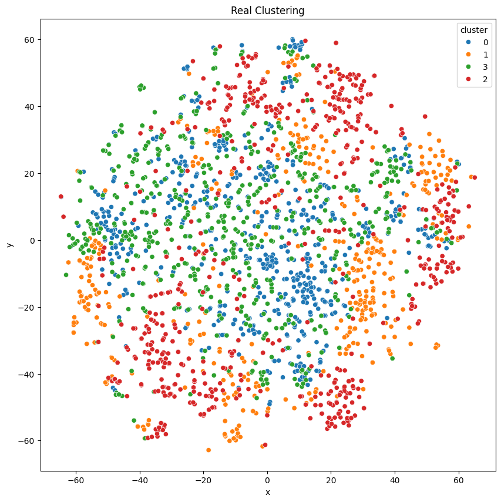

<a href="https://colab.research.google.com/github/dattali18/IR_Assignments/blob/main/Assignment.02/notebooks/IR_02_Clustering_TFIDF.ipynb" target="_parent"></a>

# Clustering

## 1. Objective

Take the document (meaning vector representation of the document, the ouput of the last assginment `Doc2Vec`, `BERT`, `Sentence-BERT`, times 4 group from each) and cluster them into groups and compare the results with the actuale division form each publication.

## 2. Input

4 Groups of matrices each line repesent a document in it's vector form, from:

1. `Doc2Vec`
2. `BERT`
3. `Sentence-BERT`

### 3. Task

- Combine the four matrices into a single matrix for each technique.
- Apply clustering using:
- **K-Means** (with `k=4` for 4 journals).
- **DBSCAN** (select `eps` and `min_samples` heuristically).
- **Gaussian Mixture Model**.
- Evaluate the clusters using:
- Metrics: Precision, Recall, F1-Score, Accuracy.
- Visualization: Use UMAP, t-SNE, or other tools (e.g., Seaborn).


### 4. Output

- The plot of the real clusters vs. the clusters from the 3 methods mentioned above.
- The metrics for each clustering method.

# Doc2Vec Matrices

We have 4 `.csv` files with each $(100, \approx 600)$ and we need to combine them into one big matrix and then cluster them.

## Plan

1. Download the files from my `GitHub`.
2. Add a `'cluster'` column for each file (`=0` for AJ etc...).
3. Cluster with `Kmeans` for `k=4`.
4. Write a function to find the right parameters for 4 clusters for `DBSCAN` (i.e. the `eps` and `min_samples` parameters).
5. Cluster with `DBSCAN`
6. Cluster with `GMM`
7. Use `t-SNE` to visualize the cluster in $\mathbb{R}^2$
8. Output the plot for each clustering methods + original
9. Measure each method using the metric mentioned above.


```python
import warnings

warnings.filterwarnings("ignore")
```

Download the files from my `GitHub`


```python
# aj_clean_link = "https://github.com/dattali18/IR_Assignments/tree/main/Assignment.02/data/TF-IDF/bm25_clean_A-J.xlsx?raw=true"
# bbc_clean_link = "https://github.com/dattali18/IR_Assignments/tree/main/Assignment.02/data/TF-IDF/bm25_clean_BBC.xlsx?raw=true"
# nyt_clean_link = "https://github.com/dattali18/IR_Assignments/tree/main/Assignment.02/data/TF-IDF/bm25_clean_NY-T.xlsx?raw=true"
# jp_clean_link = "https://github.com/dattali18/IR_Assignments/tree/main/Assignment.02/data/TF-IDF/bm25_clean_J-P.xlsx?raw=true"
```


```python
# !rm -rf data/
```


```python
# # download the file into the data dir and then try opening them
# import requests
# import os

# # if data dir doesnt exists create it
# if not os.path.exists("data"):
#     os.makedirs("data")

# def download_file(url, filename):
#     response = requests.get(url)
#     with open(filename, 'wb') as f:
#         f.write(response.content)
#     print("Downloaded file into data dir")

# download_file(aj_clean_link, "data/aj_clean.xlsx")
# download_file(bbc_clean_link, "data/bbc_clean.xlsx")
# download_file(nyt_clean_link, "data/nyt_clean.xlsx")
# download_file(jp_clean_link, "data/jp_clean.xlsx")
```

Downloaded file into data dir
Downloaded file into data dir
Downloaded file into data dir
Downloaded file into data dir


```python
import pandas as pd

df_aj = pd.read_excel("data/bm25_clean_A-J.xlsx")
# df_bbc = pd.read_excel("data/bm25_clean_BBC.xlsx")
# df_nyt = pd.read_excel("data/bm25_clean_NY-T.xlsx")
# df_jp = pd.read_excel("data/bm25_clean_J-P.xlsx")

df_aj.head()
```


<div id="df-c6d1095e-c7e5-465c-91a5-460809726fe4" class="colab-df-container">
<div>
<style scoped>
.dataframe tbody tr th:only-of-type {
	vertical-align: middle;
}

.dataframe tbody tr th {
	vertical-align: top;
}

.dataframe thead th {
	text-align: right;
}
</style>
<table border="1" class="dataframe">
<thead>
<tr style="text-align: right;">
  <th></th>
  <th>DocumentIndex</th>
  <th>israel</th>
  <th>said</th>
  <th>gaza</th>
  <th>israeli</th>
  <th>hamas</th>
  <th>rsquo</th>
  <th>ldquo</th>
  <th>rdquo</th>
  <th>war</th>
  <th>...</th>
  <th>inconsistencies</th>
  <th>kindertransport</th>
  <th>longest-serving</th>
  <th>indiscriminately</th>
  <th>american-supplied</th>
  <th>behind-the-scenes</th>
  <th>counterproductive</th>
  <th>counterprotesters</th>
  <th>interdisciplinary</th>
  <th>counter-protesters</th>
</tr>
</thead>
<tbody>
<tr>
  <th>0</th>
  <td>0</td>
  <td>0.00000</td>
  <td>0.0</td>
  <td>1.893326</td>
  <td>0.373610</td>
  <td>0.0</td>
  <td>0</td>
  <td>0</td>
  <td>0</td>
  <td>0.0000</td>
  <td>...</td>
  <td>0</td>
  <td>0</td>
  <td>0</td>
  <td>0</td>
  <td>0</td>
  <td>0.0</td>
  <td>0</td>
  <td>0</td>
  <td>0</td>
  <td>0.0</td>
</tr>
<tr>
  <th>1</th>
  <td>1</td>
  <td>0.18534</td>
  <td>0.0</td>
  <td>0.000000</td>
  <td>0.377472</td>
  <td>0.0</td>
  <td>0</td>
  <td>0</td>
  <td>0</td>
  <td>0.0000</td>
  <td>...</td>
  <td>0</td>
  <td>0</td>
  <td>0</td>
  <td>0</td>
  <td>0</td>
  <td>0.0</td>
  <td>0</td>
  <td>0</td>
  <td>0</td>
  <td>0.0</td>
</tr>
<tr>
  <th>2</th>
  <td>2</td>
  <td>0.00000</td>
  <td>0.0</td>
  <td>1.950967</td>
  <td>0.648199</td>
  <td>0.0</td>
  <td>0</td>
  <td>0</td>
  <td>0</td>
  <td>0.0000</td>
  <td>...</td>
  <td>0</td>
  <td>0</td>
  <td>0</td>
  <td>0</td>
  <td>0</td>
  <td>0.0</td>
  <td>0</td>
  <td>0</td>
  <td>0</td>
  <td>0.0</td>
</tr>
<tr>
  <th>3</th>
  <td>3</td>
  <td>0.00000</td>
  <td>0.0</td>
  <td>1.338546</td>
  <td>0.000000</td>
  <td>0.0</td>
  <td>0</td>
  <td>0</td>
  <td>0</td>
  <td>0.0557</td>
  <td>...</td>
  <td>0</td>
  <td>0</td>
  <td>0</td>
  <td>0</td>
  <td>0</td>
  <td>0.0</td>
  <td>0</td>
  <td>0</td>
  <td>0</td>
  <td>0.0</td>
</tr>
<tr>
  <th>4</th>
  <td>4</td>
  <td>0.00000</td>
  <td>0.0</td>
  <td>2.077459</td>
  <td>0.591964</td>
  <td>0.0</td>
  <td>0</td>
  <td>0</td>
  <td>0</td>
  <td>0.0000</td>
  <td>...</td>
  <td>0</td>
  <td>0</td>
  <td>0</td>
  <td>0</td>
  <td>0</td>
  <td>0.0</td>
  <td>0</td>
  <td>0</td>
  <td>0</td>
  <td>0.0</td>
</tr>
</tbody>
</table>
<p>5 rows × 7975 columns</p>
</div>
<div class="colab-df-buttons">

<div class="colab-df-container">
<button class="colab-df-convert" onclick="convertToInteractive('df-c6d1095e-c7e5-465c-91a5-460809726fe4')"
		title="Convert this dataframe to an interactive table."
		style="display:none;">

<svg xmlns="http://www.w3.org/2000/svg" height="24px" viewBox="0 -960 960 960">
<path d="M120-120v-720h720v720H120Zm60-500h600v-160H180v160Zm220 220h160v-160H400v160Zm0 220h160v-160H400v160ZM180-400h160v-160H180v160Zm440 0h160v-160H620v160ZM180-180h160v-160H180v160Zm440 0h160v-160H620v160Z"/>
</svg>
</button>

<style>
.colab-df-container {
  display:flex;
  gap: 12px;
}

.colab-df-convert {
  background-color: #E8F0FE;
  border: none;
  border-radius: 50%;
  cursor: pointer;
  display: none;
  fill: #1967D2;
  height: 32px;
  padding: 0 0 0 0;
  width: 32px;
}

.colab-df-convert:hover {
  background-color: #E2EBFA;
  box-shadow: 0px 1px 2px rgba(60, 64, 67, 0.3), 0px 1px 3px 1px rgba(60, 64, 67, 0.15);
  fill: #174EA6;
}

.colab-df-buttons div {
  margin-bottom: 4px;
}

[theme=dark] .colab-df-convert {
  background-color: #3B4455;
  fill: #D2E3FC;
}

[theme=dark] .colab-df-convert:hover {
  background-color: #434B5C;
  box-shadow: 0px 1px 3px 1px rgba(0, 0, 0, 0.15);
  filter: drop-shadow(0px 1px 2px rgba(0, 0, 0, 0.3));
  fill: #FFFFFF;
}
</style>

<script>
  const buttonEl =
	document.querySelector('#df-c6d1095e-c7e5-465c-91a5-460809726fe4 button.colab-df-convert');
  buttonEl.style.display =
	google.colab.kernel.accessAllowed ? 'block' : 'none';

  async function convertToInteractive(key) {
	const element = document.querySelector('#df-c6d1095e-c7e5-465c-91a5-460809726fe4');
	const dataTable =
	  await google.colab.kernel.invokeFunction('convertToInteractive',
												[key], {});
	if (!dataTable) return;

	const docLinkHtml = 'Like what you see? Visit the ' +
	  '<a target="_blank" href=https://colab.research.google.com/notebooks/data_table.ipynb>data table notebook</a>'
	  + ' to learn more about interactive tables.';
	element.innerHTML = '';
	dataTable['output_type'] = 'display_data';
	await google.colab.output.renderOutput(dataTable, element);
	const docLink = document.createElement('div');
	docLink.innerHTML = docLinkHtml;
	element.appendChild(docLink);
  }
</script>
</div>


<div id="df-39973277-7cf3-4da2-aa2c-f913a9166371">
<button class="colab-df-quickchart" onclick="quickchart('df-39973277-7cf3-4da2-aa2c-f913a9166371')"
		title="Suggest charts"
		style="display:none;">

<svg xmlns="http://www.w3.org/2000/svg" height="24px"viewBox="0 0 24 24"
 width="24px">
<g>
	<path d="M19 3H5c-1.1 0-2 .9-2 2v14c0 1.1.9 2 2 2h14c1.1 0 2-.9 2-2V5c0-1.1-.9-2-2-2zM9 17H7v-7h2v7zm4 0h-2V7h2v10zm4 0h-2v-4h2v4z"/>
</g>
</svg>
</button>

<style>
.colab-df-quickchart {
  --bg-color: #E8F0FE;
  --fill-color: #1967D2;
  --hover-bg-color: #E2EBFA;
  --hover-fill-color: #174EA6;
  --disabled-fill-color: #AAA;
  --disabled-bg-color: #DDD;
}

[theme=dark] .colab-df-quickchart {
  --bg-color: #3B4455;
  --fill-color: #D2E3FC;
  --hover-bg-color: #434B5C;
  --hover-fill-color: #FFFFFF;
  --disabled-bg-color: #3B4455;
  --disabled-fill-color: #666;
}

.colab-df-quickchart {
background-color: var(--bg-color);
border: none;
border-radius: 50%;
cursor: pointer;
display: none;
fill: var(--fill-color);
height: 32px;
padding: 0;
width: 32px;
}

.colab-df-quickchart:hover {
background-color: var(--hover-bg-color);
box-shadow: 0 1px 2px rgba(60, 64, 67, 0.3), 0 1px 3px 1px rgba(60, 64, 67, 0.15);
fill: var(--button-hover-fill-color);
}

.colab-df-quickchart-complete:disabled,
.colab-df-quickchart-complete:disabled:hover {
background-color: var(--disabled-bg-color);
fill: var(--disabled-fill-color);
box-shadow: none;
}

.colab-df-spinner {
border: 2px solid var(--fill-color);
border-color: transparent;
border-bottom-color: var(--fill-color);
animation:
  spin 1s steps(1) infinite;
}

@keyframes spin {
0% {
  border-color: transparent;
  border-bottom-color: var(--fill-color);
  border-left-color: var(--fill-color);
}
20% {
  border-color: transparent;
  border-left-color: var(--fill-color);
  border-top-color: var(--fill-color);
}
30% {
  border-color: transparent;
  border-left-color: var(--fill-color);
  border-top-color: var(--fill-color);
  border-right-color: var(--fill-color);
}
40% {
  border-color: transparent;
  border-right-color: var(--fill-color);
  border-top-color: var(--fill-color);
}
60% {
  border-color: transparent;
  border-right-color: var(--fill-color);
}
80% {
  border-color: transparent;
  border-right-color: var(--fill-color);
  border-bottom-color: var(--fill-color);
}
90% {
  border-color: transparent;
  border-bottom-color: var(--fill-color);
}
}
</style>

<script>
async function quickchart(key) {
  const quickchartButtonEl =
	document.querySelector('#' + key + ' button');
  quickchartButtonEl.disabled = true;  // To prevent multiple clicks.
  quickchartButtonEl.classList.add('colab-df-spinner');
  try {
	const charts = await google.colab.kernel.invokeFunction(
		'suggestCharts', [key], {});
  } catch (error) {
	console.error('Error during call to suggestCharts:', error);
  }
  quickchartButtonEl.classList.remove('colab-df-spinner');
  quickchartButtonEl.classList.add('colab-df-quickchart-complete');
}
(() => {
  let quickchartButtonEl =
	document.querySelector('#df-39973277-7cf3-4da2-aa2c-f913a9166371 button');
  quickchartButtonEl.style.display =
	google.colab.kernel.accessAllowed ? 'block' : 'none';
})();
</script>
</div>

</div>
</div>


```python
df_bbc = pd.read_excel("data/bm25_clean_BBC.xlsx")
df_nyt = pd.read_excel("data/bm25_clean_NY-T.xlsx")
df_jp = pd.read_excel("data/bm25_clean_J-P.xlsx")

print(df_bbc.shape)
print(df_nyt.shape)
print(df_jp.shape)
```

(549, 7975)
(599, 7975)
(599, 7975)


```python
# create a new df where we concat all the 4 other df but before we add a 'sheet'
# col with aj for aj etc
# remove the DocumentIndex col
# and instead add an id of aj_<index> bbc_<index>

# create an id col
df_aj['id'] = 'aj_' + df_aj['DocumentIndex'].astype(str)
df_bbc['id'] = 'bbc_' + df_bbc['DocumentIndex'].astype(str)
df_nyt['id'] = 'nyt_' + df_nyt['DocumentIndex'].astype(str)
df_jp['id'] = 'jp_' + df_jp['DocumentIndex'].astype(str)

# remove the DocumentIndex col
df_aj = df_aj.drop(columns=['DocumentIndex'])
df_bbc = df_bbc.drop(columns=['DocumentIndex'])
df_nyt = df_nyt.drop(columns=['DocumentIndex'])
df_jp = df_jp.drop(columns=['DocumentIndex'])

# add an sheet col
df_aj['Sheet'] = 'A-J'
df_bbc['Sheet'] = 'BBC'
df_nyt['Sheet'] = 'NY-T'
df_jp['Sheet'] = 'J-P'

# concat all the 4 df
df = pd.concat([df_aj, df_bbc, df_nyt, df_jp])

df.shape
```


(2346, 7976)


```python
df.head()
```


<div id="df-9351c308-cab4-4b06-aff0-78e5624c099b" class="colab-df-container">
<div>
<style scoped>
.dataframe tbody tr th:only-of-type {
	vertical-align: middle;
}

.dataframe tbody tr th {
	vertical-align: top;
}

.dataframe thead th {
	text-align: right;
}
</style>
<table border="1" class="dataframe">
<thead>
<tr style="text-align: right;">
  <th></th>
  <th>israel</th>
  <th>said</th>
  <th>gaza</th>
  <th>israeli</th>
  <th>hamas</th>
  <th>rsquo</th>
  <th>ldquo</th>
  <th>rdquo</th>
  <th>war</th>
  <th>us</th>
  <th>...</th>
  <th>longest-serving</th>
  <th>indiscriminately</th>
  <th>american-supplied</th>
  <th>behind-the-scenes</th>
  <th>counterproductive</th>
  <th>counterprotesters</th>
  <th>interdisciplinary</th>
  <th>counter-protesters</th>
  <th>id</th>
  <th>Sheet</th>
</tr>
</thead>
<tbody>
<tr>
  <th>0</th>
  <td>0.00000</td>
  <td>0.0</td>
  <td>1.893326</td>
  <td>0.373610</td>
  <td>0.0</td>
  <td>0.0</td>
  <td>0.0</td>
  <td>0.0</td>
  <td>0.0000</td>
  <td>0.000000</td>
  <td>...</td>
  <td>0.0</td>
  <td>0.0</td>
  <td>0.0</td>
  <td>0.0</td>
  <td>0.0</td>
  <td>0.0</td>
  <td>0.0</td>
  <td>0.0</td>
  <td>aj_0</td>
  <td>A-J</td>
</tr>
<tr>
  <th>1</th>
  <td>0.18534</td>
  <td>0.0</td>
  <td>0.000000</td>
  <td>0.377472</td>
  <td>0.0</td>
  <td>0.0</td>
  <td>0.0</td>
  <td>0.0</td>
  <td>0.0000</td>
  <td>1.226182</td>
  <td>...</td>
  <td>0.0</td>
  <td>0.0</td>
  <td>0.0</td>
  <td>0.0</td>
  <td>0.0</td>
  <td>0.0</td>
  <td>0.0</td>
  <td>0.0</td>
  <td>aj_1</td>
  <td>A-J</td>
</tr>
<tr>
  <th>2</th>
  <td>0.00000</td>
  <td>0.0</td>
  <td>1.950967</td>
  <td>0.648199</td>
  <td>0.0</td>
  <td>0.0</td>
  <td>0.0</td>
  <td>0.0</td>
  <td>0.0000</td>
  <td>0.000000</td>
  <td>...</td>
  <td>0.0</td>
  <td>0.0</td>
  <td>0.0</td>
  <td>0.0</td>
  <td>0.0</td>
  <td>0.0</td>
  <td>0.0</td>
  <td>0.0</td>
  <td>aj_2</td>
  <td>A-J</td>
</tr>
<tr>
  <th>3</th>
  <td>0.00000</td>
  <td>0.0</td>
  <td>1.338546</td>
  <td>0.000000</td>
  <td>0.0</td>
  <td>0.0</td>
  <td>0.0</td>
  <td>0.0</td>
  <td>0.0557</td>
  <td>0.000000</td>
  <td>...</td>
  <td>0.0</td>
  <td>0.0</td>
  <td>0.0</td>
  <td>0.0</td>
  <td>0.0</td>
  <td>0.0</td>
  <td>0.0</td>
  <td>0.0</td>
  <td>aj_3</td>
  <td>A-J</td>
</tr>
<tr>
  <th>4</th>
  <td>0.00000</td>
  <td>0.0</td>
  <td>2.077459</td>
  <td>0.591964</td>
  <td>0.0</td>
  <td>0.0</td>
  <td>0.0</td>
  <td>0.0</td>
  <td>0.0000</td>
  <td>0.000000</td>
  <td>...</td>
  <td>0.0</td>
  <td>0.0</td>
  <td>0.0</td>
  <td>0.0</td>
  <td>0.0</td>
  <td>0.0</td>
  <td>0.0</td>
  <td>0.0</td>
  <td>aj_4</td>
  <td>A-J</td>
</tr>
</tbody>
</table>
<p>5 rows × 7976 columns</p>
</div>
<div class="colab-df-buttons">

<div class="colab-df-container">
<button class="colab-df-convert" onclick="convertToInteractive('df-9351c308-cab4-4b06-aff0-78e5624c099b')"
		title="Convert this dataframe to an interactive table."
		style="display:none;">

<svg xmlns="http://www.w3.org/2000/svg" height="24px" viewBox="0 -960 960 960">
<path d="M120-120v-720h720v720H120Zm60-500h600v-160H180v160Zm220 220h160v-160H400v160Zm0 220h160v-160H400v160ZM180-400h160v-160H180v160Zm440 0h160v-160H620v160ZM180-180h160v-160H180v160Zm440 0h160v-160H620v160Z"/>
</svg>
</button>

<style>
.colab-df-container {
  display:flex;
  gap: 12px;
}

.colab-df-convert {
  background-color: #E8F0FE;
  border: none;
  border-radius: 50%;
  cursor: pointer;
  display: none;
  fill: #1967D2;
  height: 32px;
  padding: 0 0 0 0;
  width: 32px;
}

.colab-df-convert:hover {
  background-color: #E2EBFA;
  box-shadow: 0px 1px 2px rgba(60, 64, 67, 0.3), 0px 1px 3px 1px rgba(60, 64, 67, 0.15);
  fill: #174EA6;
}

.colab-df-buttons div {
  margin-bottom: 4px;
}

[theme=dark] .colab-df-convert {
  background-color: #3B4455;
  fill: #D2E3FC;
}

[theme=dark] .colab-df-convert:hover {
  background-color: #434B5C;
  box-shadow: 0px 1px 3px 1px rgba(0, 0, 0, 0.15);
  filter: drop-shadow(0px 1px 2px rgba(0, 0, 0, 0.3));
  fill: #FFFFFF;
}
</style>

<script>
  const buttonEl =
	document.querySelector('#df-9351c308-cab4-4b06-aff0-78e5624c099b button.colab-df-convert');
  buttonEl.style.display =
	google.colab.kernel.accessAllowed ? 'block' : 'none';

  async function convertToInteractive(key) {
	const element = document.querySelector('#df-9351c308-cab4-4b06-aff0-78e5624c099b');
	const dataTable =
	  await google.colab.kernel.invokeFunction('convertToInteractive',
												[key], {});
	if (!dataTable) return;

	const docLinkHtml = 'Like what you see? Visit the ' +
	  '<a target="_blank" href=https://colab.research.google.com/notebooks/data_table.ipynb>data table notebook</a>'
	  + ' to learn more about interactive tables.';
	element.innerHTML = '';
	dataTable['output_type'] = 'display_data';
	await google.colab.output.renderOutput(dataTable, element);
	const docLink = document.createElement('div');
	docLink.innerHTML = docLinkHtml;
	element.appendChild(docLink);
  }
</script>
</div>


<div id="df-23848e04-1348-483c-8b9e-e92274e15b92">
<button class="colab-df-quickchart" onclick="quickchart('df-23848e04-1348-483c-8b9e-e92274e15b92')"
		title="Suggest charts"
		style="display:none;">

<svg xmlns="http://www.w3.org/2000/svg" height="24px"viewBox="0 0 24 24"
 width="24px">
<g>
	<path d="M19 3H5c-1.1 0-2 .9-2 2v14c0 1.1.9 2 2 2h14c1.1 0 2-.9 2-2V5c0-1.1-.9-2-2-2zM9 17H7v-7h2v7zm4 0h-2V7h2v10zm4 0h-2v-4h2v4z"/>
</g>
</svg>
</button>

<style>
.colab-df-quickchart {
  --bg-color: #E8F0FE;
  --fill-color: #1967D2;
  --hover-bg-color: #E2EBFA;
  --hover-fill-color: #174EA6;
  --disabled-fill-color: #AAA;
  --disabled-bg-color: #DDD;
}

[theme=dark] .colab-df-quickchart {
  --bg-color: #3B4455;
  --fill-color: #D2E3FC;
  --hover-bg-color: #434B5C;
  --hover-fill-color: #FFFFFF;
  --disabled-bg-color: #3B4455;
  --disabled-fill-color: #666;
}

.colab-df-quickchart {
background-color: var(--bg-color);
border: none;
border-radius: 50%;
cursor: pointer;
display: none;
fill: var(--fill-color);
height: 32px;
padding: 0;
width: 32px;
}

.colab-df-quickchart:hover {
background-color: var(--hover-bg-color);
box-shadow: 0 1px 2px rgba(60, 64, 67, 0.3), 0 1px 3px 1px rgba(60, 64, 67, 0.15);
fill: var(--button-hover-fill-color);
}

.colab-df-quickchart-complete:disabled,
.colab-df-quickchart-complete:disabled:hover {
background-color: var(--disabled-bg-color);
fill: var(--disabled-fill-color);
box-shadow: none;
}

.colab-df-spinner {
border: 2px solid var(--fill-color);
border-color: transparent;
border-bottom-color: var(--fill-color);
animation:
  spin 1s steps(1) infinite;
}

@keyframes spin {
0% {
  border-color: transparent;
  border-bottom-color: var(--fill-color);
  border-left-color: var(--fill-color);
}
20% {
  border-color: transparent;
  border-left-color: var(--fill-color);
  border-top-color: var(--fill-color);
}
30% {
  border-color: transparent;
  border-left-color: var(--fill-color);
  border-top-color: var(--fill-color);
  border-right-color: var(--fill-color);
}
40% {
  border-color: transparent;
  border-right-color: var(--fill-color);
  border-top-color: var(--fill-color);
}
60% {
  border-color: transparent;
  border-right-color: var(--fill-color);
}
80% {
  border-color: transparent;
  border-right-color: var(--fill-color);
  border-bottom-color: var(--fill-color);
}
90% {
  border-color: transparent;
  border-bottom-color: var(--fill-color);
}
}
</style>

<script>
async function quickchart(key) {
  const quickchartButtonEl =
	document.querySelector('#' + key + ' button');
  quickchartButtonEl.disabled = true;  // To prevent multiple clicks.
  quickchartButtonEl.classList.add('colab-df-spinner');
  try {
	const charts = await google.colab.kernel.invokeFunction(
		'suggestCharts', [key], {});
  } catch (error) {
	console.error('Error during call to suggestCharts:', error);
  }
  quickchartButtonEl.classList.remove('colab-df-spinner');
  quickchartButtonEl.classList.add('colab-df-quickchart-complete');
}
(() => {
  let quickchartButtonEl =
	document.querySelector('#df-23848e04-1348-483c-8b9e-e92274e15b92 button');
  quickchartButtonEl.style.display =
	google.colab.kernel.accessAllowed ? 'block' : 'none';
})();
</script>
</div>

</div>
</div>


```python
# reorder the col to have id and Sheet col to the start
df = df[['id', 'Sheet'] + [col for col in df.columns if col not in ['id', 'Sheet']]]

df.head()
```


<div id="df-39848006-c518-4c86-af3f-ec6f4c8c6580" class="colab-df-container">
<div>
<style scoped>
.dataframe tbody tr th:only-of-type {
	vertical-align: middle;
}

.dataframe tbody tr th {
	vertical-align: top;
}

.dataframe thead th {
	text-align: right;
}
</style>
<table border="1" class="dataframe">
<thead>
<tr style="text-align: right;">
  <th></th>
  <th>id</th>
  <th>Sheet</th>
  <th>israel</th>
  <th>said</th>
  <th>gaza</th>
  <th>israeli</th>
  <th>hamas</th>
  <th>rsquo</th>
  <th>ldquo</th>
  <th>rdquo</th>
  <th>...</th>
  <th>inconsistencies</th>
  <th>kindertransport</th>
  <th>longest-serving</th>
  <th>indiscriminately</th>
  <th>american-supplied</th>
  <th>behind-the-scenes</th>
  <th>counterproductive</th>
  <th>counterprotesters</th>
  <th>interdisciplinary</th>
  <th>counter-protesters</th>
</tr>
</thead>
<tbody>
<tr>
  <th>0</th>
  <td>aj_0</td>
  <td>A-J</td>
  <td>0.00000</td>
  <td>0.0</td>
  <td>1.893326</td>
  <td>0.373610</td>
  <td>0.0</td>
  <td>0.0</td>
  <td>0.0</td>
  <td>0.0</td>
  <td>...</td>
  <td>0.0</td>
  <td>0.0</td>
  <td>0.0</td>
  <td>0.0</td>
  <td>0.0</td>
  <td>0.0</td>
  <td>0.0</td>
  <td>0.0</td>
  <td>0.0</td>
  <td>0.0</td>
</tr>
<tr>
  <th>1</th>
  <td>aj_1</td>
  <td>A-J</td>
  <td>0.18534</td>
  <td>0.0</td>
  <td>0.000000</td>
  <td>0.377472</td>
  <td>0.0</td>
  <td>0.0</td>
  <td>0.0</td>
  <td>0.0</td>
  <td>...</td>
  <td>0.0</td>
  <td>0.0</td>
  <td>0.0</td>
  <td>0.0</td>
  <td>0.0</td>
  <td>0.0</td>
  <td>0.0</td>
  <td>0.0</td>
  <td>0.0</td>
  <td>0.0</td>
</tr>
<tr>
  <th>2</th>
  <td>aj_2</td>
  <td>A-J</td>
  <td>0.00000</td>
  <td>0.0</td>
  <td>1.950967</td>
  <td>0.648199</td>
  <td>0.0</td>
  <td>0.0</td>
  <td>0.0</td>
  <td>0.0</td>
  <td>...</td>
  <td>0.0</td>
  <td>0.0</td>
  <td>0.0</td>
  <td>0.0</td>
  <td>0.0</td>
  <td>0.0</td>
  <td>0.0</td>
  <td>0.0</td>
  <td>0.0</td>
  <td>0.0</td>
</tr>
<tr>
  <th>3</th>
  <td>aj_3</td>
  <td>A-J</td>
  <td>0.00000</td>
  <td>0.0</td>
  <td>1.338546</td>
  <td>0.000000</td>
  <td>0.0</td>
  <td>0.0</td>
  <td>0.0</td>
  <td>0.0</td>
  <td>...</td>
  <td>0.0</td>
  <td>0.0</td>
  <td>0.0</td>
  <td>0.0</td>
  <td>0.0</td>
  <td>0.0</td>
  <td>0.0</td>
  <td>0.0</td>
  <td>0.0</td>
  <td>0.0</td>
</tr>
<tr>
  <th>4</th>
  <td>aj_4</td>
  <td>A-J</td>
  <td>0.00000</td>
  <td>0.0</td>
  <td>2.077459</td>
  <td>0.591964</td>
  <td>0.0</td>
  <td>0.0</td>
  <td>0.0</td>
  <td>0.0</td>
  <td>...</td>
  <td>0.0</td>
  <td>0.0</td>
  <td>0.0</td>
  <td>0.0</td>
  <td>0.0</td>
  <td>0.0</td>
  <td>0.0</td>
  <td>0.0</td>
  <td>0.0</td>
  <td>0.0</td>
</tr>
</tbody>
</table>
<p>5 rows × 7976 columns</p>
</div>
<div class="colab-df-buttons">

<div class="colab-df-container">
<button class="colab-df-convert" onclick="convertToInteractive('df-39848006-c518-4c86-af3f-ec6f4c8c6580')"
		title="Convert this dataframe to an interactive table."
		style="display:none;">

<svg xmlns="http://www.w3.org/2000/svg" height="24px" viewBox="0 -960 960 960">
<path d="M120-120v-720h720v720H120Zm60-500h600v-160H180v160Zm220 220h160v-160H400v160Zm0 220h160v-160H400v160ZM180-400h160v-160H180v160Zm440 0h160v-160H620v160ZM180-180h160v-160H180v160Zm440 0h160v-160H620v160Z"/>
</svg>
</button>

<style>
.colab-df-container {
  display:flex;
  gap: 12px;
}

.colab-df-convert {
  background-color: #E8F0FE;
  border: none;
  border-radius: 50%;
  cursor: pointer;
  display: none;
  fill: #1967D2;
  height: 32px;
  padding: 0 0 0 0;
  width: 32px;
}

.colab-df-convert:hover {
  background-color: #E2EBFA;
  box-shadow: 0px 1px 2px rgba(60, 64, 67, 0.3), 0px 1px 3px 1px rgba(60, 64, 67, 0.15);
  fill: #174EA6;
}

.colab-df-buttons div {
  margin-bottom: 4px;
}

[theme=dark] .colab-df-convert {
  background-color: #3B4455;
  fill: #D2E3FC;
}

[theme=dark] .colab-df-convert:hover {
  background-color: #434B5C;
  box-shadow: 0px 1px 3px 1px rgba(0, 0, 0, 0.15);
  filter: drop-shadow(0px 1px 2px rgba(0, 0, 0, 0.3));
  fill: #FFFFFF;
}
</style>

<script>
  const buttonEl =
	document.querySelector('#df-39848006-c518-4c86-af3f-ec6f4c8c6580 button.colab-df-convert');
  buttonEl.style.display =
	google.colab.kernel.accessAllowed ? 'block' : 'none';

  async function convertToInteractive(key) {
	const element = document.querySelector('#df-39848006-c518-4c86-af3f-ec6f4c8c6580');
	const dataTable =
	  await google.colab.kernel.invokeFunction('convertToInteractive',
												[key], {});
	if (!dataTable) return;

	const docLinkHtml = 'Like what you see? Visit the ' +
	  '<a target="_blank" href=https://colab.research.google.com/notebooks/data_table.ipynb>data table notebook</a>'
	  + ' to learn more about interactive tables.';
	element.innerHTML = '';
	dataTable['output_type'] = 'display_data';
	await google.colab.output.renderOutput(dataTable, element);
	const docLink = document.createElement('div');
	docLink.innerHTML = docLinkHtml;
	element.appendChild(docLink);
  }
</script>
</div>


<div id="df-bfd49861-d7f5-4c36-be2f-f25851090422">
<button class="colab-df-quickchart" onclick="quickchart('df-bfd49861-d7f5-4c36-be2f-f25851090422')"
		title="Suggest charts"
		style="display:none;">

<svg xmlns="http://www.w3.org/2000/svg" height="24px"viewBox="0 0 24 24"
 width="24px">
<g>
	<path d="M19 3H5c-1.1 0-2 .9-2 2v14c0 1.1.9 2 2 2h14c1.1 0 2-.9 2-2V5c0-1.1-.9-2-2-2zM9 17H7v-7h2v7zm4 0h-2V7h2v10zm4 0h-2v-4h2v4z"/>
</g>
</svg>
</button>

<style>
.colab-df-quickchart {
  --bg-color: #E8F0FE;
  --fill-color: #1967D2;
  --hover-bg-color: #E2EBFA;
  --hover-fill-color: #174EA6;
  --disabled-fill-color: #AAA;
  --disabled-bg-color: #DDD;
}

[theme=dark] .colab-df-quickchart {
  --bg-color: #3B4455;
  --fill-color: #D2E3FC;
  --hover-bg-color: #434B5C;
  --hover-fill-color: #FFFFFF;
  --disabled-bg-color: #3B4455;
  --disabled-fill-color: #666;
}

.colab-df-quickchart {
background-color: var(--bg-color);
border: none;
border-radius: 50%;
cursor: pointer;
display: none;
fill: var(--fill-color);
height: 32px;
padding: 0;
width: 32px;
}

.colab-df-quickchart:hover {
background-color: var(--hover-bg-color);
box-shadow: 0 1px 2px rgba(60, 64, 67, 0.3), 0 1px 3px 1px rgba(60, 64, 67, 0.15);
fill: var(--button-hover-fill-color);
}

.colab-df-quickchart-complete:disabled,
.colab-df-quickchart-complete:disabled:hover {
background-color: var(--disabled-bg-color);
fill: var(--disabled-fill-color);
box-shadow: none;
}

.colab-df-spinner {
border: 2px solid var(--fill-color);
border-color: transparent;
border-bottom-color: var(--fill-color);
animation:
  spin 1s steps(1) infinite;
}

@keyframes spin {
0% {
  border-color: transparent;
  border-bottom-color: var(--fill-color);
  border-left-color: var(--fill-color);
}
20% {
  border-color: transparent;
  border-left-color: var(--fill-color);
  border-top-color: var(--fill-color);
}
30% {
  border-color: transparent;
  border-left-color: var(--fill-color);
  border-top-color: var(--fill-color);
  border-right-color: var(--fill-color);
}
40% {
  border-color: transparent;
  border-right-color: var(--fill-color);
  border-top-color: var(--fill-color);
}
60% {
  border-color: transparent;
  border-right-color: var(--fill-color);
}
80% {
  border-color: transparent;
  border-right-color: var(--fill-color);
  border-bottom-color: var(--fill-color);
}
90% {
  border-color: transparent;
  border-bottom-color: var(--fill-color);
}
}
</style>

<script>
async function quickchart(key) {
  const quickchartButtonEl =
	document.querySelector('#' + key + ' button');
  quickchartButtonEl.disabled = true;  // To prevent multiple clicks.
  quickchartButtonEl.classList.add('colab-df-spinner');
  try {
	const charts = await google.colab.kernel.invokeFunction(
		'suggestCharts', [key], {});
  } catch (error) {
	console.error('Error during call to suggestCharts:', error);
  }
  quickchartButtonEl.classList.remove('colab-df-spinner');
  quickchartButtonEl.classList.add('colab-df-quickchart-complete');
}
(() => {
  let quickchartButtonEl =
	document.querySelector('#df-bfd49861-d7f5-4c36-be2f-f25851090422 button');
  quickchartButtonEl.style.display =
	google.colab.kernel.accessAllowed ? 'block' : 'none';
})();
</script>
</div>

</div>
</div>


```python
# create the vector col
df['vector'] = df.iloc[:, 2:].values.tolist()

df.head()
```


<div id="df-32e3dca0-a0b4-4934-b6de-01db1c7167df" class="colab-df-container">
<div>
<style scoped>
.dataframe tbody tr th:only-of-type {
	vertical-align: middle;
}

.dataframe tbody tr th {
	vertical-align: top;
}

.dataframe thead th {
	text-align: right;
}
</style>
<table border="1" class="dataframe">
<thead>
<tr style="text-align: right;">
  <th></th>
  <th>id</th>
  <th>Sheet</th>
  <th>israel</th>
  <th>said</th>
  <th>gaza</th>
  <th>israeli</th>
  <th>hamas</th>
  <th>rsquo</th>
  <th>ldquo</th>
  <th>rdquo</th>
  <th>...</th>
  <th>kindertransport</th>
  <th>longest-serving</th>
  <th>indiscriminately</th>
  <th>american-supplied</th>
  <th>behind-the-scenes</th>
  <th>counterproductive</th>
  <th>counterprotesters</th>
  <th>interdisciplinary</th>
  <th>counter-protesters</th>
  <th>vector</th>
</tr>
</thead>
<tbody>
<tr>
  <th>0</th>
  <td>aj_0</td>
  <td>A-J</td>
  <td>0.00000</td>
  <td>0.0</td>
  <td>1.893326</td>
  <td>0.373610</td>
  <td>0.0</td>
  <td>0.0</td>
  <td>0.0</td>
  <td>0.0</td>
  <td>...</td>
  <td>0.0</td>
  <td>0.0</td>
  <td>0.0</td>
  <td>0.0</td>
  <td>0.0</td>
  <td>0.0</td>
  <td>0.0</td>
  <td>0.0</td>
  <td>0.0</td>
  <td>[0.0, 0.0, 1.893326376881906, 0.37361009867568...</td>
</tr>
<tr>
  <th>1</th>
  <td>aj_1</td>
  <td>A-J</td>
  <td>0.18534</td>
  <td>0.0</td>
  <td>0.000000</td>
  <td>0.377472</td>
  <td>0.0</td>
  <td>0.0</td>
  <td>0.0</td>
  <td>0.0</td>
  <td>...</td>
  <td>0.0</td>
  <td>0.0</td>
  <td>0.0</td>
  <td>0.0</td>
  <td>0.0</td>
  <td>0.0</td>
  <td>0.0</td>
  <td>0.0</td>
  <td>0.0</td>
  <td>[0.1853396197512515, 0.0, 0.0, 0.3774716369817...</td>
</tr>
<tr>
  <th>2</th>
  <td>aj_2</td>
  <td>A-J</td>
  <td>0.00000</td>
  <td>0.0</td>
  <td>1.950967</td>
  <td>0.648199</td>
  <td>0.0</td>
  <td>0.0</td>
  <td>0.0</td>
  <td>0.0</td>
  <td>...</td>
  <td>0.0</td>
  <td>0.0</td>
  <td>0.0</td>
  <td>0.0</td>
  <td>0.0</td>
  <td>0.0</td>
  <td>0.0</td>
  <td>0.0</td>
  <td>0.0</td>
  <td>[0.0, 0.0, 1.950966635001597, 0.64819920982025...</td>
</tr>
<tr>
  <th>3</th>
  <td>aj_3</td>
  <td>A-J</td>
  <td>0.00000</td>
  <td>0.0</td>
  <td>1.338546</td>
  <td>0.000000</td>
  <td>0.0</td>
  <td>0.0</td>
  <td>0.0</td>
  <td>0.0</td>
  <td>...</td>
  <td>0.0</td>
  <td>0.0</td>
  <td>0.0</td>
  <td>0.0</td>
  <td>0.0</td>
  <td>0.0</td>
  <td>0.0</td>
  <td>0.0</td>
  <td>0.0</td>
  <td>[0.0, 0.0, 1.338545880678982, 0.0, 0.0, 0.0, 0...</td>
</tr>
<tr>
  <th>4</th>
  <td>aj_4</td>
  <td>A-J</td>
  <td>0.00000</td>
  <td>0.0</td>
  <td>2.077459</td>
  <td>0.591964</td>
  <td>0.0</td>
  <td>0.0</td>
  <td>0.0</td>
  <td>0.0</td>
  <td>...</td>
  <td>0.0</td>
  <td>0.0</td>
  <td>0.0</td>
  <td>0.0</td>
  <td>0.0</td>
  <td>0.0</td>
  <td>0.0</td>
  <td>0.0</td>
  <td>0.0</td>
  <td>[0.0, 0.0, 2.07745855842562, 0.591964341640264...</td>
</tr>
</tbody>
</table>
<p>5 rows × 7977 columns</p>
</div>
<div class="colab-df-buttons">

<div class="colab-df-container">
<button class="colab-df-convert" onclick="convertToInteractive('df-32e3dca0-a0b4-4934-b6de-01db1c7167df')"
		title="Convert this dataframe to an interactive table."
		style="display:none;">

<svg xmlns="http://www.w3.org/2000/svg" height="24px" viewBox="0 -960 960 960">
<path d="M120-120v-720h720v720H120Zm60-500h600v-160H180v160Zm220 220h160v-160H400v160Zm0 220h160v-160H400v160ZM180-400h160v-160H180v160Zm440 0h160v-160H620v160ZM180-180h160v-160H180v160Zm440 0h160v-160H620v160Z"/>
</svg>
</button>

<style>
.colab-df-container {
  display:flex;
  gap: 12px;
}

.colab-df-convert {
  background-color: #E8F0FE;
  border: none;
  border-radius: 50%;
  cursor: pointer;
  display: none;
  fill: #1967D2;
  height: 32px;
  padding: 0 0 0 0;
  width: 32px;
}

.colab-df-convert:hover {
  background-color: #E2EBFA;
  box-shadow: 0px 1px 2px rgba(60, 64, 67, 0.3), 0px 1px 3px 1px rgba(60, 64, 67, 0.15);
  fill: #174EA6;
}

.colab-df-buttons div {
  margin-bottom: 4px;
}

[theme=dark] .colab-df-convert {
  background-color: #3B4455;
  fill: #D2E3FC;
}

[theme=dark] .colab-df-convert:hover {
  background-color: #434B5C;
  box-shadow: 0px 1px 3px 1px rgba(0, 0, 0, 0.15);
  filter: drop-shadow(0px 1px 2px rgba(0, 0, 0, 0.3));
  fill: #FFFFFF;
}
</style>

<script>
  const buttonEl =
	document.querySelector('#df-32e3dca0-a0b4-4934-b6de-01db1c7167df button.colab-df-convert');
  buttonEl.style.display =
	google.colab.kernel.accessAllowed ? 'block' : 'none';

  async function convertToInteractive(key) {
	const element = document.querySelector('#df-32e3dca0-a0b4-4934-b6de-01db1c7167df');
	const dataTable =
	  await google.colab.kernel.invokeFunction('convertToInteractive',
												[key], {});
	if (!dataTable) return;

	const docLinkHtml = 'Like what you see? Visit the ' +
	  '<a target="_blank" href=https://colab.research.google.com/notebooks/data_table.ipynb>data table notebook</a>'
	  + ' to learn more about interactive tables.';
	element.innerHTML = '';
	dataTable['output_type'] = 'display_data';
	await google.colab.output.renderOutput(dataTable, element);
	const docLink = document.createElement('div');
	docLink.innerHTML = docLinkHtml;
	element.appendChild(docLink);
  }
</script>
</div>


<div id="df-700f538a-9b92-4342-9b72-639dad67d599">
<button class="colab-df-quickchart" onclick="quickchart('df-700f538a-9b92-4342-9b72-639dad67d599')"
		title="Suggest charts"
		style="display:none;">

<svg xmlns="http://www.w3.org/2000/svg" height="24px"viewBox="0 0 24 24"
 width="24px">
<g>
	<path d="M19 3H5c-1.1 0-2 .9-2 2v14c0 1.1.9 2 2 2h14c1.1 0 2-.9 2-2V5c0-1.1-.9-2-2-2zM9 17H7v-7h2v7zm4 0h-2V7h2v10zm4 0h-2v-4h2v4z"/>
</g>
</svg>
</button>

<style>
.colab-df-quickchart {
  --bg-color: #E8F0FE;
  --fill-color: #1967D2;
  --hover-bg-color: #E2EBFA;
  --hover-fill-color: #174EA6;
  --disabled-fill-color: #AAA;
  --disabled-bg-color: #DDD;
}

[theme=dark] .colab-df-quickchart {
  --bg-color: #3B4455;
  --fill-color: #D2E3FC;
  --hover-bg-color: #434B5C;
  --hover-fill-color: #FFFFFF;
  --disabled-bg-color: #3B4455;
  --disabled-fill-color: #666;
}

.colab-df-quickchart {
background-color: var(--bg-color);
border: none;
border-radius: 50%;
cursor: pointer;
display: none;
fill: var(--fill-color);
height: 32px;
padding: 0;
width: 32px;
}

.colab-df-quickchart:hover {
background-color: var(--hover-bg-color);
box-shadow: 0 1px 2px rgba(60, 64, 67, 0.3), 0 1px 3px 1px rgba(60, 64, 67, 0.15);
fill: var(--button-hover-fill-color);
}

.colab-df-quickchart-complete:disabled,
.colab-df-quickchart-complete:disabled:hover {
background-color: var(--disabled-bg-color);
fill: var(--disabled-fill-color);
box-shadow: none;
}

.colab-df-spinner {
border: 2px solid var(--fill-color);
border-color: transparent;
border-bottom-color: var(--fill-color);
animation:
  spin 1s steps(1) infinite;
}

@keyframes spin {
0% {
  border-color: transparent;
  border-bottom-color: var(--fill-color);
  border-left-color: var(--fill-color);
}
20% {
  border-color: transparent;
  border-left-color: var(--fill-color);
  border-top-color: var(--fill-color);
}
30% {
  border-color: transparent;
  border-left-color: var(--fill-color);
  border-top-color: var(--fill-color);
  border-right-color: var(--fill-color);
}
40% {
  border-color: transparent;
  border-right-color: var(--fill-color);
  border-top-color: var(--fill-color);
}
60% {
  border-color: transparent;
  border-right-color: var(--fill-color);
}
80% {
  border-color: transparent;
  border-right-color: var(--fill-color);
  border-bottom-color: var(--fill-color);
}
90% {
  border-color: transparent;
  border-bottom-color: var(--fill-color);
}
}
</style>

<script>
async function quickchart(key) {
  const quickchartButtonEl =
	document.querySelector('#' + key + ' button');
  quickchartButtonEl.disabled = true;  // To prevent multiple clicks.
  quickchartButtonEl.classList.add('colab-df-spinner');
  try {
	const charts = await google.colab.kernel.invokeFunction(
		'suggestCharts', [key], {});
  } catch (error) {
	console.error('Error during call to suggestCharts:', error);
  }
  quickchartButtonEl.classList.remove('colab-df-spinner');
  quickchartButtonEl.classList.add('colab-df-quickchart-complete');
}
(() => {
  let quickchartButtonEl =
	document.querySelector('#df-700f538a-9b92-4342-9b72-639dad67d599 button');
  quickchartButtonEl.style.display =
	google.colab.kernel.accessAllowed ? 'block' : 'none';
})();
</script>
</div>

</div>
</div>


```python
# standerdize the data mean=0 std=1

from sklearn.preprocessing import StandardScaler
import numpy as np


scaler = StandardScaler()

# apply to each line of the df

df['std_vector'] = df['vector'].apply(lambda x: scaler.fit_transform(np.array(x).reshape(-1, 1)).flatten())
df['std_vector'].head()
```


<div>
<style scoped>
.dataframe tbody tr th:only-of-type {
	vertical-align: middle;
}

.dataframe tbody tr th {
	vertical-align: top;
}

.dataframe thead th {
	text-align: right;
}
</style>
<table border="1" class="dataframe">
<thead>
<tr style="text-align: right;">
  <th></th>
  <th>std_vector</th>
</tr>
</thead>
<tbody>
<tr>
  <th>0</th>
  <td>[-0.054619953467782575, -0.054619953467782575,...</td>
</tr>
<tr>
  <th>1</th>
  <td>[0.7424595017498579, -0.05817892126005486, -0....</td>
</tr>
<tr>
  <th>2</th>
  <td>[-0.05898953471048584, -0.05898953471048584, 8...</td>
</tr>
<tr>
  <th>3</th>
  <td>[-0.055352259781569685, -0.055352259781569685,...</td>
</tr>
<tr>
  <th>4</th>
  <td>[-0.053095707056546, -0.053095707056546, 8.296...</td>
</tr>
</tbody>
</table>
</div><br><label><b>dtype:</b> object</label>


```python
cluster_map = {'A-J': 0, 'BBC': 1, 'J-P': 2, 'NY-T': 3}
df['cluster'] = df['Sheet'].map(cluster_map)
```


```python
from sklearn.cluster import KMeans, DBSCAN
from sklearn.mixture import GaussianMixture

import numpy as np

import matplotlib.pyplot as plt

import seaborn as sns
```


```python
# visualize the real cluster using t-SNE

from sklearn.manifold import TSNE

tsne = TSNE(n_components=2, random_state=0)

# transofrm the df['vector'] to dataframe with freatuer 0 - 299 for
df_copy = df['std_vector'].apply(pd.Series)

df_tsne = tsne.fit_transform(df_copy)

df_tsne = pd.DataFrame(df_tsne, columns=['x', 'y'])
```


```python
df_tsne['cluster'] = df['cluster'].astype(str).values
```


```python
# print the col name of df_tsne
df_tsne.head()
```


<div id="df-f1a50f56-8f58-41d5-9bde-2279905f3c5a" class="colab-df-container">
<div>
<style scoped>
.dataframe tbody tr th:only-of-type {
	vertical-align: middle;
}

.dataframe tbody tr th {
	vertical-align: top;
}

.dataframe thead th {
	text-align: right;
}
</style>
<table border="1" class="dataframe">
<thead>
<tr style="text-align: right;">
  <th></th>
  <th>x</th>
  <th>y</th>
  <th>cluster</th>
</tr>
</thead>
<tbody>
<tr>
  <th>0</th>
  <td>-27.501118</td>
  <td>-19.840776</td>
  <td>0</td>
</tr>
<tr>
  <th>1</th>
  <td>0.310439</td>
  <td>23.311745</td>
  <td>0</td>
</tr>
<tr>
  <th>2</th>
  <td>3.521003</td>
  <td>3.698400</td>
  <td>0</td>
</tr>
<tr>
  <th>3</th>
  <td>-51.727081</td>
  <td>-8.922517</td>
  <td>0</td>
</tr>
<tr>
  <th>4</th>
  <td>6.055501</td>
  <td>-19.095232</td>
  <td>0</td>
</tr>
</tbody>
</table>
</div>
<div class="colab-df-buttons">

<div class="colab-df-container">
<button class="colab-df-convert" onclick="convertToInteractive('df-f1a50f56-8f58-41d5-9bde-2279905f3c5a')"
		title="Convert this dataframe to an interactive table."
		style="display:none;">

<svg xmlns="http://www.w3.org/2000/svg" height="24px" viewBox="0 -960 960 960">
<path d="M120-120v-720h720v720H120Zm60-500h600v-160H180v160Zm220 220h160v-160H400v160Zm0 220h160v-160H400v160ZM180-400h160v-160H180v160Zm440 0h160v-160H620v160ZM180-180h160v-160H180v160Zm440 0h160v-160H620v160Z"/>
</svg>
</button>

<style>
.colab-df-container {
  display:flex;
  gap: 12px;
}

.colab-df-convert {
  background-color: #E8F0FE;
  border: none;
  border-radius: 50%;
  cursor: pointer;
  display: none;
  fill: #1967D2;
  height: 32px;
  padding: 0 0 0 0;
  width: 32px;
}

.colab-df-convert:hover {
  background-color: #E2EBFA;
  box-shadow: 0px 1px 2px rgba(60, 64, 67, 0.3), 0px 1px 3px 1px rgba(60, 64, 67, 0.15);
  fill: #174EA6;
}

.colab-df-buttons div {
  margin-bottom: 4px;
}

[theme=dark] .colab-df-convert {
  background-color: #3B4455;
  fill: #D2E3FC;
}

[theme=dark] .colab-df-convert:hover {
  background-color: #434B5C;
  box-shadow: 0px 1px 3px 1px rgba(0, 0, 0, 0.15);
  filter: drop-shadow(0px 1px 2px rgba(0, 0, 0, 0.3));
  fill: #FFFFFF;
}
</style>

<script>
  const buttonEl =
	document.querySelector('#df-f1a50f56-8f58-41d5-9bde-2279905f3c5a button.colab-df-convert');
  buttonEl.style.display =
	google.colab.kernel.accessAllowed ? 'block' : 'none';

  async function convertToInteractive(key) {
	const element = document.querySelector('#df-f1a50f56-8f58-41d5-9bde-2279905f3c5a');
	const dataTable =
	  await google.colab.kernel.invokeFunction('convertToInteractive',
												[key], {});
	if (!dataTable) return;

	const docLinkHtml = 'Like what you see? Visit the ' +
	  '<a target="_blank" href=https://colab.research.google.com/notebooks/data_table.ipynb>data table notebook</a>'
	  + ' to learn more about interactive tables.';
	element.innerHTML = '';
	dataTable['output_type'] = 'display_data';
	await google.colab.output.renderOutput(dataTable, element);
	const docLink = document.createElement('div');
	docLink.innerHTML = docLinkHtml;
	element.appendChild(docLink);
  }
</script>
</div>


<div id="df-6077ace3-65a7-4d06-9c38-f48431afacdc">
<button class="colab-df-quickchart" onclick="quickchart('df-6077ace3-65a7-4d06-9c38-f48431afacdc')"
		title="Suggest charts"
		style="display:none;">

<svg xmlns="http://www.w3.org/2000/svg" height="24px"viewBox="0 0 24 24"
 width="24px">
<g>
	<path d="M19 3H5c-1.1 0-2 .9-2 2v14c0 1.1.9 2 2 2h14c1.1 0 2-.9 2-2V5c0-1.1-.9-2-2-2zM9 17H7v-7h2v7zm4 0h-2V7h2v10zm4 0h-2v-4h2v4z"/>
</g>
</svg>
</button>

<style>
.colab-df-quickchart {
  --bg-color: #E8F0FE;
  --fill-color: #1967D2;
  --hover-bg-color: #E2EBFA;
  --hover-fill-color: #174EA6;
  --disabled-fill-color: #AAA;
  --disabled-bg-color: #DDD;
}

[theme=dark] .colab-df-quickchart {
  --bg-color: #3B4455;
  --fill-color: #D2E3FC;
  --hover-bg-color: #434B5C;
  --hover-fill-color: #FFFFFF;
  --disabled-bg-color: #3B4455;
  --disabled-fill-color: #666;
}

.colab-df-quickchart {
background-color: var(--bg-color);
border: none;
border-radius: 50%;
cursor: pointer;
display: none;
fill: var(--fill-color);
height: 32px;
padding: 0;
width: 32px;
}

.colab-df-quickchart:hover {
background-color: var(--hover-bg-color);
box-shadow: 0 1px 2px rgba(60, 64, 67, 0.3), 0 1px 3px 1px rgba(60, 64, 67, 0.15);
fill: var(--button-hover-fill-color);
}

.colab-df-quickchart-complete:disabled,
.colab-df-quickchart-complete:disabled:hover {
background-color: var(--disabled-bg-color);
fill: var(--disabled-fill-color);
box-shadow: none;
}

.colab-df-spinner {
border: 2px solid var(--fill-color);
border-color: transparent;
border-bottom-color: var(--fill-color);
animation:
  spin 1s steps(1) infinite;
}

@keyframes spin {
0% {
  border-color: transparent;
  border-bottom-color: var(--fill-color);
  border-left-color: var(--fill-color);
}
20% {
  border-color: transparent;
  border-left-color: var(--fill-color);
  border-top-color: var(--fill-color);
}
30% {
  border-color: transparent;
  border-left-color: var(--fill-color);
  border-top-color: var(--fill-color);
  border-right-color: var(--fill-color);
}
40% {
  border-color: transparent;
  border-right-color: var(--fill-color);
  border-top-color: var(--fill-color);
}
60% {
  border-color: transparent;
  border-right-color: var(--fill-color);
}
80% {
  border-color: transparent;
  border-right-color: var(--fill-color);
  border-bottom-color: var(--fill-color);
}
90% {
  border-color: transparent;
  border-bottom-color: var(--fill-color);
}
}
</style>

<script>
async function quickchart(key) {
  const quickchartButtonEl =
	document.querySelector('#' + key + ' button');
  quickchartButtonEl.disabled = true;  // To prevent multiple clicks.
  quickchartButtonEl.classList.add('colab-df-spinner');
  try {
	const charts = await google.colab.kernel.invokeFunction(
		'suggestCharts', [key], {});
  } catch (error) {
	console.error('Error during call to suggestCharts:', error);
  }
  quickchartButtonEl.classList.remove('colab-df-spinner');
  quickchartButtonEl.classList.add('colab-df-quickchart-complete');
}
(() => {
  let quickchartButtonEl =
	document.querySelector('#df-6077ace3-65a7-4d06-9c38-f48431afacdc button');
  quickchartButtonEl.style.display =
	google.colab.kernel.accessAllowed ? 'block' : 'none';
})();
</script>
</div>

</div>
</div>


```python
import matplotlib.pyplot as plt

import seaborn as sns

# plot the df_tsne
plt.figure(figsize=(10, 10))
# add labels
plt.title('Real Clustering')

# make color scheme red, blue, green etc
sns.scatterplot(data=df_tsne, x='x', y='y', hue='cluster')

# create a scatterplot

# plt.scatter(df_tsne['x'], df_tsne['y'], c=df_tsne['cluster'])

# show the plot

plt.show()
```





### Kmeans


```python
kmeans = KMeans(n_clusters=4, random_state=0).fit(df['std_vector'].tolist())

df['cluster_kmeans'] = kmeans.labels_

df['cluster_kmeans'].head()
```


<div>
<style scoped>
.dataframe tbody tr th:only-of-type {
	vertical-align: middle;
}

.dataframe tbody tr th {
	vertical-align: top;
}

.dataframe thead th {
	text-align: right;
}
</style>
<table border="1" class="dataframe">
<thead>
<tr style="text-align: right;">
  <th></th>
  <th>cluster_kmeans</th>
</tr>
</thead>
<tbody>
<tr>
  <th>0</th>
  <td>1</td>
</tr>
<tr>
  <th>1</th>
  <td>0</td>
</tr>
<tr>
  <th>2</th>
  <td>1</td>
</tr>
<tr>
  <th>3</th>
  <td>3</td>
</tr>
<tr>
  <th>4</th>
  <td>1</td>
</tr>
</tbody>
</table>
</div><br><label><b>dtype:</b> int32</label>


```python
# visutalize the cluster using the t-SNE df

df_tsne['cluster_kmeans'] = df['cluster_kmeans'].astype(str).values

reverse_cluster_map = {v: k for k, v in cluster_map.items()}

plt.figure(figsize=(10, 10))

plt.title('Kmeans Clustering')

# make color scheme red, blue, green etc


df_tsne['cluster_kmeans'] = df_tsne['cluster_kmeans'].map(str)

sns.scatterplot(data=df_tsne, x='x', y='y', hue='cluster_kmeans')

plt.show()
```


### DBSCAN


```python
!pip install kneed
```

Collecting kneed
  Downloading kneed-0.8.5-py3-none-any.whl.metadata (5.5 kB)
Requirement already satisfied: numpy>=1.14.2 in /usr/local/lib/python3.10/dist-packages (from kneed) (1.26.4)
Requirement already satisfied: scipy>=1.0.0 in /usr/local/lib/python3.10/dist-packages (from kneed) (1.13.1)
Downloading kneed-0.8.5-py3-none-any.whl (10 kB)
Installing collected packages: kneed
Successfully installed kneed-0.8.5


```python
import numpy as np
import pandas as pd
from sklearn.neighbors import NearestNeighbors
from kneed import KneeLocator
from sklearn.cluster import DBSCAN

def get_parameters(df, num_clusters=4, eps_adjustment=1.0, min_samples_adjustment=1):
X = np.array(df)

# Ensure n_neighbors does not exceed the number of samples
n_neighbors = min(2 * X.shape[1] - 1, len(X) - 1)
neighbors = NearestNeighbors(n_neighbors=n_neighbors, metric='cosine')
neighbors_fit = neighbors.fit(X)
distances, indices = neighbors_fit.kneighbors(X)
distances = np.sort(distances, axis=0)
distances = distances[:, 1]

# Use KneeLocator to find the "elbow" point in the k-distance graph
kneedle = KneeLocator(range(len(distances)), distances, S=1.0, curve="convex", direction="increasing")
eps = distances[kneedle.elbow] * eps_adjustment

# Set min_samples to 2 * dimensions, another common heuristic
min_samples = 2 * X.shape[1] * min_samples_adjustment

return eps, min_samples

def find_best_parameters(df, num_clusters=4):
best_eps = None
best_min_samples = None
best_num_clusters = 0

for eps_adjustment in np.arange(0.5, 2.0, 0.1):
	for min_samples_adjustment in range(1, 5):
		eps, min_samples = get_parameters(df, num_clusters, eps_adjustment, min_samples_adjustment)
		# Use DBSCAN with cosine similarity
		db = DBSCAN(eps=eps, min_samples=min_samples, metric='cosine').fit(df)
		labels = db.labels_
		num_clusters_found = len(set(labels)) - (1 if -1 in labels else 0)

		if num_clusters_found == num_clusters:
			return eps, min_samples

		if num_clusters_found > best_num_clusters:
			best_eps = eps
			best_min_samples = min_samples
			best_num_clusters = num_clusters_found

return best_eps, best_min_samples

vector_data = np.array(df['std_vector'].tolist())  # Convert column to 2D numpy array

eps, min_samples = get_parameters(vector_data, num_clusters=4)
print(f"Best eps: {eps}, Best min_samples: {min_samples}")
```

Best eps: 0.9022547382747841, Best min_samples: 15948


```python
# use DBSCAN

dbscan = DBSCAN(eps=eps, min_samples=15948).fit(df['std_vector'].tolist())

df['cluster_dbscan'] = dbscan.labels_
```


```python
# count the number of cluster

num_clusters = len(df['cluster_dbscan'].unique())

print(f"Number of clusters: {num_clusters}")
```

Number of clusters: 1


```python
# visualize data

# visutalize the cluster using the t-SNE df

df_tsne['cluster_dbscan'] = df['cluster_dbscan'].astype(str).values

reverse_cluster_map = {v: k for k, v in cluster_map.items()}

plt.figure(figsize=(10, 10))

plt.title('DBSCAN Clustering')

# make color scheme red, blue, green etc


df_tsne['cluster_dbscan'] = df_tsne['cluster_dbscan'].map(str)

sns.scatterplot(data=df_tsne, x='x', y='y', hue='cluster_dbscan')

plt.show()
```


### GMM


```python
# apply GMM

gmm = GaussianMixture(n_components=4, random_state=0).fit(df['std_vector'].tolist())

df['cluster_gmm'] = gmm.predict(df['std_vector'].tolist())

df['cluster_gmm'].head()

```


<div>
<style scoped>
.dataframe tbody tr th:only-of-type {
	vertical-align: middle;
}

.dataframe tbody tr th {
	vertical-align: top;
}

.dataframe thead th {
	text-align: right;
}
</style>
<table border="1" class="dataframe">
<thead>
<tr style="text-align: right;">
  <th></th>
  <th>cluster_gmm</th>
</tr>
</thead>
<tbody>
<tr>
  <th>0</th>
  <td>1</td>
</tr>
<tr>
  <th>1</th>
  <td>0</td>
</tr>
<tr>
  <th>2</th>
  <td>1</td>
</tr>
<tr>
  <th>3</th>
  <td>3</td>
</tr>
<tr>
  <th>4</th>
  <td>1</td>
</tr>
</tbody>
</table>
</div><br><label><b>dtype:</b> int64</label>


```python
# visualize data

# visutalize the cluster using the t-SNE df

df_tsne['cluster_gmm'] = df['cluster_gmm'].astype(str).values

reverse_cluster_map = {v: k for k, v in cluster_map.items()}

plt.figure(figsize=(10, 10))

plt.title('GMM Clustering')

# make color scheme red, blue, green etc


df_tsne['cluster_gmm'] = df_tsne['cluster_gmm'].map(str)

sns.scatterplot(data=df_tsne, x='x', y='y', hue='cluster_gmm')

plt.show()
```


## Measurements


```python
from sklearn.metrics import precision_score, recall_score, f1_score, accuracy_score

def evluate_model(real, pred):
precision = precision_score(real, pred, average='macro')
recall = recall_score(real, pred, average='macro')
f1 = f1_score(real, pred, average='macro')
accuracy = accuracy_score(real, pred)

return precision, recall, f1, accuracy
```


```python
kmeans_evalutation_df = pd.DataFrame(columns=['precision', 'recall', 'f1', 'accuracy'])

kmeans_evalutation_df.loc['kmeans'] = evluate_model(df['cluster'], df['cluster_kmeans'])

kmeans_evalutation_df
```


<div id="df-57358de5-80a7-4008-ad32-d9af1ee920ea" class="colab-df-container">
<div>
<style scoped>
.dataframe tbody tr th:only-of-type {
	vertical-align: middle;
}

.dataframe tbody tr th {
	vertical-align: top;
}

.dataframe thead th {
	text-align: right;
}
</style>
<table border="1" class="dataframe">
<thead>
<tr style="text-align: right;">
  <th></th>
  <th>precision</th>
  <th>recall</th>
  <th>f1</th>
  <th>accuracy</th>
</tr>
</thead>
<tbody>
<tr>
  <th>kmeans</th>
  <td>0.190291</td>
  <td>0.213727</td>
  <td>0.2007</td>
  <td>0.218244</td>
</tr>
</tbody>
</table>
</div>
<div class="colab-df-buttons">

<div class="colab-df-container">
<button class="colab-df-convert" onclick="convertToInteractive('df-57358de5-80a7-4008-ad32-d9af1ee920ea')"
		title="Convert this dataframe to an interactive table."
		style="display:none;">

<svg xmlns="http://www.w3.org/2000/svg" height="24px" viewBox="0 -960 960 960">
<path d="M120-120v-720h720v720H120Zm60-500h600v-160H180v160Zm220 220h160v-160H400v160Zm0 220h160v-160H400v160ZM180-400h160v-160H180v160Zm440 0h160v-160H620v160ZM180-180h160v-160H180v160Zm440 0h160v-160H620v160Z"/>
</svg>
</button>

<style>
.colab-df-container {
  display:flex;
  gap: 12px;
}

.colab-df-convert {
  background-color: #E8F0FE;
  border: none;
  border-radius: 50%;
  cursor: pointer;
  display: none;
  fill: #1967D2;
  height: 32px;
  padding: 0 0 0 0;
  width: 32px;
}

.colab-df-convert:hover {
  background-color: #E2EBFA;
  box-shadow: 0px 1px 2px rgba(60, 64, 67, 0.3), 0px 1px 3px 1px rgba(60, 64, 67, 0.15);
  fill: #174EA6;
}

.colab-df-buttons div {
  margin-bottom: 4px;
}

[theme=dark] .colab-df-convert {
  background-color: #3B4455;
  fill: #D2E3FC;
}

[theme=dark] .colab-df-convert:hover {
  background-color: #434B5C;
  box-shadow: 0px 1px 3px 1px rgba(0, 0, 0, 0.15);
  filter: drop-shadow(0px 1px 2px rgba(0, 0, 0, 0.3));
  fill: #FFFFFF;
}
</style>

<script>
  const buttonEl =
	document.querySelector('#df-57358de5-80a7-4008-ad32-d9af1ee920ea button.colab-df-convert');
  buttonEl.style.display =
	google.colab.kernel.accessAllowed ? 'block' : 'none';

  async function convertToInteractive(key) {
	const element = document.querySelector('#df-57358de5-80a7-4008-ad32-d9af1ee920ea');
	const dataTable =
	  await google.colab.kernel.invokeFunction('convertToInteractive',
												[key], {});
	if (!dataTable) return;

	const docLinkHtml = 'Like what you see? Visit the ' +
	  '<a target="_blank" href=https://colab.research.google.com/notebooks/data_table.ipynb>data table notebook</a>'
	  + ' to learn more about interactive tables.';
	element.innerHTML = '';
	dataTable['output_type'] = 'display_data';
	await google.colab.output.renderOutput(dataTable, element);
	const docLink = document.createElement('div');
	docLink.innerHTML = docLinkHtml;
	element.appendChild(docLink);
  }
</script>
</div>


<div id="id_67066c28-d71e-4aa4-9161-3d3bf6dabc11">
<style>
  .colab-df-generate {
	background-color: #E8F0FE;
	border: none;
	border-radius: 50%;
	cursor: pointer;
	display: none;
	fill: #1967D2;
	height: 32px;
	padding: 0 0 0 0;
	width: 32px;
  }

  .colab-df-generate:hover {
	background-color: #E2EBFA;
	box-shadow: 0px 1px 2px rgba(60, 64, 67, 0.3), 0px 1px 3px 1px rgba(60, 64, 67, 0.15);
	fill: #174EA6;
  }

  [theme=dark] .colab-df-generate {
	background-color: #3B4455;
	fill: #D2E3FC;
  }

  [theme=dark] .colab-df-generate:hover {
	background-color: #434B5C;
	box-shadow: 0px 1px 3px 1px rgba(0, 0, 0, 0.15);
	filter: drop-shadow(0px 1px 2px rgba(0, 0, 0, 0.3));
	fill: #FFFFFF;
  }
</style>
<button class="colab-df-generate" onclick="generateWithVariable('kmeans_evalutation_df')"
		title="Generate code using this dataframe."
		style="display:none;">

<svg xmlns="http://www.w3.org/2000/svg" height="24px"viewBox="0 0 24 24"
   width="24px">
<path d="M7,19H8.4L18.45,9,17,7.55,7,17.6ZM5,21V16.75L18.45,3.32a2,2,0,0,1,2.83,0l1.4,1.43a1.91,1.91,0,0,1,.58,1.4,1.91,1.91,0,0,1-.58,1.4L9.25,21ZM18.45,9,17,7.55Zm-12,3A5.31,5.31,0,0,0,4.9,8.1,5.31,5.31,0,0,0,1,6.5,5.31,5.31,0,0,0,4.9,4.9,5.31,5.31,0,0,0,6.5,1,5.31,5.31,0,0,0,8.1,4.9,5.31,5.31,0,0,0,12,6.5,5.46,5.46,0,0,0,6.5,12Z"/>
</svg>
</button>
<script>
  (() => {
  const buttonEl =
	document.querySelector('#id_67066c28-d71e-4aa4-9161-3d3bf6dabc11 button.colab-df-generate');
  buttonEl.style.display =
	google.colab.kernel.accessAllowed ? 'block' : 'none';

  buttonEl.onclick = () => {
	google.colab.notebook.generateWithVariable('kmeans_evalutation_df');
  }
  })();
</script>
</div>

</div>
</div>


```python
# same for DBSCAN but map -1 to 2
df['cluster_dbscan'] = df['cluster_dbscan'].map(lambda x: x if x != -1 else 2)

dbscan_evalutation_df = pd.DataFrame(columns=['precision', 'recall', 'f1', 'accuracy'])

dbscan_evalutation_df.loc['dbscan'] = evluate_model(df['cluster'], df['cluster_dbscan'])

dbscan_evalutation_df
```


<div id="df-69f60dd3-4a93-4598-b55d-d5e3348e549f" class="colab-df-container">
<div>
<style scoped>
.dataframe tbody tr th:only-of-type {
	vertical-align: middle;
}

.dataframe tbody tr th {
	vertical-align: top;
}

.dataframe thead th {
	text-align: right;
}
</style>
<table border="1" class="dataframe">
<thead>
<tr style="text-align: right;">
  <th></th>
  <th>precision</th>
  <th>recall</th>
  <th>f1</th>
  <th>accuracy</th>
</tr>
</thead>
<tbody>
<tr>
  <th>dbscan</th>
  <td>0.063832</td>
  <td>0.25</td>
  <td>0.101698</td>
  <td>0.255328</td>
</tr>
</tbody>
</table>
</div>
<div class="colab-df-buttons">

<div class="colab-df-container">
<button class="colab-df-convert" onclick="convertToInteractive('df-69f60dd3-4a93-4598-b55d-d5e3348e549f')"
		title="Convert this dataframe to an interactive table."
		style="display:none;">

<svg xmlns="http://www.w3.org/2000/svg" height="24px" viewBox="0 -960 960 960">
<path d="M120-120v-720h720v720H120Zm60-500h600v-160H180v160Zm220 220h160v-160H400v160Zm0 220h160v-160H400v160ZM180-400h160v-160H180v160Zm440 0h160v-160H620v160ZM180-180h160v-160H180v160Zm440 0h160v-160H620v160Z"/>
</svg>
</button>

<style>
.colab-df-container {
  display:flex;
  gap: 12px;
}

.colab-df-convert {
  background-color: #E8F0FE;
  border: none;
  border-radius: 50%;
  cursor: pointer;
  display: none;
  fill: #1967D2;
  height: 32px;
  padding: 0 0 0 0;
  width: 32px;
}

.colab-df-convert:hover {
  background-color: #E2EBFA;
  box-shadow: 0px 1px 2px rgba(60, 64, 67, 0.3), 0px 1px 3px 1px rgba(60, 64, 67, 0.15);
  fill: #174EA6;
}

.colab-df-buttons div {
  margin-bottom: 4px;
}

[theme=dark] .colab-df-convert {
  background-color: #3B4455;
  fill: #D2E3FC;
}

[theme=dark] .colab-df-convert:hover {
  background-color: #434B5C;
  box-shadow: 0px 1px 3px 1px rgba(0, 0, 0, 0.15);
  filter: drop-shadow(0px 1px 2px rgba(0, 0, 0, 0.3));
  fill: #FFFFFF;
}
</style>

<script>
  const buttonEl =
	document.querySelector('#df-69f60dd3-4a93-4598-b55d-d5e3348e549f button.colab-df-convert');
  buttonEl.style.display =
	google.colab.kernel.accessAllowed ? 'block' : 'none';

  async function convertToInteractive(key) {
	const element = document.querySelector('#df-69f60dd3-4a93-4598-b55d-d5e3348e549f');
	const dataTable =
	  await google.colab.kernel.invokeFunction('convertToInteractive',
												[key], {});
	if (!dataTable) return;

	const docLinkHtml = 'Like what you see? Visit the ' +
	  '<a target="_blank" href=https://colab.research.google.com/notebooks/data_table.ipynb>data table notebook</a>'
	  + ' to learn more about interactive tables.';
	element.innerHTML = '';
	dataTable['output_type'] = 'display_data';
	await google.colab.output.renderOutput(dataTable, element);
	const docLink = document.createElement('div');
	docLink.innerHTML = docLinkHtml;
	element.appendChild(docLink);
  }
</script>
</div>


<div id="id_a2d64e90-9e5b-4add-bff4-36a5c021f69d">
<style>
  .colab-df-generate {
	background-color: #E8F0FE;
	border: none;
	border-radius: 50%;
	cursor: pointer;
	display: none;
	fill: #1967D2;
	height: 32px;
	padding: 0 0 0 0;
	width: 32px;
  }

  .colab-df-generate:hover {
	background-color: #E2EBFA;
	box-shadow: 0px 1px 2px rgba(60, 64, 67, 0.3), 0px 1px 3px 1px rgba(60, 64, 67, 0.15);
	fill: #174EA6;
  }

  [theme=dark] .colab-df-generate {
	background-color: #3B4455;
	fill: #D2E3FC;
  }

  [theme=dark] .colab-df-generate:hover {
	background-color: #434B5C;
	box-shadow: 0px 1px 3px 1px rgba(0, 0, 0, 0.15);
	filter: drop-shadow(0px 1px 2px rgba(0, 0, 0, 0.3));
	fill: #FFFFFF;
  }
</style>
<button class="colab-df-generate" onclick="generateWithVariable('dbscan_evalutation_df')"
		title="Generate code using this dataframe."
		style="display:none;">

<svg xmlns="http://www.w3.org/2000/svg" height="24px"viewBox="0 0 24 24"
   width="24px">
<path d="M7,19H8.4L18.45,9,17,7.55,7,17.6ZM5,21V16.75L18.45,3.32a2,2,0,0,1,2.83,0l1.4,1.43a1.91,1.91,0,0,1,.58,1.4,1.91,1.91,0,0,1-.58,1.4L9.25,21ZM18.45,9,17,7.55Zm-12,3A5.31,5.31,0,0,0,4.9,8.1,5.31,5.31,0,0,0,1,6.5,5.31,5.31,0,0,0,4.9,4.9,5.31,5.31,0,0,0,6.5,1,5.31,5.31,0,0,0,8.1,4.9,5.31,5.31,0,0,0,12,6.5,5.46,5.46,0,0,0,6.5,12Z"/>
</svg>
</button>
<script>
  (() => {
  const buttonEl =
	document.querySelector('#id_a2d64e90-9e5b-4add-bff4-36a5c021f69d button.colab-df-generate');
  buttonEl.style.display =
	google.colab.kernel.accessAllowed ? 'block' : 'none';

  buttonEl.onclick = () => {
	google.colab.notebook.generateWithVariable('dbscan_evalutation_df');
  }
  })();
</script>
</div>

</div>
</div>


```python
# same for GMM

gmm_evalutation_df = pd.DataFrame(columns=['precision', 'recall', 'f1', 'accuracy'])

gmm_evalutation_df.loc['gmm'] = evluate_model(df['cluster'], df['cluster_gmm'])

gmm_evalutation_df
```


<div id="df-543a8f68-d6ba-4d78-a8fc-0a80d04488ba" class="colab-df-container">
<div>
<style scoped>
.dataframe tbody tr th:only-of-type {
	vertical-align: middle;
}

.dataframe tbody tr th {
	vertical-align: top;
}

.dataframe thead th {
	text-align: right;
}
</style>
<table border="1" class="dataframe">
<thead>
<tr style="text-align: right;">
  <th></th>
  <th>precision</th>
  <th>recall</th>
  <th>f1</th>
  <th>accuracy</th>
</tr>
</thead>
<tbody>
<tr>
  <th>gmm</th>
  <td>0.190291</td>
  <td>0.213727</td>
  <td>0.2007</td>
  <td>0.218244</td>
</tr>
</tbody>
</table>
</div>
<div class="colab-df-buttons">

<div class="colab-df-container">
<button class="colab-df-convert" onclick="convertToInteractive('df-543a8f68-d6ba-4d78-a8fc-0a80d04488ba')"
		title="Convert this dataframe to an interactive table."
		style="display:none;">

<svg xmlns="http://www.w3.org/2000/svg" height="24px" viewBox="0 -960 960 960">
<path d="M120-120v-720h720v720H120Zm60-500h600v-160H180v160Zm220 220h160v-160H400v160Zm0 220h160v-160H400v160ZM180-400h160v-160H180v160Zm440 0h160v-160H620v160ZM180-180h160v-160H180v160Zm440 0h160v-160H620v160Z"/>
</svg>
</button>

<style>
.colab-df-container {
  display:flex;
  gap: 12px;
}

.colab-df-convert {
  background-color: #E8F0FE;
  border: none;
  border-radius: 50%;
  cursor: pointer;
  display: none;
  fill: #1967D2;
  height: 32px;
  padding: 0 0 0 0;
  width: 32px;
}

.colab-df-convert:hover {
  background-color: #E2EBFA;
  box-shadow: 0px 1px 2px rgba(60, 64, 67, 0.3), 0px 1px 3px 1px rgba(60, 64, 67, 0.15);
  fill: #174EA6;
}

.colab-df-buttons div {
  margin-bottom: 4px;
}

[theme=dark] .colab-df-convert {
  background-color: #3B4455;
  fill: #D2E3FC;
}

[theme=dark] .colab-df-convert:hover {
  background-color: #434B5C;
  box-shadow: 0px 1px 3px 1px rgba(0, 0, 0, 0.15);
  filter: drop-shadow(0px 1px 2px rgba(0, 0, 0, 0.3));
  fill: #FFFFFF;
}
</style>

<script>
  const buttonEl =
	document.querySelector('#df-543a8f68-d6ba-4d78-a8fc-0a80d04488ba button.colab-df-convert');
  buttonEl.style.display =
	google.colab.kernel.accessAllowed ? 'block' : 'none';

  async function convertToInteractive(key) {
	const element = document.querySelector('#df-543a8f68-d6ba-4d78-a8fc-0a80d04488ba');
	const dataTable =
	  await google.colab.kernel.invokeFunction('convertToInteractive',
												[key], {});
	if (!dataTable) return;

	const docLinkHtml = 'Like what you see? Visit the ' +
	  '<a target="_blank" href=https://colab.research.google.com/notebooks/data_table.ipynb>data table notebook</a>'
	  + ' to learn more about interactive tables.';
	element.innerHTML = '';
	dataTable['output_type'] = 'display_data';
	await google.colab.output.renderOutput(dataTable, element);
	const docLink = document.createElement('div');
	docLink.innerHTML = docLinkHtml;
	element.appendChild(docLink);
  }
</script>
</div>


<div id="id_f3e54d18-18c0-4ca8-9430-8dce866a394b">
<style>
  .colab-df-generate {
	background-color: #E8F0FE;
	border: none;
	border-radius: 50%;
	cursor: pointer;
	display: none;
	fill: #1967D2;
	height: 32px;
	padding: 0 0 0 0;
	width: 32px;
  }

  .colab-df-generate:hover {
	background-color: #E2EBFA;
	box-shadow: 0px 1px 2px rgba(60, 64, 67, 0.3), 0px 1px 3px 1px rgba(60, 64, 67, 0.15);
	fill: #174EA6;
  }

  [theme=dark] .colab-df-generate {
	background-color: #3B4455;
	fill: #D2E3FC;
  }

  [theme=dark] .colab-df-generate:hover {
	background-color: #434B5C;
	box-shadow: 0px 1px 3px 1px rgba(0, 0, 0, 0.15);
	filter: drop-shadow(0px 1px 2px rgba(0, 0, 0, 0.3));
	fill: #FFFFFF;
  }
</style>
<button class="colab-df-generate" onclick="generateWithVariable('gmm_evalutation_df')"
		title="Generate code using this dataframe."
		style="display:none;">

<svg xmlns="http://www.w3.org/2000/svg" height="24px"viewBox="0 0 24 24"
   width="24px">
<path d="M7,19H8.4L18.45,9,17,7.55,7,17.6ZM5,21V16.75L18.45,3.32a2,2,0,0,1,2.83,0l1.4,1.43a1.91,1.91,0,0,1,.58,1.4,1.91,1.91,0,0,1-.58,1.4L9.25,21ZM18.45,9,17,7.55Zm-12,3A5.31,5.31,0,0,0,4.9,8.1,5.31,5.31,0,0,0,1,6.5,5.31,5.31,0,0,0,4.9,4.9,5.31,5.31,0,0,0,6.5,1,5.31,5.31,0,0,0,8.1,4.9,5.31,5.31,0,0,0,12,6.5,5.46,5.46,0,0,0,6.5,12Z"/>
</svg>
</button>
<script>
  (() => {
  const buttonEl =
	document.querySelector('#id_f3e54d18-18c0-4ca8-9430-8dce866a394b button.colab-df-generate');
  buttonEl.style.display =
	google.colab.kernel.accessAllowed ? 'block' : 'none';

  buttonEl.onclick = () => {
	google.colab.notebook.generateWithVariable('gmm_evalutation_df');
  }
  })();
</script>
</div>

</div>
</div>


