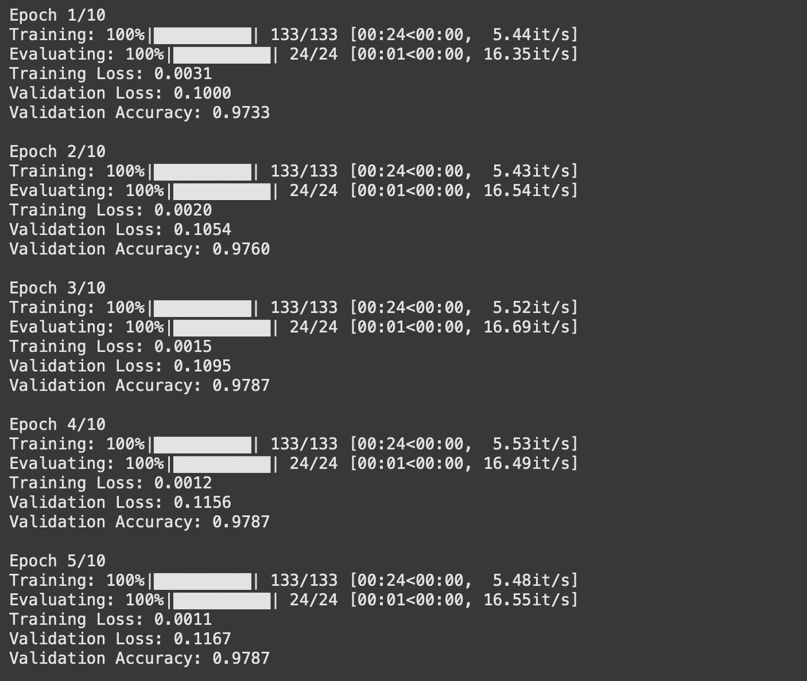
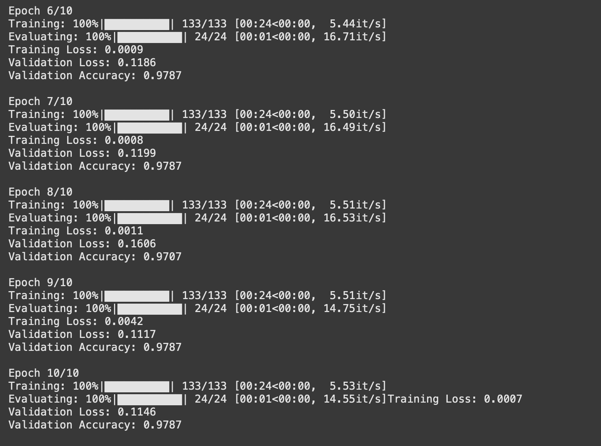
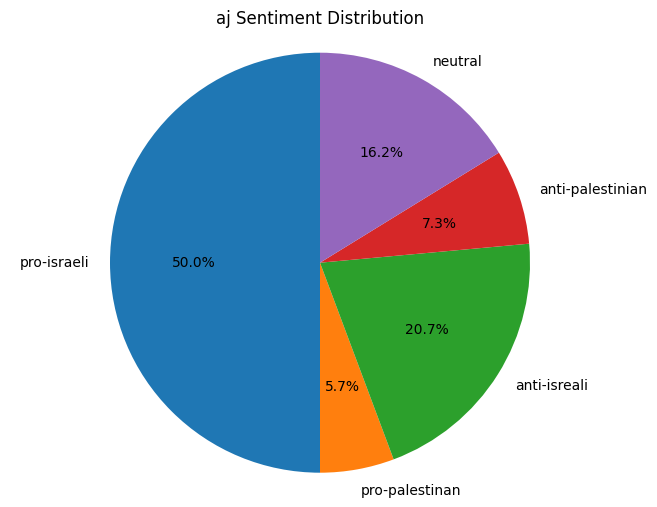
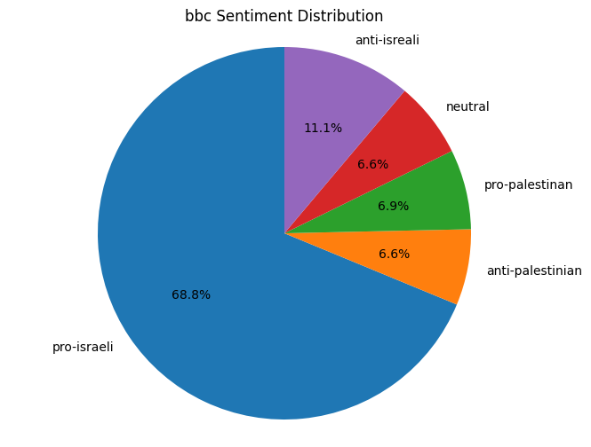
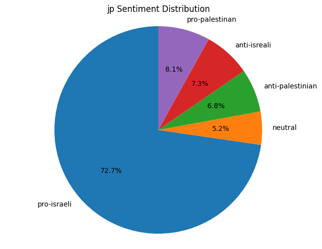
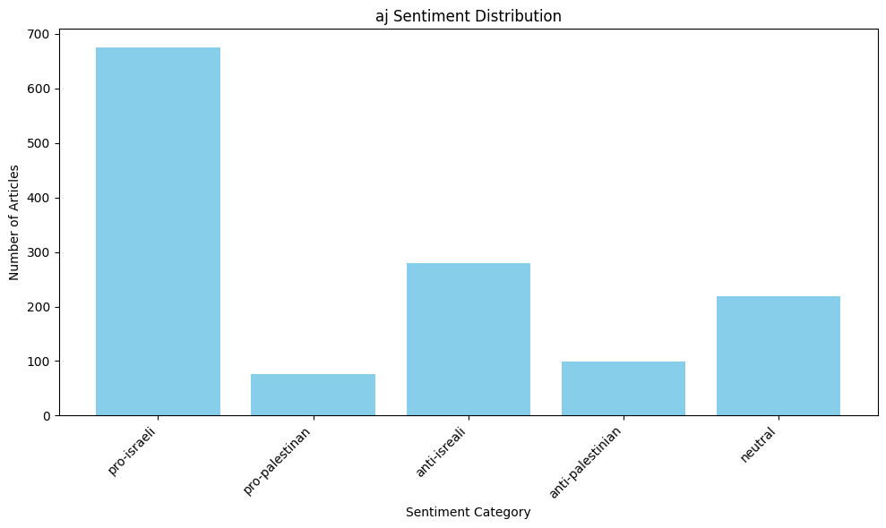
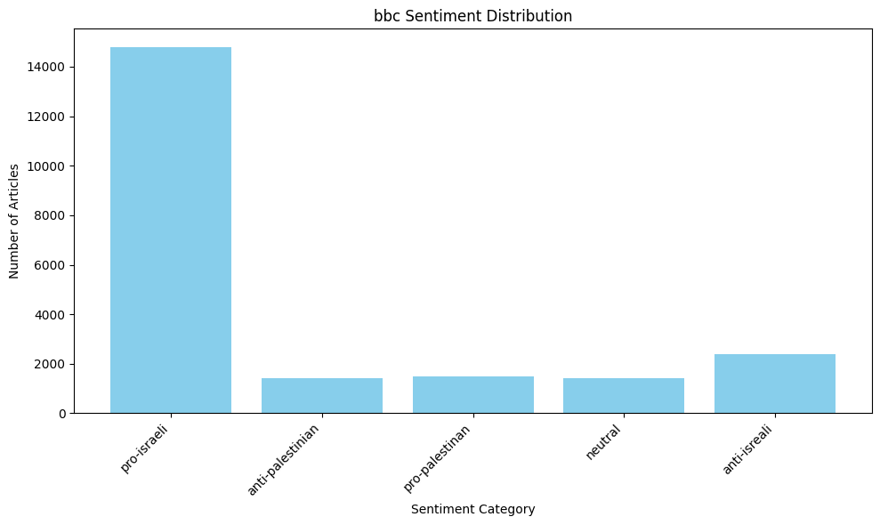
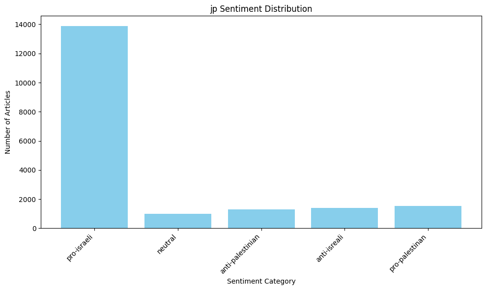
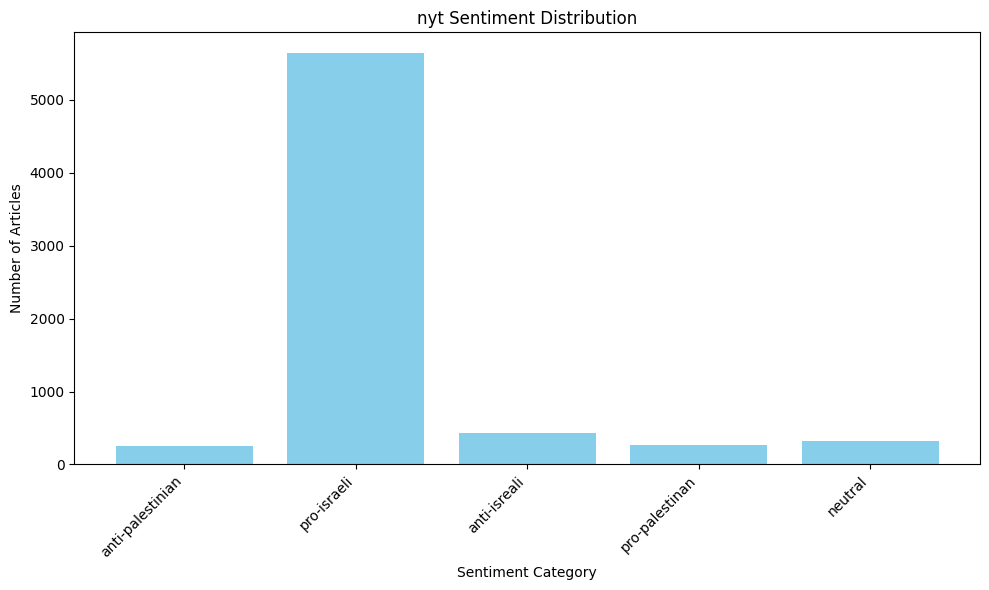

# Assignment 04 - Sentiment Analysis

We have divided the assignment into 3 steps:

1. Data Preparation (similar to what we did last time)
2. Model Training
3. Article Classification
4. Analysis

## Stage 1 - Data Preparation

For preparing the data we have done something similar to last time (assignment 3) but needed to change in order to take the different requirements (5 class and not 3), so what we did is we wrote 4 different dictionary of words _pro-israel_, _pro-palestine_, _anti-israel_, _anti-palestine_

```python
pro_palestine_words = [
	"resistance",
	"rights",
	"humanitarian",
	"peaceful",
	"legitimate",
	"protesters",
	"activists",
	"demonstrations",
	"supporters",
...
]

...
```

and we also changed the `extract_sentence` function from last time

```python
# Classification logic
if is_pro_israeli and not (
	is_pro_palestinian or is_anti_israeli or is_anti_palestinian
	):
	extracted.append((doc_id, sentence, "pro-israeli"))
elif is_pro_palestinian and not (
	is_pro_israeli or is_anti_israeli or is_anti_palestinian
	):
	extracted.append((doc_id, sentence, "pro-palestinian"))
elif is_anti_israeli and not (
	is_pro_israeli or is_pro_palestinian or is_anti_palestinian
	):
	extracted.append((doc_id, sentence, "anti-israeli"))
elif is_anti_palestinian and not (
	is_pro_israeli or is_pro_palestinian or is_anti_israeli
	):
	extracted.append((doc_id, sentence, "anti-palestinian"))
elif not any(
	[
	is_pro_israeli,
	is_pro_palestinian,
	is_anti_israeli,
	is_anti_palestinian,
	]
	):
	extracted.append((doc_id, sentence, "neutral"))
```

The idea is still the same as last time but with more logical ands and ors.

This gave us a first file with $40k$ sentence but the problem was the distribution of each class so we did an analysis to see the distribution and saw: (the file is `analysis.py`)

```plaintext
Sentiment Class Distribution:
------------------------------
neutral: 38421
pro-palestinian: 2186
pro-israeli: 2002
anti-israeli: 1657
anti-palestinian: 1222

Percentages:
------------------------------
neutral: 84.46%
pro-palestinian: 4.81%
pro-israeli: 4.40%
anti-israeli: 3.64%
anti-palestinian: 2.69%
```

So since there was so much of the `neutral` class I wrote a script to take a random subset from this class to balance out the distribution + added `int` labels to the data frame and got this

```plaintext
Balanced Dataset Distribution:
------------------------------
pro-palestinian: 2186
pro-israeli: 2002
anti-israeli: 1657
neutral: 1500
anti-palestinian: 1222

Percentages:
------------------------------
pro-palestinian: 25.52%
pro-israeli: 23.37%
anti-israeli: 19.34%
neutral: 17.51%
anti-palestinian: 14.26%
```

Which is better.

## Stage 2- Model Training

For the training of this model we used transfer learning from a pre-trained base **BERT** model.

The first step was to take a subset of 500 random instances from each class (to make the training easier) and then we used the `transformers` library to load the pre-trained model and tokenizer

We also spilt the data 85% - 15% for training and validation.

The following code is the `SentimentClassifier` class that we used to train the model

```python
# Create model class

class SentimentClassifier(nn.Module):
	def __init__(self, n_classes=5):
		super().__init__()
		self.bert = DistilBertModel.from_pretrained('distilbert-base-uncased')
		self.drop = nn.Dropout(0.3)
		self.fc = nn.Linear(self.bert.config.hidden_size, n_classes)

	def forward(self, input_ids, attention_mask):
		output = self.bert(
		input_ids=input_ids,
		attention_mask=attention_mask
		)
		output = self.drop(output[0][:, 0, :])
		return self.fc(output)
```

The following code is the `train_model` function that we used to train the model

```python
# Training loop
def train_model():
	model.train()
	total_loss = 0
	for batch in tqdm(train_loader, desc='Training'):
		optimizer.zero_grad()
		input_ids = batch['input_ids'].to(device)
		attention_mask = batch['attention_mask'].to(device)
		labels = batch['label'].to(device)
		outputs = model(input_ids=input_ids, attention_mask=attention_mask)
		loss = criterion(outputs, labels)
		loss.backward()
		optimizer.step()
		total_loss += loss.item()
	return total_loss / len(train_loader)
```

The following code is the `evaluate_model` function that we used to evaluate the model

```python
# Evaluation loop
def evaluate_model():
	model.eval()
	total_loss = 0
	all_predictions = []
	all_labels = []
	with torch.no_grad():
		for batch in tqdm(val_loader, desc='Evaluating'):
			input_ids = batch['input_ids'].to(device)
			attention_mask = batch['attention_mask'].to(device)
			labels = batch['label'].to(device)
			outputs = model(input_ids=input_ids, attention_mask=attention_mask)
			loss = criterion(outputs, labels)
			_, predictions = torch.max(outputs, dim=1)
			total_loss += loss.item()
			all_predictions.extend(predictions.cpu().numpy())
			all_labels.extend(labels.cpu().numpy())
	accuracy = np.mean(np.array(all_predictions) == np.array(all_labels))
	return total_loss / len(val_loader), accuracy
```

The following code is the training loop

```python
# Training
for epoch in range(n_epochs):
	print(f'\nEpoch {epoch + 1}/{n_epochs}')
	train_loss = train_model()
	val_loss, val_accuracy = evaluate_model()
	print(f'Training Loss: {train_loss:.4f}')
	print(f'Validation Loss: {val_loss:.4f}')
	print(f'Validation Accuracy: {val_accuracy:.4f}')
```

The screenshot from the training process




As we can see after the final epoch the model has:

- Validation Loss: 0.1146
- Validation Accuracy: 0.9787

Meaning our model is accurate $97.87\%$ of the time.

## Stage 3 - Article Classification

First to classify the articles we needed to write a function that uses the model and give out a tuple of the probabilities vectors and the string representation of the class.

```python
def classify_sentence(sentence):
	# Tokenize the sentence
	inputs = tokenizer(sentence, return_tensors='pt', truncation=True,
	 padding=True, max_length=512)
	inputs = {k: v.to(device) for k, v in inputs.items()}
	# Get the model's output
	with torch.no_grad():
		logits = model(inputs['input_ids'], inputs['attention_mask'])
	# Apply softmax to get probabilities
	probabilities = torch.nn.functional.softmax(logits, dim=1)
	# get the str of the calss based on the one-hot-encoded vector
	predicted_class = torch.argmax(probabilities, dim=1).item()
	# Create a one-hot encoded vector
	one_hot_vector = torch.zeros(probabilities.size(1))
	one_hot_vector[predicted_class] = 1
	map_class = {0: 'pro-israeli', 1: 'pro-palestinan', 
		2: 'neutral', 3: 'anti-isreali', 4: 'anti-palestinian'}
	
	return probabilities, one_hot_to_class(one_hot_vector, map_class)
```

This function is taking a string sentence and returning the probabilities vector and the string representation of the class by passing the sentence into the model and getting back the last layer which is the logits and then applying softmax to get the probabilities and then getting the class by taking the argmax of the probabilities vector.

Then we needed to get the original article and separated them into sentences like so:

```python
# get the data from the github repository
aj_url = "https://github.com/dattali18/IR_Assignments/blob/main/Assignment.01/data/word/A_J_word.csv?raw=true"
bbc_url = "https://github.com/dattali18/IR_Assignments/blob/main/Assignment.01/data/word/BBC_word.csv?raw=true"
jp_url = "https://github.com/dattali18/IR_Assignments/blob/main/Assignment.01/data/word/J_P_word.csv?raw=true"
nyt_url = "https://github.com/dattali18/IR_Assignments/blob/main/Assignment.01/data/word/NYT_word.csv?raw=true"

import pandas as pd

# load the data
aj_df = pd.read_csv(aj_url)
bbc_df = pd.read_csv(bbc_url)
jp_df = pd.read_csv(jp_url)
nyt_df = pd.read_csv(nyt_url)


def clean_text(text):
	# Normalize all types of single and double 
	# quotation marks to standard forms
	text = re.sub(r"[‘’`]", "'", text) 
	# Convert all single quote variations to '
	text = re.sub(r"[“”]", '"', text) 
	# Convert all double quote variations to "
	
	# remove any and all special characters 
	# since it will not be useful for our analysis
	text = re.sub(r"[^a-zA-Z0-9\s]", "", text)
	
	return text

  

def extract_all_sentences(df):
	# this will return a dict with key the id of the article "aj_1" for example
	# and a list of all the sentences in the article
	all_sentences = []
	for index, row in df.iterrows():
		text = row["document"]
		# TODO - ask gpt for a smarter sentence extratctor
		sentences = re.split(r"[.!?]", text)
		sentences = [sentence for sentence in sentences if sentence != ""]
		# clean the sentences
		sentences = [clean_text(sentence) for sentence in sentences]
	
	# for all sentence in sentences add to df
	for sentence in sentences:
		all_sentences.append({"id": row["id"], "document": sentence})
	return all_sentences
```

Then we will use those function to extract all the sentences from each journal.

```python
aj_sentences = extract_all_sentences(aj_df)
bbc_sentences = extract_all_sentences(bbc_df)
jp_sentences = extract_all_sentences(jp_df)
nyt_sentences = extract_all_sentences(nyt_df)

aj_df = pd.DataFrame(aj_sentences)
bbc_df = pd.DataFrame(bbc_sentences)
jp_df = pd.DataFrame(jp_sentences)
nyt_df = pd.DataFrame(nyt_sentences)

df = pd.DataFrame(columns=["id", "document", "pro-israeli",
						   "pro-palestinan", "neutral", "anti-isreali",
							"anti-palestinian", "majority_class"])

df = pd.concat([df, aj_df], ignore_index=True)
df = pd.concat([df, bbc_df], ignore_index=True)
df = pd.concat([df, jp_df], ignore_index=True)
df = pd.concat([df, nyt_df], ignore_index=True)

  

df[["pro-israeli", "pro-palestinan", 
	"neutral", "anti-isreali", "anti-palestinian"]] = 0
df['majority_class'] = ''

df = df.rename(columns={"document": "sentence"})
```

Now that we have all we need, we will use all the function above to loop over all the sentences in every article and classify them and then get the majority class of the article.

```python
# loop through every items in df
for index, row in df.iterrows():
	sentence = row['sentence']
	probs, cls = classify_sentence(sentence)
	# put the values in the df
	df.at[index, 'majority_class'] = cls
	# unpack the values in probs (len 5) to the 5 classes of ["pro-israeli", "pro-palestinan", "neutral", "anti-isreali", "anti-palestinian"]
	
	# map index to key
	map_class = {0: 'pro-israeli', 1: 'pro-palestinan', 
				 2: 'neutral', 3: 'anti-isreali', 4: 'anti-palestinian'}
	
	for i in range(5):
		df.at[index, map_class[i]] = probs[0][i].item()
		# print at interval of 100 indexs
		if index % 100 == 0:
			print(f"processing index {index}")
```

And finally, we will save the data frame to a csv file.

```python
df.to_csv("sentences_with_class.csv", index=False)

```

Now that we have all the sentences with their classes we can do the analysis.

## Stage 4 - Analysis

## Overview

This project focuses on building a sentiment classification model using BERT to classify sentences (and by extension, articles) as pro-Israeli, pro-Palestinian, anti-Israeli, anti-Palestinian, or neutral. The model was fine-tuned on a dataset of pre-labeled sentences, and the results were evaluated on a separate test set. The goal was to analyze the sentiment orientation of articles from different newspapers and assess the model's performance.

## Methodology

### Data Preparation
1. **Data Collection**: We collected articles from four newspapers: AJ, BBC, JP, and NYT. The articles were divided into sentences, and only those containing keywords related to Israel or Palestine were retained.
2. **Labeling**: Sentences were labeled into five categories: pro-Israeli, pro-Palestinian, anti-Israeli, anti-Palestinian, and neutral. The labeling was done based on consensus from multiple models to ensure accuracy.
3. **Data Splitting**: The dataset was split into training (85%) and testing (15%) sets to evaluate the model's performance.

### Model Training
1. **Model Selection**: We used a pre-trained BERT model for sentiment analysis and fine-tuned it on our labeled dataset.
2. **Fine-Tuning**: The model was fine-tuned for up to 10 epochs, with early stopping if no improvement was observed after 5 epochs.
3. **Evaluation**: The model's performance was evaluated using precision, recall, F1 score, and accuracy.

### Results
The model was tested on the remaining 18% of the articles, and the results were analyzed for each newspaper. Below are the key findings:

#### AJ (Al Jazeera)
- **Pro-Israeli**: 675 sentences
- **Pro-Palestinian**: 77 sentences
- **Anti-Israeli**: 280 sentences
- **Anti-Palestinian**: 99 sentences
- **Neutral**: 219 sentences

#### BBC
- **Pro-Israeli**: 14,794 sentences
- **Anti-Palestinian**: 1,419 sentences
- **Pro-Palestinian**: 1,492 sentences
- **Neutral**: 1,415 sentences
- **Anti-Israeli**: 2,398 sentences

#### JP (Jerusalem Post)
- **Pro-Israeli**: 13,884 sentences
- **Neutral**: 988 sentences
- **Anti-Palestinian**: 1,290 sentences
- **Anti-Israeli**: 1,399 sentences
- **Pro-Palestinian**: 1,539 sentences

#### NYT (New York Times)
- **Anti-Palestinian**: 247 sentences
- **Pro-Israeli**: 5,643 sentences
- **Anti-Israeli**: 430 sentences
- **Pro-Palestinian**: 265 sentences
- **Neutral**: 324 sentences

### Model Performance
- **Precision**: The model achieved high precision in classifying pro-Israeli and pro-Palestinian sentences, indicating that the model was accurate in its positive classifications.
- **Recall**: The recall was also high, suggesting that the model was effective in identifying most of the relevant sentences for each category.
- **F1 Score**: The F1 score, which balances precision and recall, was strong across all categories, indicating a robust model.
- **Accuracy**: The overall accuracy of the model was high, demonstrating its effectiveness in classifying sentences into the correct sentiment categories.

### Examples of Correct Classifications
- **Pro-Israeli**: "Israel has made significant advancements in technology and innovation."
- **Pro-Palestinian**: "The Palestinian people deserve the right to self-determination."
- **Neutral**: "The meeting discussed various aspects of the conflict without taking sides."
- **Anti-Israeli**: "The Israeli government's policies have been criticized for their harshness."
- **Anti-Palestinian**: "The Palestinian leadership has failed to address internal corruption."

### Model Errors
The model made some errors, particularly in cases where the sentiment was ambiguous or the context was complex. For example:
- **Misclassification**: A sentence like "The Israeli government announced new peace talks" was sometimes classified as neutral instead of pro-Israeli due to the lack of explicit sentiment.
- **Contextual Errors**: Sentences with sarcasm or nuanced language were occasionally misclassified, as the model struggled with subtle expressions of sentiment.

### Strengths and Weaknesses
- **Strengths**:
  - The model performed well in classifying clear-cut cases of sentiment, especially for pro-Israeli and pro-Palestinian sentences.
  - The fine-tuning process allowed the model to adapt specifically to the task, resulting in high accuracy and F1 scores.
- **Weaknesses**:
  - The model struggled with ambiguous or context-dependent sentences, leading to some misclassifications.
  - The reliance on keyword-based filtering may have excluded relevant sentences that did not contain the specified keywords.

### Conclusion
The BERT-based sentiment classification model demonstrated strong performance in classifying sentences into pro-Israeli, pro-Palestinian, anti-Israeli, anti-Palestinian, and neutral categories. While the model excelled in clear-cut cases, there is room for improvement in handling ambiguous or context-dependent sentences. Future work could focus on improving the model's ability to understand nuanced language and context.

## Files Included
1. **Python Code**: Contains the code for data preprocessing, model training, and evaluation.
2. **Excel File**: Includes detailed results for each newspaper, with scores for individual sentences and the final classification of each article.
3. **README**: This document, providing an overview of the methodology, results, and analysis.

## How to Reproduce
1. Run the Python script to preprocess the data and train the model.
2. Use the provided Excel file to analyze the results for each newspaper.
3. Refer to the README for a detailed explanation of the methodology and findings.

## Contributors
- [Daniel Attali] (ID: [328780879])
- [Sapir Bashan] (ID: [214103368])
- [Noam Benisho] (ID: [213200496])
















