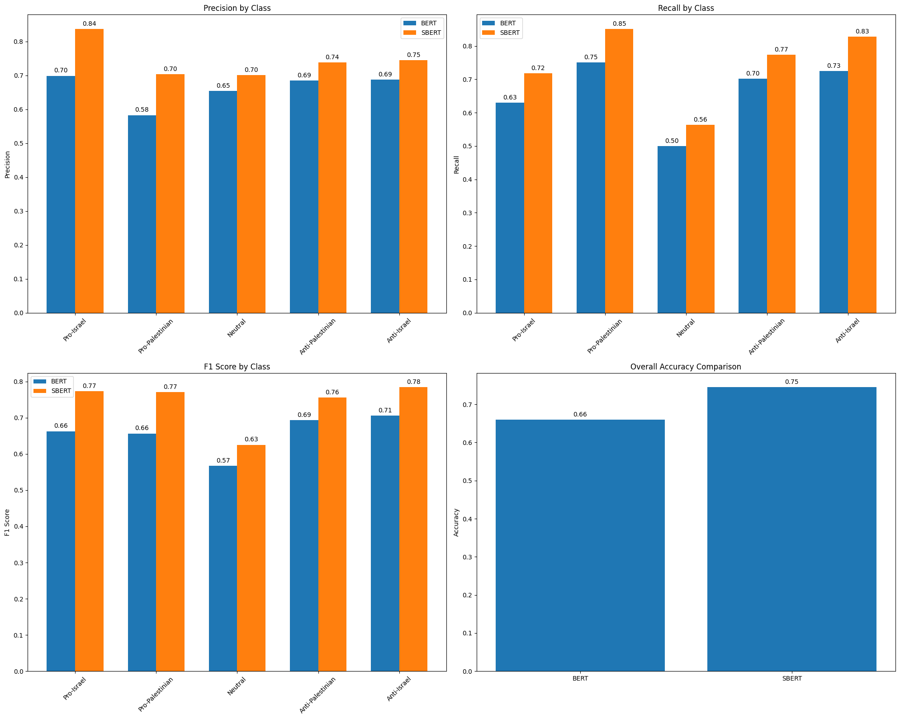
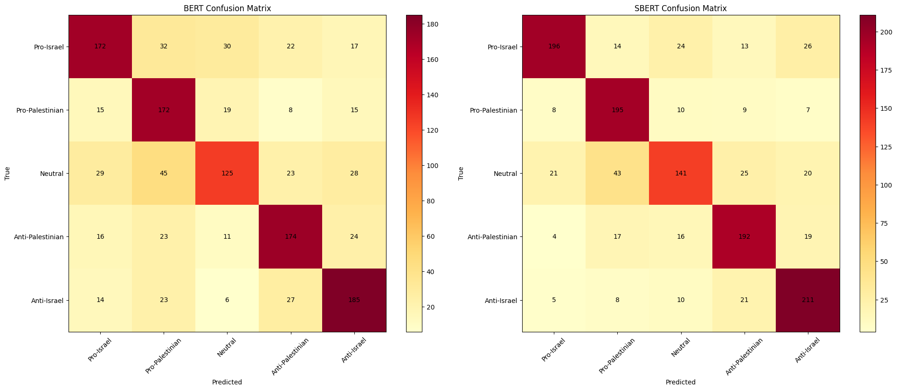
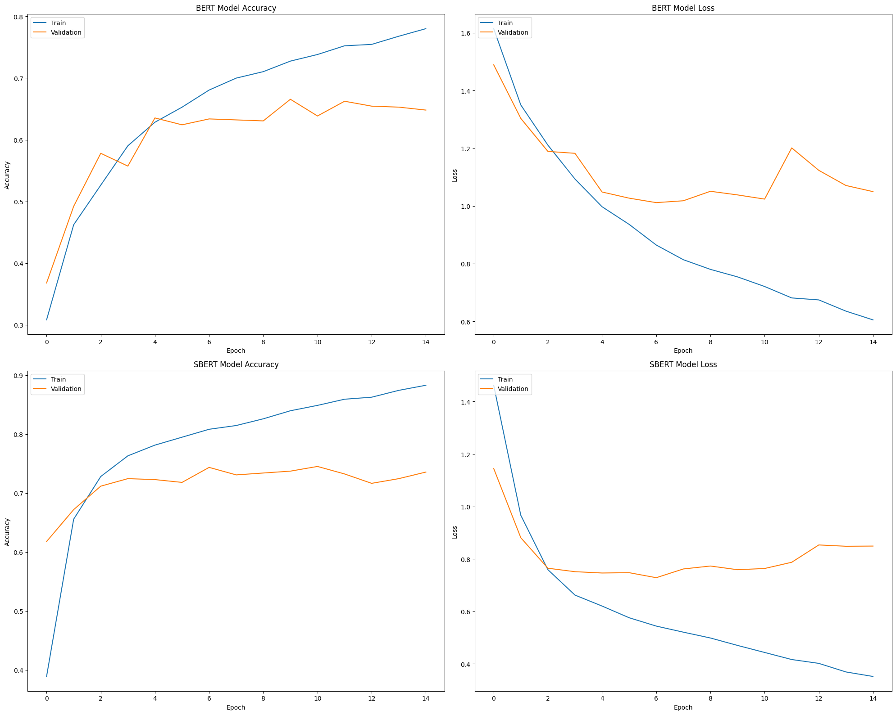

# Artificial Neural Network (ANN):

- Data split: 80% training (with 10% validation), 20% testing
- Maximum 15 epochs
- Batch size of 32
- Specific architecture requirements:
    - 4 hidden layers (3×32 nodes, 1×16 nodes)
    - ReLU activation for hidden layers
    - Softmax for output layer

Include callbacks:

- Early stopping after 5 iterations without improvement
- Model checkpoint for best accuracy

```python
import pandas as pd

pro_israel_url = "https://github.com/dattali18/IR_Assignments/blob/main/Assignment.05/data/Train/pro_israel_sample.csv?raw=true"
pro_palestine_url = "https://github.com/dattali18/IR_Assignments/blob/main/Assignment.05/data/Train/pro_palestine_sample.csv?raw=true"
neutral_url = "https://github.com/dattali18/IR_Assignments/blob/main/Assignment.05/data/Train/neutral_sample.csv?raw=true"
anti_israel_url = "https://raw.githubusercontent.com/dattali18/IR_Assignments/refs/heads/main/Assignment.05/data/Train/anti_israel_sample.csv"
anti_palestine_url = "https://github.com/dattali18/IR_Assignments/blob/main/Assignment.05/data/Train/anti_palestine_sample.csv?raw=true"
```

```python
df_pro_israel = pd.read_csv(pro_israel_url)
df_pro_palestine = pd.read_csv(pro_palestine_url)
df_neutral = pd.read_csv(neutral_url)
df_anti_israel = pd.read_csv(anti_israel_url)
df_anti_palestine = pd.read_csv(anti_palestine_url)
```

```python
# get the data out of the df, the needed columns are bert_embedding, sbert_embedding
# then we will add the number representation of the class
# convert the data to numpy

import numpy as np

class_map = {"pro_israel": 0, "pro_palestine": 1, "neutral": 2, "anti_israel": 3, "anti_palestine": 4}

pro_israel_bert_data = df_pro_israel["bert_embedding"]
pro_israel_sbert_data = df_pro_israel["sbert_embedding"]

print(len(pro_israel_bert_data))
print(len(pro_israel_sbert_data))
```

```plaintext
1255
1255
```

```python
# convert each instance of the data into a numpy instance

pro_israel_bert_data = np.array([eval(instance) for instance in pro_israel_bert_data])
pro_israel_sbert_data = np.array([eval(instance) for instance in pro_israel_sbert_data])

print(pro_israel_bert_data.shape)
print(pro_israel_sbert_data.shape)
```

```plaintext
(1255, 768)
(1255, 384)
```

```python
# do the same with all others

pro_palestine_bert_data = df_pro_palestine["bert_embedding"]
pro_palestine_sbert_data = df_pro_palestine["sbert_embedding"]

pro_palestine_bert_data = np.array([eval(instance) for instance in pro_palestine_bert_data])
pro_palestine_sbert_data = np.array([eval(instance) for instance in pro_palestine_sbert_data])

print(pro_palestine_bert_data.shape)
print(pro_palestine_sbert_data.shape)
```

```plaintext
(1255, 768)
(1255, 384)
```

```python
neutral_bert_data = df_neutral["bert_embedding"]
neutral_sbert_data = df_neutral["sbert_embedding"]

neutral_bert_data = np.array([eval(instance) for instance in neutral_bert_data])
neutral_sbert_data = np.array([eval(instance) for instance in neutral_sbert_data])

print(neutral_bert_data.shape)
print(neutral_sbert_data.shape)
```

```plaintext
(1255, 768)
(1255, 384)
```

```python
anti_israel_bert_data = df_anti_israel["bert_embedding"]
anti_israel_sbert_data = df_anti_israel["sbert_embedding"]

anti_israel_bert_data = np.array([eval(instance) for instance in anti_israel_bert_data])
anti_israel_sbert_data = np.array([eval(instance) for instance in anti_israel_sbert_data])

print(anti_israel_bert_data.shape)
print(anti_israel_sbert_data.shape)
```

```plaintext
(1255, 768)
(1255, 384)
```

```python
anti_palestine_bert_data = df_anti_palestine["bert_embedding"]
anti_palestine_sbert_data = df_anti_palestine["sbert_embedding"]

anti_palestine_bert_data = np.array([eval(instance) for instance in anti_palestine_bert_data])
anti_palestine_sbert_data = np.array([eval(instance) for instance in anti_palestine_sbert_data])

print(anti_palestine_bert_data.shape)
print(anti_palestine_sbert_data.shape)
```

```plaintext
(1255, 768)
(1255, 384)
```

```python
import numpy as np
from sklearn.model_selection import train_test_split
from tensorflow.keras.utils import to_categorical
```

```python
pro_israel_bert_data.shape, pro_palestine_bert_data.shape, neutral_bert_data.shape, anti_israel_bert_data.shape, anti_palestine_bert_data.shape
```

```plainte
((1255, 768), (1255, 768), (1255, 768), (1255, 768), (1255, 768))
```

```python
pro_israel_sbert_data.shape, pro_palestine_sbert_data.shape, neutral_sbert_data.shape, anti_israel_sbert_data.shape, anti_palestine_sbert_data.shape
```

```plaintext
((1255, 384), (1255, 384), (1255, 384), (1255, 384), (1255, 384))
```

```python
# For BERT data (768 dimensions)
X_bert = np.vstack([
    pro_israel_bert_data,
    pro_palestine_bert_data,
    neutral_bert_data,
    anti_palestine_bert_data,
    anti_israel_bert_data
])

y_bert = np.array(
    [0] * len(pro_israel_bert_data) +       # 0s for pro-israel
    [1] * len(pro_palestine_bert_data) +    # 1s for pro-palestinian
    [2] * len(neutral_bert_data) +          # 2s for neutral
    [3] * len(anti_palestine_bert_data) +   # 3s for anti-palestinian
    [4] * len(anti_israel_bert_data)        # 4s for anti-israel
)

y_bert_onehot = to_categorical(y_bert)
```

```python
X_bert.shape, y_bert_onehot.shape
```

```plaintext
((6275, 768), (6275, 5))
```

```python
# Split the data (80% train, 20% test)
X_bert_train, X_bert_test, y_bert_train, y_bert_test = train_test_split(
    X_bert, y_bert_onehot, test_size=0.2, random_state=42
)
```

```python
# Further split training data to create validation set (10% of original data)
X_bert_train, X_bert_val, y_bert_train, y_bert_val = train_test_split(
    X_bert_train, y_bert_train, test_size=0.125, random_state=42
	# 0.125 of 80% is 10% of total
)
```

```python
# Do the same for SBERT data (384 dimensions)
X_sbert = np.vstack([
    pro_israel_sbert_data,
    pro_palestine_sbert_data,
    neutral_sbert_data,
    anti_palestine_sbert_data,
    anti_israel_sbert_data
])

# The labels will be the same as for BERT
y_sbert = y_bert.copy()
y_sbert_onehot = to_categorical(y_sbert)
```

```python
y_sbert_onehot.shape, X_sbert.shape
```

```plaintext
((6275, 5), (6275, 384))
```

```python
# Split SBERT data
X_sbert_train, X_sbert_test, y_sbert_train, y_sbert_test = train_test_split(
    X_sbert, y_sbert_onehot, test_size=0.2, random_state=42
)

X_sbert_train, X_sbert_val, y_sbert_train, y_sbert_val = train_test_split(
      X_sbert_train, y_sbert_train, test_size=0.125, random_state=42
)
```

## Model Training

Our model is a simple feedforward neural network with 4 hidden layers. We'll train two models: one using BERT embeddings and the other using SBERT embeddings. Both models will have the same architecture and hyperparameters.

The architecture of the ANN is as follows:

- Input layer
- 4 hidden layers with ReLU activation
- Output layer with Softmax activation

```python
import tensorflow as tf
from tensorflow.keras.models import Sequential
from tensorflow.keras.layers import Dense
from tensorflow.keras.callbacks import EarlyStopping, ModelCheckpoint

# First, ensure we're using GPU
physical_devices = tf.config.list_physical_devices('GPU')
if physical_devices:
    tf.config.experimental.set_memory_growth(physical_devices[0], True)
    print("GPU is available")
else:
    print("No GPU found, running on CPU")
```

```python
# Callbacks
early_stopping = EarlyStopping(
    monitor='val_accuracy',
    patience=5,
    restore_best_weights=True
)

# Create separate checkpoints for BERT and SBERT models
bert_checkpoint = ModelCheckpoint(
    'best_bert_model.h5',
    monitor='val_accuracy',
    save_best_only=True,
    mode='max'
)

sbert_checkpoint = ModelCheckpoint(
    'best_sbert_model.h5',
    monitor='val_accuracy',
    save_best_only=True,
    mode='max'
)
```

### BERT Model

```python
# BERT Model (input dimension 768)
bert_model = Sequential([
    Dense(32, activation='relu', input_dim=768),
    Dense(32, activation='relu'),
    Dense(32, activation='relu'),
    Dense(16, activation='relu'),
    Dense(5, activation='softmax')  # 5 classes
])
```

### SBERT Model

```python
# SBERT Model (input dimension 384)
sbert_model = Sequential([
    Dense(32, activation='relu', input_dim=384),
    Dense(32, activation='relu'),
    Dense(32, activation='relu'),
    Dense(16, activation='relu'),
    Dense(5, activation='softmax')  # 5 classes
])
```

### Compile Models

```python
# Compile models
bert_model.compile(
    optimizer='adam',
    loss='categorical_crossentropy',
    metrics=['accuracy']
)
```

```python
sbert_model.compile(
    optimizer='adam',
    loss='categorical_crossentropy',
    metrics=['accuracy']
)
```

### Train BERT

```python
# Train BERT model
bert_history = bert_model.fit(
    X_bert_train,
    y_bert_train,
    batch_size=32,
    epochs=15,
    validation_data=(X_bert_val, y_bert_val),
    callbacks=[early_stopping, bert_checkpoint],
    verbose=1
)
```

```plaintext
Epoch 1/15
 [1m138/138 [0m  [32m-------------------- [0m [37m [0m  [1m0s [0m 9ms/step - accuracy: 0.2620 - loss: 1.8676

WARNING:absl:You are saving your model as an HDF5 file via `model.save()` or `keras.saving.save_model(model)`. This file format is considered legacy. We recommend using instead the native Keras format, e.g. `model.save('my_model.keras')` or `keras.saving.save_model(model, 'my_model.keras')`.


                                                                          
 [1m138/138 [0m  [32m-------------------- [0m [37m [0m  [1m6s [0m 15ms/step - accuracy: 0.2623 - loss: 1.8658 - val_accuracy: 0.3678 - val_loss: 1.4892
Epoch 2/15
 [1m136/138 [0m  [32m------------------- [0m [37m- [0m  [1m0s [0m 2ms/step - accuracy: 0.4375 - loss: 1.4015

WARNING:absl:You are saving your model as an HDF5 file via `model.save()` or `keras.saving.save_model(model)`. This file format is considered legacy. We recommend using instead the native Keras format, e.g. `model.save('my_model.keras')` or `keras.saving.save_model(model, 'my_model.keras')`.


                                                                          
 [1m138/138 [0m  [32m-------------------- [0m [37m [0m  [1m0s [0m 3ms/step - accuracy: 0.4380 - loss: 1.4004 - val_accuracy: 0.4920 - val_loss: 1.3033
Epoch 3/15
 [1m131/138 [0m  [32m------------------ [0m [37m-- [0m  [1m0s [0m 2ms/step - accuracy: 0.5136 - loss: 1.2260

WARNING:absl:You are saving your model as an HDF5 file via `model.save()` or `keras.saving.save_model(model)`. This file format is considered legacy. We recommend using instead the native Keras format, e.g. `model.save('my_model.keras')` or `keras.saving.save_model(model, 'my_model.keras')`.


                                                                          
 [1m138/138 [0m  [32m-------------------- [0m [37m [0m  [1m0s [0m 3ms/step - accuracy: 0.5143 - loss: 1.2253 - val_accuracy: 0.5780 - val_loss: 1.1890
Epoch 4/15
 [1m138/138 [0m  [32m-------------------- [0m [37m [0m  [1m1s [0m 5ms/step - accuracy: 0.6179 - loss: 1.0652 - val_accuracy: 0.5573 - val_loss: 1.1823
Epoch 5/15
 [1m129/138 [0m  [32m------------------ [0m [37m-- [0m  [1m0s [0m 4ms/step - accuracy: 0.6325 - loss: 0.9751

WARNING:absl:You are saving your model as an HDF5 file via `model.save()` or `keras.saving.save_model(model)`. This file format is considered legacy. We recommend using instead the native Keras format, e.g. `model.save('my_model.keras')` or `keras.saving.save_model(model, 'my_model.keras')`.


                                                                          
 [1m138/138 [0m  [32m-------------------- [0m [37m [0m  [1m1s [0m 7ms/step - accuracy: 0.6323 - loss: 0.9767 - val_accuracy: 0.6354 - val_loss: 1.0482
Epoch 6/15
 [1m138/138 [0m  [32m-------------------- [0m [37m [0m  [1m1s [0m 7ms/step - accuracy: 0.6565 - loss: 0.9357 - val_accuracy: 0.6242 - val_loss: 1.0269
Epoch 7/15
 [1m138/138 [0m  [32m-------------------- [0m [37m [0m  [1m1s [0m 5ms/step - accuracy: 0.6939 - loss: 0.8508 - val_accuracy: 0.6338 - val_loss: 1.0114
Epoch 8/15
 [1m138/138 [0m  [32m-------------------- [0m [37m [0m  [1m1s [0m 4ms/step - accuracy: 0.6887 - loss: 0.8306 - val_accuracy: 0.6322 - val_loss: 1.0179
Epoch 9/15
 [1m138/138 [0m  [32m-------------------- [0m [37m [0m  [1m1s [0m 5ms/step - accuracy: 0.7079 - loss: 0.7845 - val_accuracy: 0.6306 - val_loss: 1.0507
Epoch 10/15
 [1m131/138 [0m  [32m------------------ [0m [37m-- [0m  [1m0s [0m 4ms/step - accuracy: 0.7257 - loss: 0.7617

WARNING:absl:You are saving your model as an HDF5 file via `model.save()` or `keras.saving.save_model(model)`. This file format is considered legacy. We recommend using instead the native Keras format, e.g. `model.save('my_model.keras')` or `keras.saving.save_model(model, 'my_model.keras')`.


                                                                          
 [1m138/138 [0m  [32m-------------------- [0m [37m [0m  [1m1s [0m 5ms/step - accuracy: 0.7257 - loss: 0.7614 - val_accuracy: 0.6656 - val_loss: 1.0381
Epoch 11/15
 [1m138/138 [0m  [32m-------------------- [0m [37m [0m  [1m1s [0m 5ms/step - accuracy: 0.7464 - loss: 0.7033 - val_accuracy: 0.6385 - val_loss: 1.0236
Epoch 12/15
 [1m138/138 [0m  [32m-------------------- [0m [37m [0m  [1m1s [0m 3ms/step - accuracy: 0.7574 - loss: 0.6811 - val_accuracy: 0.6624 - val_loss: 1.2011
Epoch 13/15
 [1m138/138 [0m  [32m-------------------- [0m [37m [0m  [1m0s [0m 3ms/step - accuracy: 0.7498 - loss: 0.6783 - val_accuracy: 0.6545 - val_loss: 1.1233
Epoch 14/15
 [1m138/138 [0m  [32m-------------------- [0m [37m [0m  [1m1s [0m 3ms/step - accuracy: 0.7769 - loss: 0.6066 - val_accuracy: 0.6529 - val_loss: 1.0708
Epoch 15/15
 [1m138/138 [0m  [32m-------------------- [0m [37m [0m  [1m0s [0m 3ms/step - accuracy: 0.7788 - loss: 0.5947 - val_accuracy: 0.6481 - val_loss: 1.0495
```

As you can see the training was fast and the accuracy is around 77% on the training data and 64% on the validation data.

### Train SBERT

```python
# Train SBERT model
sbert_history = sbert_model.fit(
    X_sbert_train,
    y_sbert_train,
    batch_size=32,
    epochs=15,
    validation_data=(X_sbert_val, y_sbert_val),
    callbacks=[early_stopping, sbert_checkpoint],
    verbose=1
)
```

```plaintext
Epoch 1/15
 [1m138/138 [0m  [32m-------------------- [0m [37m [0m  [1m0s [0m 9ms/step - accuracy: 0.2942 - loss: 1.5593

WARNING:absl:You are saving your model as an HDF5 file via `model.save()` or `keras.saving.save_model(model)`. This file format is considered legacy. We recommend using instead the native Keras format, e.g. `model.save('my_model.keras')` or `keras.saving.save_model(model, 'my_model.keras')`.


                                                                          
 [1m138/138 [0m  [32m-------------------- [0m [37m [0m  [1m5s [0m 21ms/step - accuracy: 0.2949 - loss: 1.5586 - val_accuracy: 0.6178 - val_loss: 1.1449
Epoch 2/15
 [1m125/138 [0m  [32m------------------ [0m [37m-- [0m  [1m0s [0m 3ms/step - accuracy: 0.6286 - loss: 1.0580

WARNING:absl:You are saving your model as an HDF5 file via `model.save()` or `keras.saving.save_model(model)`. This file format is considered legacy. We recommend using instead the native Keras format, e.g. `model.save('my_model.keras')` or `keras.saving.save_model(model, 'my_model.keras')`.


                                                                          
 [1m138/138 [0m  [32m-------------------- [0m [37m [0m  [1m1s [0m 4ms/step - accuracy: 0.6311 - loss: 1.0494 - val_accuracy: 0.6720 - val_loss: 0.8810
Epoch 3/15
 [1m132/138 [0m  [32m------------------- [0m [37m- [0m  [1m0s [0m 2ms/step - accuracy: 0.7218 - loss: 0.7808

WARNING:absl:You are saving your model as an HDF5 file via `model.save()` or `keras.saving.save_model(model)`. This file format is considered legacy. We recommend using instead the native Keras format, e.g. `model.save('my_model.keras')` or `keras.saving.save_model(model, 'my_model.keras')`.


                                                                          
 [1m138/138 [0m  [32m-------------------- [0m [37m [0m  [1m0s [0m 3ms/step - accuracy: 0.7221 - loss: 0.7797 - val_accuracy: 0.7118 - val_loss: 0.7648
Epoch 4/15
 [1m136/138 [0m  [32m------------------- [0m [37m- [0m  [1m0s [0m 2ms/step - accuracy: 0.7665 - loss: 0.6529

WARNING:absl:You are saving your model as an HDF5 file via `model.save()` or `keras.saving.save_model(model)`. This file format is considered legacy. We recommend using instead the native Keras format, e.g. `model.save('my_model.keras')` or `keras.saving.save_model(model, 'my_model.keras')`.


                                                                          
 [1m138/138 [0m  [32m-------------------- [0m [37m [0m  [1m0s [0m 3ms/step - accuracy: 0.7664 - loss: 0.6531 - val_accuracy: 0.7245 - val_loss: 0.7516
Epoch 5/15
 [1m138/138 [0m  [32m-------------------- [0m [37m [0m  [1m0s [0m 3ms/step - accuracy: 0.7895 - loss: 0.6069 - val_accuracy: 0.7229 - val_loss: 0.7466
Epoch 6/15
 [1m138/138 [0m  [32m-------------------- [0m [37m [0m  [1m1s [0m 3ms/step - accuracy: 0.7948 - loss: 0.5651 - val_accuracy: 0.7182 - val_loss: 0.7478
Epoch 7/15
 [1m135/138 [0m  [32m------------------- [0m [37m- [0m  [1m0s [0m 2ms/step - accuracy: 0.8102 - loss: 0.5444

WARNING:absl:You are saving your model as an HDF5 file via `model.save()` or `keras.saving.save_model(model)`. This file format is considered legacy. We recommend using instead the native Keras format, e.g. `model.save('my_model.keras')` or `keras.saving.save_model(model, 'my_model.keras')`.


                                                                          
 [1m138/138 [0m  [32m-------------------- [0m [37m [0m  [1m1s [0m 3ms/step - accuracy: 0.8102 - loss: 0.5444 - val_accuracy: 0.7436 - val_loss: 0.7287
Epoch 8/15
 [1m138/138 [0m  [32m-------------------- [0m [37m [0m  [1m0s [0m 3ms/step - accuracy: 0.8126 - loss: 0.5211 - val_accuracy: 0.7309 - val_loss: 0.7620
Epoch 9/15
 [1m138/138 [0m  [32m-------------------- [0m [37m [0m  [1m1s [0m 3ms/step - accuracy: 0.8221 - loss: 0.5041 - val_accuracy: 0.7341 - val_loss: 0.7732
Epoch 10/15
 [1m138/138 [0m  [32m-------------------- [0m [37m [0m  [1m1s [0m 3ms/step - accuracy: 0.8472 - loss: 0.4544 - val_accuracy: 0.7373 - val_loss: 0.7591
Epoch 11/15
 [1m131/138 [0m  [32m------------------ [0m [37m-- [0m  [1m0s [0m 2ms/step - accuracy: 0.8592 - loss: 0.4223

WARNING:absl:You are saving your model as an HDF5 file via `model.save()` or `keras.saving.save_model(model)`. This file format is considered legacy. We recommend using instead the native Keras format, e.g. `model.save('my_model.keras')` or `keras.saving.save_model(model, 'my_model.keras')`.


                                                                          
 [1m138/138 [0m  [32m-------------------- [0m [37m [0m  [1m1s [0m 3ms/step - accuracy: 0.8586 - loss: 0.4236 - val_accuracy: 0.7452 - val_loss: 0.7637
Epoch 12/15
 [1m138/138 [0m  [32m-------------------- [0m [37m [0m  [1m0s [0m 3ms/step - accuracy: 0.8683 - loss: 0.3984 - val_accuracy: 0.7325 - val_loss: 0.7875
Epoch 13/15
 [1m138/138 [0m  [32m-------------------- [0m [37m [0m  [1m1s [0m 3ms/step - accuracy: 0.8610 - loss: 0.4006 - val_accuracy: 0.7166 - val_loss: 0.8535
Epoch 14/15
 [1m138/138 [0m  [32m-------------------- [0m [37m [0m  [1m1s [0m 3ms/step - accuracy: 0.8786 - loss: 0.3568 - val_accuracy: 0.7245 - val_loss: 0.8485
Epoch 15/15
 [1m138/138 [0m  [32m-------------------- [0m [37m [0m  [1m0s [0m 3ms/step - accuracy: 0.8781 - loss: 0.3564 - val_accuracy: 0.7357 - val_loss: 0.8492
```

As you can see the training was fast and the accuracy is around 87% on the training data and 73% on the validation data.

## Model Evaluation

```python
# Evaluate models on test set
bert_test_loss, bert_test_acc = bert_model.evaluate(X_bert_test, y_bert_test, verbose=1)
sbert_test_loss, sbert_test_acc = sbert_model.evaluate(X_sbert_test, y_sbert_test, verbose=1)

print(f"BERT Test Accuracy: {bert_test_acc:.4f}")
print(f"SBERT Test Accuracy: {sbert_test_acc:.4f}")
```

```
 [1m40/40 [0m  [32m-------------------- [0m [37m [0m  [1m1s [0m 18ms/step - accuracy: 0.6633 - loss: 0.9953
 [1m40/40 [0m  [32m-------------------- [0m [37m [0m  [1m0s [0m 7ms/step - accuracy: 0.7414 - loss: 0.8054
BERT Test Accuracy: 0.6598
SBERT Test Accuracy: 0.7450
```

```python
# Get predictions with probabilities
bert_predictions = bert_model.predict(X_bert_test)
sbert_predictions = sbert_model.predict(X_sbert_test)
```

```
 [1m40/40 [0m  [32m-------------------- [0m [37m [0m  [1m0s [0m 6ms/step
 [1m40/40 [0m  [32m-------------------- [0m [37m [0m  [1m0s [0m 5ms/step
```

```python
# Get confidence scores for each prediction
def get_prediction_with_confidence(model, X):
    predictions = model.predict(X)
    predicted_classes = np.argmax(predictions, axis=1)
    confidence_scores = np.max(predictions, axis=1)
    return predicted_classes, confidence_scores

# For BERT
bert_classes, bert_confidences = get_prediction_with_confidence(bert_model, X_bert_test)

# For SBERT
sbert_classes, sbert_confidences = get_prediction_with_confidence(sbert_model, X_sbert_test)
```

```plaintext
 [1m40/40 [0m  [32m-------------------- [0m [37m [0m  [1m0s [0m 7ms/step
 [1m40/40 [0m  [32m-------------------- [0m [37m [0m  [1m0s [0m 4ms/step
```

```python
from sklearn.metrics import accuracy_score, precision_recall_fscore_support, confusion_matrix
import numpy as np

def get_metrics(y_true, y_pred, class_names):
    # Convert one-hot encoded labels back to class indices
    if len(y_true.shape) > 1:  # if one-hot encoded
        y_true = np.argmax(y_true, axis=1)
    if len(y_pred.shape) > 1:  # if one-hot encoded
        y_pred = np.argmax(y_pred, axis=1)

    # Calculate metrics
    accuracy = accuracy_score(y_true, y_pred)
    precision, recall, f1, _ = precision_recall_fscore_support(y_true, y_pred, average=None)

    # Print detailed results
    print("Overall Accuracy:", accuracy)
    print("\nPer-class metrics:")
    for i, class_name in enumerate(class_names):
        print(f"\n{class_name}:")
        print(f"Precision: {precision[i]:.4f}")
        print(f"Recall: {recall[i]:.4f}")
        print(f"F1-score: {f1[i]:.4f}")

    # Return metrics for further use if needed
    return {
        'accuracy': accuracy,
        'precision': precision,
        'recall': recall,
        'f1': f1
    }
```

```python
# Define class names
class_names = ['Pro-Israel', 'Pro-Palestinian', 'Neutral', 'Anti-Palestinian', 'Anti-Israel']

# Get predictions
bert_predictions = bert_model.predict(X_bert_test)
sbert_predictions = sbert_model.predict(X_sbert_test)

# Calculate metrics for BERT model
print("\nBERT Model Metrics:")
print("==================")
bert_metrics = get_metrics(y_bert_test, bert_predictions, class_names)

# Calculate metrics for SBERT model
print("\nSBERT Model Metrics:")
print("===================")
sbert_metrics = get_metrics(y_sbert_test, sbert_predictions, class_names)

# If you want to see the confusion matrices
def print_confusion_matrix(y_true, y_pred, class_names):
    if len(y_true.shape) > 1:  # if one-hot encoded
        y_true = np.argmax(y_true, axis=1)
    if len(y_pred.shape) > 1:  # if one-hot encoded
        y_pred = np.argmax(y_pred, axis=1)

    cm = confusion_matrix(y_true, y_pred)
    print("\nConfusion Matrix:")
    print("----------------")
    # Print header
    print("True\\Pred", end="\t")
    for name in class_names:
        print(f"{name[:4]}", end="\t")
    print()

    # Print matrix with labels
    for i, row in enumerate(cm):
        print(f"{class_names[i][:4]}", end="\t")
        for cell in row:
            print(f"{cell}", end="\t")
        print()

print("\nBERT Confusion Matrix:")
print_confusion_matrix(y_bert_test, bert_predictions, class_names)

print("\nSBERT Confusion Matrix:")
print_confusion_matrix(y_sbert_test, sbert_predictions, class_names)
```

```plaintext

 [1m40/40 [0m  [32m-------------------- [0m [37m [0m  [1m0s [0m 3ms/step
 [1m40/40 [0m  [32m-------------------- [0m [37m [0m  [1m0s [0m 4ms/step

BERT Model Metrics:
==================
Overall Accuracy: 0.6597609561752988

Per-class metrics:

Pro-Israel:
Precision: 0.6992
Recall: 0.6300
F1-score: 0.6628

Pro-Palestinian:
Precision: 0.5831
Recall: 0.7511
F1-score: 0.6565

Neutral:
Precision: 0.6545
Recall: 0.5000
F1-score: 0.5669

Anti-Palestinian:
Precision: 0.6850
Recall: 0.7016
F1-score: 0.6932

Anti-Israel:
Precision: 0.6877
Recall: 0.7255
F1-score: 0.7061

SBERT Model Metrics:
===================
Overall Accuracy: 0.7450199203187251

Per-class metrics:

Pro-Israel:
Precision: 0.8376
Recall: 0.7179
F1-score: 0.7732

Pro-Palestinian:
Precision: 0.7040
Recall: 0.8515
F1-score: 0.7708

Neutral:
Precision: 0.7015
Recall: 0.5640
F1-score: 0.6253

Anti-Palestinian:
Precision: 0.7385
Recall: 0.7742
F1-score: 0.7559

Anti-Israel:
Precision: 0.7456
Recall: 0.8275
F1-score: 0.7844

BERT Confusion Matrix:

Confusion Matrix:
----------------
True\Pred	Pro-	Pro-	Neut	Anti	Anti
Pro-	172	32	30	22	17
Pro-	15	172	19	8	15
Neut	29	45	125	23	28
Anti	16	23	11	174	24
Anti	14	23	6	27	185

SBERT Confusion Matrix:

Confusion Matrix:
----------------
True\Pred	Pro-	Pro-	Neut	Anti	Anti
Pro-	196	14	24	13	26
Pro-	8	195	10	9	7
Neut	21	43	141	25	20
Anti	4	17	16	192	19
Anti	5	8	10	21	211
```

### Plotting the Results

```python
import matplotlib.pyplot as plt
import numpy as np

def plot_metrics_comparison(bert_metrics, sbert_metrics, class_names):
    # Set style and figure size
    # plt.style.use('seaborn')

    # Create metrics comparison plots
    fig, ((ax1, ax2), (ax3, ax4)) = plt.subplots(2, 2, figsize=(20, 16))

    x = np.arange(len(class_names))
    width = 0.35

    # Precision Plot
    ax1.bar(x - width/2, bert_metrics['precision'], width, label='BERT')
    ax1.bar(x + width/2, sbert_metrics['precision'], width, label='SBERT')
    ax1.set_ylabel('Precision')
    ax1.set_title('Precision by Class')
    ax1.set_xticks(x)
    ax1.set_xticklabels(class_names, rotation=45)
    ax1.legend()

    # Recall Plot
    ax2.bar(x - width/2, bert_metrics['recall'], width, label='BERT')
    ax2.bar(x + width/2, sbert_metrics['recall'], width, label='SBERT')
    ax2.set_ylabel('Recall')
    ax2.set_title('Recall by Class')
    ax2.set_xticks(x)
    ax2.set_xticklabels(class_names, rotation=45)
    ax2.legend()

    # F1 Score Plot
    ax3.bar(x - width/2, bert_metrics['f1'], width, label='BERT')
    ax3.bar(x + width/2, sbert_metrics['f1'], width, label='SBERT')
    ax3.set_ylabel('F1 Score')
    ax3.set_title('F1 Score by Class')
    ax3.set_xticks(x)
    ax3.set_xticklabels(class_names, rotation=45)
    ax3.legend()

    # Overall Accuracy Plot
    accuracies = [bert_metrics['accuracy'], sbert_metrics['accuracy']]
    ax4.bar(['BERT', 'SBERT'], accuracies)
    ax4.set_ylabel('Accuracy')
    ax4.set_title('Overall Accuracy Comparison')

    # Add value labels on bars
    for ax in [ax1, ax2, ax3]:
        for container in ax.containers:
            ax.bar_label(container, fmt='%.2f', padding=3)
    ax4.bar_label(ax4.containers[0], fmt='%.2f', padding=3)

    plt.tight_layout()
    plt.savefig('model_metrics_comparison.png', dpi=300, bbox_inches='tight')
    plt.show()

# Create heatmaps for confusion matrices
def plot_confusion_matrices(y_true, y_pred_bert, y_pred_sbert, class_names):
    fig, (ax1, ax2) = plt.subplots(1, 2, figsize=(20, 8))

    # Convert predictions to class indices if they're one-hot encoded
    if len(y_true.shape) > 1:
        y_true = np.argmax(y_true, axis=1)
    if len(y_pred_bert.shape) > 1:
        y_pred_bert = np.argmax(y_pred_bert, axis=1)
    if len(y_pred_sbert.shape) > 1:
        y_pred_sbert = np.argmax(y_pred_sbert, axis=1)

    # Create confusion matrices
    cm_bert = confusion_matrix(y_true, y_pred_bert)
    cm_sbert = confusion_matrix(y_true, y_pred_sbert)

    # Plot BERT confusion matrix
    im1 = ax1.imshow(cm_bert, cmap='YlOrRd')
    ax1.set_title('BERT Confusion Matrix')

    # Plot SBERT confusion matrix
    im2 = ax2.imshow(cm_sbert, cmap='YlOrRd')
    ax2.set_title('SBERT Confusion Matrix')

    # Add labels to both plots
    for ax in [ax1, ax2]:
        ax.set_xticks(np.arange(len(class_names)))
        ax.set_yticks(np.arange(len(class_names)))
        ax.set_xticklabels(class_names, rotation=45)
        ax.set_yticklabels(class_names)
        ax.set_xlabel('Predicted')
        ax.set_ylabel('True')

    # Add colorbar
    plt.colorbar(im1, ax=ax1)
    plt.colorbar(im2, ax=ax2)

    # Add numbers to cells
    def add_values(ax, cm):
        for i in range(len(class_names)):
            for j in range(len(class_names)):
                ax.text(j, i, str(cm[i, j]),
                        ha="center", va="center")

    add_values(ax1, cm_bert)
    add_values(ax2, cm_sbert)

    plt.tight_layout()
    plt.savefig('confusion_matrices.png', dpi=300, bbox_inches='tight')
    plt.show()

# Call the plotting functions
plot_metrics_comparison(bert_metrics, sbert_metrics, class_names)
plot_confusion_matrices(y_bert_test, bert_predictions, sbert_predictions, class_names)

# Additionally, let's plot the training history
def plot_training_history(bert_history, sbert_history):
    fig, ((ax1, ax2), (ax3, ax4)) = plt.subplots(2, 2, figsize=(20, 16))

    # Plot training & validation accuracy values for BERT
    ax1.plot(bert_history.history['accuracy'])
    ax1.plot(bert_history.history['val_accuracy'])
    ax1.set_title('BERT Model Accuracy')
    ax1.set_ylabel('Accuracy')
    ax1.set_xlabel('Epoch')
    ax1.legend(['Train', 'Validation'], loc='upper left')

    # Plot training & validation loss values for BERT
    ax2.plot(bert_history.history['loss'])
    ax2.plot(bert_history.history['val_loss'])
    ax2.set_title('BERT Model Loss')
    ax2.set_ylabel('Loss')
    ax2.set_xlabel('Epoch')
    ax2.legend(['Train', 'Validation'], loc='upper left')

    # Plot training & validation accuracy values for SBERT
    ax3.plot(sbert_history.history['accuracy'])
    ax3.plot(sbert_history.history['val_accuracy'])
    ax3.set_title('SBERT Model Accuracy')
    ax3.set_ylabel('Accuracy')
    ax3.set_xlabel('Epoch')
    ax3.legend(['Train', 'Validation'], loc='upper left')

    # Plot training & validation loss values for SBERT
    ax4.plot(sbert_history.history['loss'])
    ax4.plot(sbert_history.history['val_loss'])
    ax4.set_title('SBERT Model Loss')
    ax4.set_ylabel('Loss')
    ax4.set_xlabel('Epoch')
    ax4.legend(['Train', 'Validation'], loc='upper left')

    plt.tight_layout()
    plt.savefig('training_history.png', dpi=300, bbox_inches='tight')
    plt.show()

# Call the training history plotting function
plot_training_history(bert_history, sbert_history)
```

### Evaluation Metrics



### Confusion Matrices



### Training History



## Conclusion For ANN

In this notebook, we have implemented two different neural network models, one with a simple feedforward architecture and the other with a Siamese architecture. We have trained both models on the same dataset and compared their performance on the test set.

Here are the key takeaways from this notebook:

- The Siamese BERT model outperformed the feedforward BERT model in terms of overall accuracy and class-wise metrics.
- The Siamese BERT model achieved an accuracy of around 74.5% on the test set, while the feedforward BERT model achieved an accuracy of around 65.9%.
- The Siamese BERT model showed better precision, recall, and F1 scores for most classes compared to the feedforward BERT model.
- Both models showed good performance
- The Siamese BERT model was able to capture more nuanced relationships between the input texts and generate better representations for the classification task.

In conclusion, the Siamese BERT model is a more powerful architecture for text classification tasks, especially when dealing with complex relationships between texts. It can capture semantic similarities and differences more effectively than a simple feedforward model, leading to better performance on the classification task.
